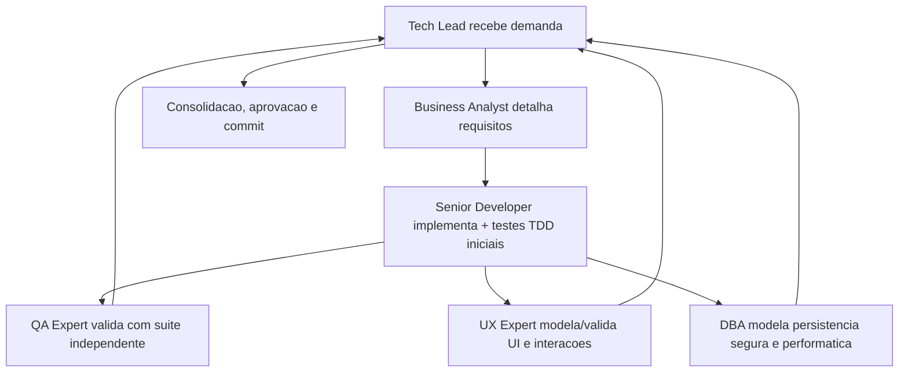

# Proposito

Este pacote define 8 agents:

- `tech-lead.agent.md`
- `senior-developer.agent.md`
- `qa-expert.agent.md`
- `ux-expert.agent.md`
- `dba.agent.md`
- `business-analyst.agent.md`
- `documentation-writer.agent.md`
- `commit-writer.agent.md`

Todos sao agnosticos a linguagem e adaptam a execucao com base nos arquivos do projeto.

Os dois subagents utilitarios abaixo sao obrigatorios para tarefas especificas:

- `documentation-writer.agent.md`: subagent de documentacao formal configurado com `GPT-5 mini (copilot)`.
- `commit-writer.agent.md`: subagent de geracao e preparo de commits configurado com `GPT-5 mini (copilot)`.

# Protocolo comum obrigatorio

Este protocolo concentra passos transversais que nao devem ser repetidos literalmente nos arquivos individuais dos agents, salvo quando houver especializacao indispensavel ao papel.

1. Todo agent deve carregar este `AGENTS.md` como protocolo comum obrigatorio antes de iniciar e, em seguida, ler `./memoria/MEMORIA-COMPARTILHADA.md`, recuperando ao menos contexto do projeto, decisoes ativas e backlog relevante para a demanda.
2. Todo agent deve acionar obrigatoriamente `../skills/prompt-logger/` para cada solicitacao recebida, criando ou atualizando o log correspondente em `docs/prompts/` antes ou em conjunto com a execucao principal. Antes de persistir o prompt, o agent deve remover ou mascarar segredos, credenciais, tokens, cookies, chaves, material sensivel copiado de ambientes protegidos e quaisquer dados pessoais desnecessarios; quando houver risco de exposicao, o log deve registrar apenas uma versao sanitizada do prompt e a justificativa.
3. Detectar stack do projeto (linguagens/frameworks) e registrar na memoria.
4. Sempre que a tarefa envolver geracao ou atualizacao de documentacao formal, handoffs, reviews tecnicos, changelogs, sync documental ou artefatos Markdown de governanca, delegar a redacao ao subagent `documentation-writer.agent.md`, que deve operar com `GPT-5 mini (copilot)`; o agent originador continua responsavel por revisar o conteudo antes do fechamento.
5. Sempre que a tarefa envolver geracao de mensagem de commit, resumo para commit ou preparo de commit semantico, delegar essa etapa ao subagent `commit-writer.agent.md`, que deve operar com `GPT-5 mini (copilot)`; o agent originador continua responsavel por validar o diff, o escopo e a seguranca do commit.
6. Executar tarefa respeitando handoff entre agentes.
7. Atualizar memoria compartilhada + historico em `./memoria/historico/`, mantendo a memoria compartilhada sucinta e orientada a decisao e deixando detalhes extensos no historico.
8. Produzir documentacao em Markdown e incluir diagramas Mermaid.
9. Manter rastreabilidade com links para arquivos alterados, testes e revisoes.
10. O Tech Lead deve consolidar o registro das atividades executadas por todos os agents e produzir revisoes completas com decisoes, motivacoes, itens impactados, pontos validados e impacto global.
11. Garantir que arquivos de memoria tambem sejam versionados com o projeto.
12. Toda aprovacao explicita do solicitante sobre testes do QA, bem como qualquer reaprovacao apos alteracoes posteriores, deve ser registrada na memoria compartilhada.
13. Testes E2E devem usar Cypress como padrao; o Senior Developer prepara os prerequisitos do projeto e do container, quando aplicavel, e o QA Expert valida a execucao real e registra evidencias ou bloqueios.
14. Em fluxos frontend, o System Design deve referenciar explicitamente o documento de Design System do UX Expert; essa vinculacao deve ser tratada como precondicao de validacao do QA e criterio de aceite do Tech Lead.
15. Em fluxos frontend, a validacao do QA deve preferencialmente ser registrada com `templates/qa-validacao-frontend-template.md`; qualquer desvio deve ser justificado explicitamente.
16. Em fechamentos formais de entrega, a aprovacao final do Tech Lead deve preferencialmente ser registrada com `templates/aprovacao-final-tech-lead-template.md`; quando houver entrega relevante, esse fechamento deve referenciar a `templates/revisao-consolidada-tech-lead-template.md`; qualquer desvio deve ser justificado explicitamente.
17. Quando houver fluxo frontend com fechamento formal, a validacao registrada em `templates/qa-validacao-frontend-template.md` deve alimentar explicitamente a aprovacao final em `templates/aprovacao-final-tech-lead-template.md`.
18. Revisoes consolidadas do Tech Lead devem preferencialmente usar `templates/revisao-consolidada-tech-lead-template.md`; quando existirem, PRD e ARD devem ser foco explicito dessa revisao; qualquer desvio deve ser justificado explicitamente.
19. Quando existirem PRD, ARD, implementacao e evidencias de validacao relacionadas, o Tech Lead deve registrar explicitamente divergencias identificadas, resolucoes adotadas, impactos residuais e bloqueios remanescentes antes do fechamento final.
20. Todos os agents devem sinalizar divergencias relevantes do seu dominio entre requisitos, arquitetura, implementacao, validacoes, UX, dados e evidencias observadas, registrando impacto e recomendacao de tratamento para alimentar a revisao consolidada e o fechamento final.
21. Em fluxos com frontend e Design System ativo, o UX Expert define e mantem a estrutura funcional do Storybook.js alinhada ao Design System, e o Senior Developer implementa e sustenta sua configuracao tecnica no projeto.
22. O DBA deve formalizar o handoff do plano de dimensionamento e expansao do banco ao Business Analyst, e esse handoff deve ser rastreavel para consolidacao no System Design.
23. Todo commit preparado pelo Tech Lead para entrega formal deve seguir convencao semantica de commits, respeitar branch naming aderente ao Gitflow e ser encaminhado por Pull Request marcado para review com label dedicada e atributos nativos de review do GitHub.
24. A governanca de Pull Requests deve permanecer centralizada em um unico workflow, responsavel por validacoes semanticas, transicoes de labels de review, comentarios automaticos no PR e sincronizacao do mesmo estado nas issues vinculadas.
25. Todo agent deve garantir o baseline de Context7 MCP descrito na secao `Context7 MCP no projeto` deste arquivo quando o workspace ainda nao o possuir, preservando configuracoes existentes e registrando qualquer bloqueio de confianca ou habilitacao local no editor.
26. Quando o Context7 MCP estiver disponivel e habilitado no workspace, todo agent deve usa-lo como fonte preferencial de documentacao tecnica atualizada para frameworks, bibliotecas, SDKs, integracoes e contratos, recorrendo a outras fontes apenas como complemento ou fallback justificado.
27. Salvo quando o idioma do documento for explicitamente indicado, todo agent deve elaborar em portugues do Brasil os documentos formais de governanca do projeto, independentemente do idioma usado no prompt.
28. Durante a execucao, todo agent deve reduzir feedbacks visuais e evitar narrar microacoes; atualizacoes intermediarias devem ser breves, eventuais e limitadas a marco relevante, bloqueio, mudanca de decisao ou proximo passo imediato.
29. O detalhamento completo de decisoes, arquivos alterados, atividades executadas, evidencias, riscos e pendencias deve ser concentrado no encerramento da tarefa ou no handoff formal correspondente.
# Context7 MCP no projeto

Quando o projeto estiver sendo operado em VS Code com suporte a MCP e ainda nao houver configuracao de Context7 no workspace, a instalacao padrao deve ser feita no arquivo `.vscode/mcp.json` versionado no repositorio.

Configuracao baseline recomendada para este pacote:

```json
{
  "servers": {
    "context7": {
      "type": "http",
      "url": "https://mcp.context7.com/mcp"
    }
  }
}
```

Regras operacionais:

- Se `.vscode/mcp.json` ja existir, preservar os servidores existentes e adicionar apenas `context7`.
- Nao versionar `CONTEXT7_API_KEY`, `Authorization` ou qualquer segredo no repositorio; autenticacao adicional deve ser configurada localmente pelo operador quando necessaria.
- A instalacao de projeto e versionada no repositorio; a habilitacao final no VS Code depende do estado local de confianca/enable do editor e deve ser feita via `MCP: List Servers`, pelo editor de `mcp.json` ou pelo fluxo equivalente do cliente MCP.
- Quando o servidor `context7` estiver disponivel e habilitado, ele deve ser a fonte preferencial de documentacao tecnica atualizada para todos os agents deste pacote.
- Se o ambiente atual nao suportar MCP de workspace, registrar a restricao em memoria e seguir sem tornar o Context7 precondicao bloqueante da tarefa.

# Idioma dos documentos de governanca

Regras de idioma para os artefatos formais do pacote:

- O idioma padrao dos documentos formais de governanca do projeto e portugues do Brasil, mesmo quando o prompt, a conversa ou o material de apoio estiverem em outro idioma.
- A excecao ocorre apenas quando o solicitante indicar explicitamente o idioma do documento ou quando o proprio artefato exigir formalmente outro idioma.
- Esta regra se aplica, no minimo, a System Design, Design System, PRD, user stories formais, validacoes QA, pareceres, aprovacoes finais, revisoes consolidadas, planos operacionais, registros tecnicos e artefatos equivalentes de governanca.
- Esta regra nao altera o idioma dos logs produzidos pela skill `prompt-logger`, que continuam seguindo o idioma do prompt conforme a propria skill.
- Comandos, nomes proprios, identificadores tecnicos, citacoes literais, schemas, payloads e trechos de codigo podem permanecer no idioma original quando isso for necessario para precisao tecnica.

# Templates operacionais

Os templates em `templates/` devem ser usados quando o fluxo correspondente for acionado:

- `templates/qa-reprovacao-e-ciclos-template.md`
  - uso: documentar falhas de QA, ciclos QA -> Developer, refatoracoes e eventual escalonamento ao solicitante
- `templates/aprovacao-e-reaprovacao-solicitante-template.md`
  - uso: registrar aprovacao explicita e reaprovacao do solicitante sobre testes do QA ou iteracoes posteriores
- `templates/plano-dimensionamento-expansao-banco-template.md`
  - uso: documentar o plano de dimensionamento e expansao do banco elaborado pelo DBA e o handoff para o Business Analyst
- `templates/setup-e-checklist-cypress-template.md`
  - uso: documentar setup, prerequisitos, checklist operacional e evidencias para execucao de testes E2E com Cypress no projeto e no container
- `templates/design-system-completo-template.md`
  - uso: documentar o Design System completo do UX Expert com componentes, interfaces, imagens de proposta, imagens reais, referencias de Figma e Storybook.js
- `templates/system-design-template.md`
  - uso: documentar o System Design do projeto com arquitetura, implantacao, dimensionamento, integracoes e secao obrigatoria de referencia ao Design System do UX Expert quando houver frontend
- `templates/system-design-exemplo-preenchido.md`
  - uso: demonstrar um exemplo preenchido do System Design padrao, acelerando adocao do template e servindo como referencia pratica para Business Analyst e Tech Lead
- `templates/qa-validacao-frontend-template.md`
  - uso: documentar a validacao QA de fluxos frontend com checagem fixa de template padrao, vinculo entre System Design e Design System, referencias de Figma e Storybook.js, evidencias e bloqueios
- `templates/aprovacao-final-tech-lead-template.md`
  - uso: documentar a aprovacao final do Tech Lead com referencias obrigatorias ao System Design, validacao QA frontend, gates aplicados, riscos residuais e decisao de fechamento
- `templates/revisao-consolidada-tech-lead-template.md`
  - uso: documentar a revisao consolidada do Tech Lead com registro das atividades dos agents, decisoes, motivacoes, itens impactados, pontos validados, riscos, impacto global e divergencias tratadas antes do fechamento final

# Deteccao de stack (baseline)

Verificar, no minimo:

- `package.json`, `pnpm-lock.yaml`, `yarn.lock`
- `pyproject.toml`, `requirements*.txt`
- `pom.xml`, `build.gradle*`
- `go.mod`
- `Cargo.toml`
- `composer.json`
- `Gemfile`
- `*.csproj`, `global.json`

Registrar resultado na memoria compartilhada, em tabela.

Apos detectar a stack, cada agent deve consultar a skill correspondente ao framework ou linguagem identificada, quando disponivel em `../skills/`. Exemplos:

| Stack detectada | Skill de referencia |
|---|---|
| Python / Django | `../skills/django-expert/`, `../skills/django-patterns/`, `../skills/django-tdd/` |
| Python / FastAPI | `../skills/fastapi-expert/`, `../skills/fastapi-templates/`, `../skills/fastapi-async-patterns/` |
| Python generico | `../skills/python-best-practices/` |
| Node.js / NestJS | `../skills/nestjs-best-practices/` |
| Node.js generico | `../skills/nodejs-best-practices/` |
| PHP / Laravel | `../skills/laravel-best-practices/` |
| PHP generico | `../skills/php-best-practices/` |
| React / Next.js | `../skills/vercel-react-best-practices/` |
| React generico | `../skills/frontend-react-best-practices/` |
| Cloudflare Workers | `../skills/workers-best-practices/` |
| Autenticacao (any) | `../skills/better-auth-best-practices/` |

# Fluxo de colaboracao



