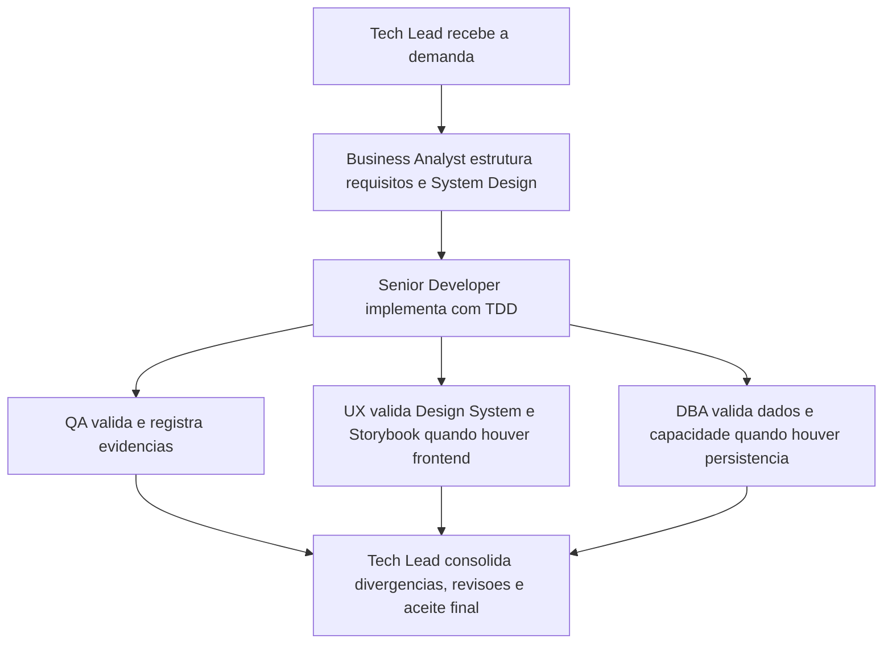

# Memoria Compartilhada dos Agents

> Arquivo versionavel e obrigatorio para todos os agents deste pacote.

## Regras de persistencia

- Todo agent deve ler este arquivo antes de atuar.
- Este arquivo deve manter apenas contexto estrutural e decisoes permanentes relativas ao protocolo e ao comportamento de agents e skills.
- Detalhes extensos, cronologia de mudancas e evidencias completas devem ficar em `memoria/historico/`.
- Toda mudanca estrutural deve atualizar esta memoria e gerar registro no historico.
- O conteudo deve ser curto, consolidado e sem duplicacao textual.
- Diagramas Mermaid so devem ser mantidos quando ajudarem a explicar um fluxo estrutural do pacote.

## Contexto do pacote

| Campo | Valor |
|---|---|
| Projeto | Pacote de agents reutilizaveis (Agentes) |
| Objetivo atual | Manter um baseline enxuto de protocolo e comportamento para agents e skills |
| Stack detectada | Markdown (documentacao e configuracao de agents) |
| Frameworks detectados | N/A no workspace atual |
| Estado do baseline | Estabilizado e portavel |
| Responsavel de consolidacao | Tech Lead |

## Resumo estrutural

- O protocolo comum fica centralizado em [AGENTS.md](../../AGENTS.md), e a memoria principal deve funcionar apenas como resumo duravel desse baseline.
- Os agents operam com personas explicitas, handoffs rastreaveis, gates obrigatorios e comportamento consistente por papel.
- As skills complementam o protocolo com especializacao reutilizavel e devem ser acionadas de forma disciplinada, sem duplicar o comportamento transversal na memoria.
- Detalhes cronologicos, evidencias extensas e ajustes editoriais ficam em `memoria/historico/`.

## Decisoes ativas de protocolo, agents e skills

| ID | Decisao | Impacto permanente | Dono | Status |
|---|---|---|---|---|
| DEC-STR-01 | O pacote opera com protocolo comum, memoria compartilhada concisa e historico versionado. | Garante continuidade, rastreabilidade e baixo acoplamento entre iteracoes. | Tech Lead | Ativa |
| DEC-STR-02 | Os 6 agents devem manter persona operacional explicita e agir com handoffs rastreaveis, detectando stack antes de executar. | Preserva consistencia de comportamento, especializacao por papel e adaptacao ao projeto-alvo. | Tech Lead | Ativa |
| DEC-STR-03 | Gates especializados permanecem obrigatorios: QA para validacao independente, UX para frontend/experiencia e DBA para persistencia/dados. | Evita fechamento de demanda sem revisao adequada do dominio afetado. | Tech Lead | Ativa |
| DEC-STR-04 | O Business Analyst e dono do System Design; o DBA fornece plano de dimensionamento/expansao; o handoff DBA -> BA deve ser explicito e rastreavel. | Mantem coerencia entre requisitos, arquitetura, dados e planejamento de capacidade. | Tech Lead | Ativa |
| DEC-STR-05 | O Senior Developer deve trabalhar com TDD, avaliar no minimo 3 abordagens, aplicar Clean Architecture e priorizar reutilizacao. | Estabelece o baseline de engenharia esperado pelo pacote. | Tech Lead | Ativa |
| DEC-STR-06 | Toda implementacao passa por QA; reprovacoes exigem registro, retorno ao desenvolvimento e escalonamento ao solicitante apos mais de 3 ciclos. | Formaliza o ciclo de qualidade e cria criterio objetivo para destravar impasses. | Tech Lead | Ativa |
| DEC-STR-07 | Testes definidos pelo QA exigem aprovacao explicita do solicitante, e alteracoes posteriores exigem reaprovacao explicita. | Preserva governanca de aceite e trilha auditavel de validacoes. | Tech Lead | Ativa |
| DEC-STR-08 | Cypress e o padrao de E2E; o Senior Developer prepara prerequisitos tecnicos e o QA Expert valida a execucao real com evidencias ou bloqueios. | Clarifica ownership operacional e padroniza a stack de E2E. | Tech Lead | Ativa |
| DEC-STR-09 | Em frontend, o System Design deve referenciar explicitamente o Design System; o QA valida esse vinculo; o Tech Lead o trata como criterio de aceite. | Conecta arquitetura, UX e validacao no fluxo padrao de entrega frontend. | Tech Lead | Ativa |
| DEC-STR-10 | O UX Expert define a estrutura funcional do Storybook alinhada ao Design System, e o Senior Developer sustenta sua implementacao tecnica quando houver frontend. | Evita ambiguidade de ownership entre UX e desenvolvimento. | Tech Lead | Ativa |
| DEC-STR-11 | O Tech Lead deve consolidar atividades, revisoes, PRD/ARD quando existirem, divergencias, evidencias e impacto global antes do fechamento final. | Garante fechamento executivo consistente e auditavel. | Tech Lead | Ativa |
| DEC-STR-12 | Todos os agents devem sinalizar divergencias do proprio dominio entre requisitos, arquitetura, implementacao, UX, dados e evidencias. | Antecipа inconsistencias e alimenta a revisao consolidada e o aceite final. | Tech Lead | Ativa |
| DEC-STR-13 | Templates e skills do pacote devem permanecer reutilizaveis, agnosticos ao projeto e alinhados aos papeis dos agents. | Mantem portabilidade do pacote e reduz acoplamento a repositorios especificos. | Tech Lead | Ativa |
| DEC-STR-14 | A governanca de Pull Requests fica centralizada em um unico workflow, com validacao semantica, Gitflow, labels de review granulares, comentarios automaticos no PR e sincronizacao do mesmo estado nas issues vinculadas. | Reduz sobreposicao de automacoes, preserva rastreabilidade unica do ciclo de review e mantem PR/issue coerentes durante abertura, revisao, dismiss e merge. | Tech Lead | Ativa |
| DEC-STR-15 | Skills transversais devem concentrar detalhamento operacional reutilizavel, enquanto o protocolo comum permanece centralizado em `AGENTS.md` e os agents preservam apenas obrigacoes, gates e ownerships especificos sem repetir instrucoes extensas ja formalizadas em skills, templates ou no protocolo transversal. | Reduz redundancia entre agents, melhora descoberta das skills e mantem o pacote reutilizavel em qualquer projeto. | Tech Lead | Ativa |
| DEC-STR-16 | Todo agent deve acionar a skill `prompt-logger` em cada solicitacao recebida e manter o log correspondente em `docs/prompts/` como trilha auditavel do prompt, interpretacao e plano de acao, sempre com sanitizacao obrigatoria de segredos, credenciais, tokens, PII desnecessaria e outros dados sensiveis antes da persistencia. | Padroniza rastreabilidade por solicitacao sem transformar o repositório em superficie de exposicao de dados sensiveis. | Tech Lead | Ativa |
| DEC-STR-17 | A deteccao de stack em `AGENTS.md` deve produzir um mapeamento explicito stack → skill para que cada agent saiba qual skill especializada consultar apos detectar a tecnologia do projeto-alvo. | Elimina o gap entre deteccao de stack e uso das skills especializadas, tornando a adaptacao automatica e rastreavel. | Tech Lead | Ativa |
| DEC-STR-18 | Skills com sobreposicao de escopo devem declarar nota de delimitacao explicita (`Scope boundary`) no topo da secao de ativacao, com links para as skills complementares. Cada skill deve cobrir um escopo unico e nao duplicar orientacoes ja formalizadas em outra skill do pacote. | Previne uso duplicado ou omissao de skills complementares, mantendo coerencia do pacote. | Tech Lead | Ativa |
| DEC-STR-19 | Exemplos de codigo em skills nao podem conter vulnerabilidades de seguranca (nonces estaticos, algoritmos de hash quebrados para senha, etc.). Warnings de seguranca devem ser explícitos e inconfundíveis — comentários inline minimos sao insuficientes. | Garante que o pacote nao propague anti-padroes de seguranca para os projetos que o consomem. | Tech Lead | Ativa |
| DEC-STR-22 | O bootstrap de todo agent deve tornar explicita a carga inicial de `AGENTS.md` antes da leitura de `./memoria/MEMORIA-COMPARTILHADA.md`, evitando depender apenas de referencias implícitas ao protocolo comum. | Garante que o protocolo transversal seja consumido de forma inequívoca por todos os roles antes de qualquer execução. | Tech Lead | Ativa |
| DEC-STR-23 | Em workspaces VS Code, o pacote deve versionar um baseline de Context7 MCP no projeto via `.vscode/mcp.json` quando essa configuracao estiver ausente, sem expor segredos e sem sobrescrever outros servidores ja definidos. | Padroniza acesso a documentacao atualizada no workspace e evita depender apenas de configuracoes globais do usuario. | Tech Lead | Ativa |
| DEC-STR-24 | Quando o Context7 MCP estiver disponivel e habilitado no workspace, ele deve ser a fonte preferencial de documentacao tecnica atualizada para todos os agents, com fallback controlado para skills e demais fontes apenas quando necessario. | Uniformiza a consulta de documentacao viva entre os roles e reduz dependencia de conhecimento estatico ou pesquisa generica. | Tech Lead | Ativa |
| DEC-STR-25 | Documentos formais de governanca do projeto devem ser elaborados em portugues do Brasil por padrao em todos os agents, independentemente do idioma do prompt, salvo quando o idioma do documento for explicitamente indicado. Logs do `prompt-logger` permanecem no idioma original do prompt. | Uniformiza a linguagem oficial dos artefatos de governanca sem quebrar a rastreabilidade da skill de logging por prompt. | Tech Lead | Ativa |
| DEC-STR-26 | O baseline Gitflow do pacote aceita `feature/*`, `bugfix/*`, `release/*`, `hotfix/*` e `support/*`, e skill, workflow, template de PR, guia de contribuicao e regras dos agents devem permanecer sincronizados com esse conjunto. | Elimina divergencia entre orientacao da skill e automacao ativa do repositorio, evitando branches validas na documentacao e rejeitadas na pipeline ou vice-versa. | Tech Lead | Ativa |
| DEC-STR-27 | Durante a execucao, todos os agents devem reduzir feedbacks visuais e limitar atualizacoes intermediarias a sinteses curtas por marco, bloqueio, mudanca de decisao ou proximo passo imediato; o detalhamento completo fica concentrado no encerramento ou no handoff formal. | Reduz ruido operacional durante a execucao sem perder rastreabilidade, preservando um relatorio final completo para auditoria e tomada de decisao. | Tech Lead | Ativa |
| DEC-STR-31 | O pacote pode versionar utilitarios opcionais de apoio operacional, desde que nao se tornem obrigacao protocolar sem decisao explicita registrada. | Permite manter ferramentas auxiliares no repositorio sem impor comportamento transversal aos agents. | Tech Lead | Ativa |

## Ownerships criticos

| Tema | Ownership principal | Apoio obrigatorio |
|---|---|---|
| Consolidacao final | Tech Lead | Todos os agents alimentam evidencias, divergencias e handoffs |
| System Design | Business Analyst | DBA para capacidade e dados; UX para referencia ao Design System em frontend |
| Design System | UX Expert | Senior Developer para implementacao tecnica de Storybook quando houver frontend |
| Implementacao | Senior Developer | QA para validacao independente |
| E2E com Cypress | QA Expert na validacao | Senior Developer nos prerequisitos tecnicos |
| Plano de banco e expansao | DBA | Business Analyst para consolidacao no System Design |

## Artefatos padrao permanentes

| Artefato | Uso estrutural |
|---|---|
| `templates/system-design-template.md` | Base padrao do System Design |
| `templates/system-design-exemplo-preenchido.md` | Referencia de preenchimento do System Design |
| `templates/design-system-completo-template.md` | Base padrao do Design System |
| `templates/qa-validacao-frontend-template.md` | Validacao QA de fluxos frontend |
| `templates/aprovacao-final-tech-lead-template.md` | Fechamento formal do Tech Lead |
| `templates/revisao-consolidada-tech-lead-template.md` | Revisao consolidada do Tech Lead |
| `templates/qa-reprovacao-e-ciclos-template.md` | Registro de reprovacoes QA e ciclos de refatoracao |
| `templates/aprovacao-e-reaprovacao-solicitante-template.md` | Registro de aprovacao e reaprovacao do solicitante |
| `templates/plano-dimensionamento-expansao-banco-template.md` | Plano de capacidade e expansao do banco |
| `templates/setup-e-checklist-cypress-template.md` | Setup e checklist operacional do Cypress |
| `.github/prompts/execucao-enxuta.prompt.md` | Prompt reutilizavel de workspace para execucao com feedback intermediario minimo e relatorio final detalhado |

## Estado do backlog

| Item | Estado |
|---|---|
| Baseline estrutural do pacote | Concluido e sem backlog estrutural ativo no momento |

## Riscos permanentes

| Risco | Mitigacao permanente | Owner |
|---|---|---|
| Agents perderem especificidade operacional ao longo do tempo | Preservar personas explicitas, handoffs e metricas por papel | Tech Lead |
| Divergencia entre protocolo, templates, skills e agents | Atualizar memoria principal de forma consolidada e detalhar ajustes no historico | Tech Lead |
| Fechamentos ocorrerem sem rastreabilidade suficiente | Exigir revisao consolidada, evidencias e registros de aprovacao quando aplicavel | Tech Lead |
| Skills referenciadas no mapeamento de stack nao existirem no workspace do projeto-alvo | Agents devem verificar disponibilidade da skill antes de consumi-la; mapeamento em `AGENTS.md` deve ser auditado ao portar o pacote | Tech Lead |
| Exemplos de codigo em skills introduzirem vulnerabilidades de seguranca | Revisao de segurança obrigatoria ao adicionar ou atualizar exemplos de codigo; usar `DEC-STR-19` como criterio | Tech Lead |

## Historico de referencia

- O historico foi reduzido para manter apenas registros estruturais e reutilizaveis para o futuro dos agents.
- O saneamento desta memoria foi registrado em `memoria/historico/2026-03-21-1245-limpeza-memoria-estrutural.md`.
- A consolidacao da governanca de PR, labels de review e sincronizacao com issues foi registrada em `memoria/historico/2026-03-21-1315-consolidacao-governanca-pr-issue-review.md`.
- O alinhamento entre skills e agents, com genericizacao de referencias especificas e reducao de redundancias, foi registrado em `memoria/historico/2026-03-21-1345-alinhamento-skills-agents-portabilidade.md`.
- A obrigatoriedade transversal da skill `prompt-logger` para todos os agents foi registrada em `memoria/historico/2026-03-22-0001-obrigatoriedade-prompt-logger.md`.
- A centralizacao adicional do protocolo comum em `AGENTS.md` e a genericizacao residual da skill `prompt-logger` foram registradas em `memoria/historico/2026-03-23-0001-centralizacao-protocolo-genericizacao-skill.md`.
- A diferenciacao operacional entre `documentation-sync` e `review-documentation`, junto com a limpeza residual de referencias quebradas no catalogo de skills, foi registrada em `memoria/historico/2026-03-23-0002-diferenciacao-skills-documentais-e-limpeza-catalogo.md`.
- A validacao deterministica de links locais em skills e a desambiguacao adicional do trio de acessibilidade foram registradas em `memoria/historico/2026-03-23-0003-validacao-links-skills-e-desambiguacao-acessibilidade.md`.
- A evolucao autonoma do pacote (referencias skills em agents, subdiretorios `references/` em skills, correcao de vulnerabilidades CSP/MD5, resolucao de sobreposicoes WCAG e django-security, e correcao de lacunas estruturais em ux-expert, dba e AGENTS.md) foi registrada em `memoria/historico/2026-03-31-0001-evolucao-skills-agents-vulnerabilidades-governanca.md`.
- A explicitacao do bootstrap de `AGENTS.md` em todos os agents antes da leitura da memoria compartilhada foi registrada em `memoria/historico/2026-04-18-0001-bootstrap-agents-carregam-agents-md.md`.
- A padronizacao do Context7 MCP no workspace do projeto, via `.vscode/mcp.json` e protocolo comum em `AGENTS.md`, foi registrada em `memoria/historico/2026-04-18-0002-context7-mcp-workspace-baseline.md`.
- A propagacao do uso operacional do Context7 MCP para todos os agents, como fonte preferencial de documentacao tecnica quando disponivel, foi registrada em `memoria/historico/2026-04-18-0003-context7-uso-operacional-todos-agents.md`.
- A padronizacao do portugues do Brasil como idioma padrao dos documentos formais de governanca do projeto, com excecao apenas quando o idioma do documento for explicitamente indicado, foi registrada em `memoria/historico/2026-04-18-0004-governanca-ptbr-padrao.md`.
- O alinhamento do baseline Gitflow para aceitar `feature/*`, `bugfix/*`, `release/*`, `hotfix/*` e `support/*` em skill, workflow, template de PR, contribuicao e agents foi registrado em `memoria/historico/2026-04-18-0005-alinhamento-gitflow-branches.md`.
- A clarificacao operacional no onboarding sobre quando usar `bugfix/*` versus `support/*`, como desdobramento documental do baseline Gitflow ativo, foi registrada em `memoria/historico/2026-04-18-0006-onboarding-gitflow-bugfix-support.md`.
- A padronizacao de comunicacao enxuta durante a execucao dos agents, com detalhamento completo concentrado no encerramento, foi registrada em `memoria/historico/2026-04-27-0001-comunicacao-enxuta-agents.md`.
- A adicao do prompt reutilizavel de workspace para execucao enxuta e dos exemplos explicitos de status curto e relatorio final detalhado nos agents foi registrada em `memoria/historico/2026-04-27-0002-prompt-workspace-e-exemplos-comunicacao.md`.
- A remocao da obrigatoriedade de calcular e exibir tokens no protocolo do pacote foi registrada em `memoria/historico/2026-04-27-0009-remocao-tokens-do-protocolo.md`.
- A remocao completa do helper de estimativa de tokens do baseline versionado foi registrada em `memoria/historico/2026-04-27-0010-remocao-helper-tokens.md`.
- A sanitizacao obrigatoria do `prompt-logger`, a limpeza de exemplos inseguros de CSP/CSRF e a normalizacao de boundaries entre skills de seguranca, design e acessibilidade foram registradas em `memoria/historico/2026-05-11-0001-sanitizacao-promptlogger-e-normalizacao-skills.md`.

## Fluxo estrutural do pacote

