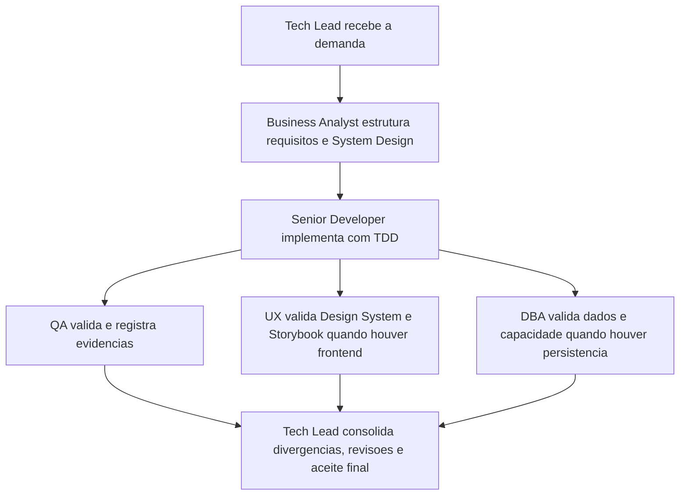

# Memoria Compartilhada dos Agents

> Arquivo versionavel e obrigatorio para todos os agents deste pacote.

## Regras de persistencia

- Todo agent deve ler este arquivo antes de atuar.
- Este arquivo deve manter apenas contexto estrutural e decisoes permanentes relativas ao protocolo e ao comportamento de agents e skills.
- Detalhes extensos, cronologia de mudancas e evidencias completas devem ficar em `memoria/historico/`.
- Toda mudanca estrutural deve atualizar esta memoria e gerar registro no historico.
- O conteudo deve ser curto, consolidado e sem duplicacao textual.
- Diagramas Mermaid so devem ser mantidos quando ajudarem a explicar um fluxo estrutural do pacote.

## Contexto do pacote

| Campo | Valor |
|---|---|
| Projeto | Pacote de agents reutilizaveis (Agentes) |
| Objetivo atual | Manter um baseline enxuto de protocolo e comportamento para agents e skills |
| Stack detectada | Markdown (documentacao e configuracao de agents) |
| Frameworks detectados | N/A no workspace atual |
| Estado do baseline | Estabilizado e portavel |
| Responsavel de consolidacao | Tech Lead |

---

## Projeto Ativo — SCIE / eleitor

Este pacote esta operando no projeto **SCIE — Sistema de Cadastro e Inteligencia Eleitoral**.

| Campo | Valor |
|---|---|
| Repositorio | `/home/sales/eleitor` |
| Branch principal | `develop` — toda PR e aberta para `develop` (base de integracao) |
| Memoria compartilhada do projeto | `../../memoria/MEMORIA-COMPARTILHADA.md` (relativo a este arquivo) |
| Historico do projeto | `../../memoria/historico/` |
| Docs formais | `../../docs/` |

### Stack detectada no projeto

| Camada | Tecnologia |
|---|---|
| Backend | NestJS 11, TypeScript 5.9, PostgreSQL 16 + PostGIS, Node 20 |
| Frontend | React 19, Vite 8, TypeScript 5.9, Tailwind CSS v3, TanStack Router 1.170, TanStack Query 5.101, TanStack Form 1.33 |
| Auth | JWT local HS256, stateless — `POST /auth/login` |
| Testes E2E | Cypress 14 via Docker |
| Testes unitarios | Vitest 4 |
| i18n | i18next + react-i18next (locales: pt-BR, en) |
| Notificacoes | Sonner 2 (toast) |

### Convencoes criticas do projeto

| Assunto | Convencao |
|---|---|
| Testes | Sempre via Docker — nunca instalar Cypress localmente |
| Hot reload backend | `docker restart scie-backend` apos alteracoes (sem watch) |
| Envelope API | `{ success, data, meta, error }` — `ApiClient.request()` faz unwrap automatico |
| Perfis | `admin_nacional` \| `coordenador_regional` (minusculo com underscore) |
| Commits | Conventional Commits + Gitflow |
| Swagger | Todo novo endpoint precisa de decoradores completos + tag em `main.ts` |

### Situacao atual (2026-06-08)

- Branch: `develop` | Working tree: limpo (sem pendencias de commit)
- **I18N-001** — commitado em `97d7d31`; `api-error-translator.ts` rastreado; `AppShellProvider` sem strings hardcoded
- **E2E-002** (coordenadores, eleitores, pleitos) — implementada; aguarda validacao QA no container e aprovacao formal do solicitante
- **Novas funcionalidades commitadas desde 2026-06-07:**
  - `UI-001`: `DataTable` + `ApiDataTable` (filtragem, ordenacao, paginacao server-side)
  - `ELEICAO-002`: locais de votacao — importacao CSV + `section_number` + relatorio de skipped
  - `ELEICAO-003`: resultados de urna (`BallotResultsPage`) + candidatos (`CandidatesPage`) com importacao em lote
  - Sonner integrado para notificacoes toast
  - Multiplos fixes no `docker-stack.yml` e CI
- Memoria compartilhada do projeto: `../../memoria/MEMORIA-COMPARTILHADA.md` (atualizada em 2026-06-08)

### QA — Revisao e otimizacao de TDD (2026-06-13)

- **Parecer QA:** REPROVADO para fechamento formal sob `protocolo-tdd`. Bloqueios: (B1) ausencia total de `data-cy`/`data-test` no frontend + E2E dependente de `cy.contains` com i18n; (B2) integracao sem Testcontainers.
- **O2+O3 implementados (backend):** split unit/integracao no Vitest + harness Testcontainers (PostGIS) hermético.
  - `vitest.config.ts` (unit, exclui `*.int.spec.ts`, roda SEM banco) e `vitest.integration.config.ts` (singleFork + `globalSetup`).
  - `test/integration/global-setup.ts`: sobe `postgis/postgis:18-3.6`, aplica `scripts/01-init-postgis.sql` + `npm run migrate` + `npm run seed` (reuso do caminho canonico, sem duplicar SQL).
  - Specs de integracao renomeadas para `*.int.spec.ts` (2: `postgres-internal-user-access`, `postgres-density-distance-analysis`).
  - Scripts: `test`/`test:unit` (sem DB), `test:integration`, `test:all`.
  - Validacao: `postgres-internal-user-access.repository.int.spec.ts` passa 6/6 via Testcontainers.
- **Defeitos pre-existentes expostos (handoff -> Senior Developer):**
  - DEF-TDD-01 (corrigido): specs de auth mockavam `bcrypt`, mas o codigo usa `bcryptjs` -> mock nao aplicava. Ajustado em `local-auth.use-case.spec.ts` e `local-auth.controller.spec.ts`.
  - DEF-TDD-02: `postgres-density-distance-analysis.repository.int.spec.ts` usa ids texto (`test-density-*`) e `region_id` texto, incompativeis com `voters.id UUID` -> `operator does not exist: uuid ~~ unknown`. Suite nunca esteve verde; exige refatorar para uuids reais.
  - DEF-TDD-03: `local-auth.use-case.spec.ts` (4 testes) quebra com `Cannot read properties of undefined (reading 'isEnabled')` — mock desatualizado apos introducao de TOTP (migr. 015).
  - DEF-TDD-04: `territorial-mesh.controller.spec.ts` (2 testes) retorna 401 — guard de auth sem setup de token/usuario.
- **Backlog QA pendente (nao executado):** O1 (instrumentar `data-cy` + migrar Cypress), O4 (politica de intercept), O5 (unit/componente frontend), O6 (thresholds de cobertura), O7 (exaustao real com saturacao/p95).

### QA — Backlog O1/O4/O5/O6/O7 executado (2026-06-13)

- **O5 (frontend unit/componente):** criado setup Vitest + Testing Library + jsdom (`frontend/vitest.config.ts`, `vitest.setup.ts`). Testes: `api-error-translator.spec.ts`, `menu-permissions.spec.ts`, `DataTable.spec.tsx`. **20/20 verdes.** `getByTestId` configurado para casar com `data-cy`.
- **O6 (thresholds):** gate de cobertura incremental (pisos globais baixos + por-arquivo altos). Frontend: gate **passa** (EXIT 0). Backend: thresholds em `vitest.config.ts` (verificacao verde depende de corrigir DEF-TDD-03/04).
- **O7 (exaustao real):** `density-distance-analysis.exhaustion.int.spec.ts` (Testcontainers). Mede throughput de insercao (~60k linhas/s) e curva de latencia da query PostGIS por volume controlado. **2/2 verdes e deterministico** (sem flaky).
- **O1 (data-cy):** `DataTable` instrumentado (row/prev/next/page) + fluxo login (`LoginPage` + `cy.login` + `login.cy.ts` migrados para `[data-cy=...]`). Demais fluxos: rollout documentado em `frontend/cypress/README.md`.
- **O4 (politica de intercept):** formalizada em `frontend/cypress/README.md` (happy-path no backend real; intercept so para 3rd-party e simulacao explicita de erro). `login.cy.ts` ja roda contra backend real.
- **Defeitos de PRODUCAO encontrados+corrigidos (DEF-TDD-05):** `postgres-density-distance-analysis.repository.ts` tinha `ORDER BY <alias>::int` (alias com cast nao visivel em ORDER BY -> `column ... does not exist`) em DUAS queries. O endpoint de densidade quebraria (500) sempre que houvesse clusters. Corrigido para `ORDER BY COUNT(*)`/`COUNT(*) FILTER(...)`.
- **Achado de capacidade (para Business Analyst):** query de densidade e superlinear (N=100->28ms, N=200->247ms ~9x) e atinge ~6s @ 2000 eleitores, com instabilidade acima disso. Recomenda-se otimizacao (indice/algoritmo) antes de escalar.

### QA — DEF-TDD-02/03/04 corrigidos (2026-06-13)

Suites 100% verdes: **backend unit 357/357, backend integration 18/18, frontend 20/20**.

- **DEF-TDD-02 (corrigido):** `postgres-density-distance-analysis.repository.int.spec.ts` reescrito para o schema REAL (`cpf_hash`/`full_name`/`status`, sem `name`/`cpf`/`internal_user_id`; id UUID default; limpeza por `full_name LIKE`).
- **DEF-TDD-03 (corrigido):** `local-auth.use-case.spec.ts` — faltava o 5o arg do construtor (`totpRepository`); adicionado mock `makeTotpRepository()` com `isEnabled=false`.
- **DEF-TDD-04 (corrigido):** `territorial-mesh.controller.spec.ts` — rota protegida por `JwtAuthGuard`; passou a emitir token admin via `JwtService` e enviar `Authorization: Bearer`.
- **DEF-TDD-06 (PRODUCAO, corrigido):** mesma repository de densidade comparava `rc.internal_user_id` (uuid) com `text[]` no escopo nao-global -> `operator does not exist: uuid = text` (500 para coordenador_regional). Corrigido com `rc.internal_user_id::text`.
- **Infra de teste:** `vitest.integration.config.ts` agora usa `fileParallelism: false` — specs de integracao compartilham o mesmo banco efemero e nao podem intercalar (contaminacao cruzada de massa).
- Pendencia residual: elevar thresholds de cobertura (O6) conforme a suite cresce; rollout `data-cy` (O1) aos fluxos voters/coordinators/elections/account.

### QA — B1 resolvido na raiz (data-cy rollout) (2026-06-13)

- **O1 concluido** nos fluxos auth, account/menu, voters, coordinators, elections + DataTable + Modal. **57 `data-cy`** em componentes, **83 seletores `data-cy`** nos specs.
- **B1 (seletores frageis a i18n) eliminado para AÇÕES:** nenhum `cy.contains('<texto>')` dispara click/type — todos usam `data-cy`/`#id`. Unico `.contains().click()` restante mira dado dinamico (chip de bairro), nao rotulo.
- **Modal compartilhado instrumentado:** prop `dataCy` → raiz `role=dialog` + botoes `${dataCy}-confirm`/`-cancel`. Diálogos de remoção: `voter/coordinator/election-delete-dialog`.
- Convenção: `<entidade>-<elemento>` (ex.: `voter-cpf`, `election-turn-1`, `account-menu-logout`); documentada em `frontend/cypress/README.md` (com política O4 de intercept).
- Verificacao: `tsc -p tsconfig.app.json` EXIT 0; suite unit/componente frontend 20/20. Execução E2E roda no Docker stack (`docker compose run --rm cypress`).
- **Tail CONCLUÍDO (2026-06-13):** dashboard (`dashboard-title`, `dashboard-kpi-sessionProfile` com `data-profile` — perfil verificado por CÓDIGO, não por rótulo i18n), `login-title`, `SurfaceCard dataCy` (`election-list-card`) e `datatable-th-<colId>` (genérico p/ todas as listas). B1 100% eliminado: nenhum seletor (ação ou asserção) depende de texto i18n; restam apenas `cy.contains` de dado dinâmico (e-mail logado, chips digitados). `tsc` EXIT 0; frontend unit 20/20.

### Dev — fix duplicidade de CPF em lideranças (2026-06-14)

- **Bug (prod):** `POST /liderancas` com CPF já existente estourava 500 — `INSERT ... ON CONFLICT (id)` resolve só pela PK, mas a colisão era em `uq_liderancas_cpf_hash` (índice **global**, `WHERE cpf_hash IS NOT NULL`, cobre `deactivated`). A pré-checagem `findByCpfHash` filtrava `status='active'`, então CPF de liderança desativada (ou corrida concorrente) furava a checagem.
- **Decisão do solicitante:** CPF é **único global** — bloquear recadastro mesmo após desativação (não há fluxo de reativação hoje).
- **Fix:** (1) `findByCpfHash` passou a considerar todos os status; (2) `save()` captura 23505/`uq_liderancas_cpf_hash` → `LeadershipCpfConflictError` (novo erro tipado no port); (3) `RegisterLeadershipUseCase` traduz para `cpf_already_in_use` → controller já mapeia para 400 "CPF já cadastrado". `update-leadership` não grava `cpf_hash`, logo não precisa da rede de 23505.
- **Testes:** unit `register-leadership.use-case.spec.ts` (4/4); suíte unit backend **361/361** verde; `tsc` EXIT 0. Integração `postgres-leadership.repository.int.spec.ts` (4 casos) escrita no padrão Testcontainers.
- **BLOQUEIO (handoff QA):** suíte de integração não roda no container `scie-backend` (runtime) — sem Docker socket p/ Testcontainers + incompatibilidade `undici`/testcontainers (`webidl.util.markAsUncloneable is not a function`) trava o `global-setup` (afeta TODOS os `*.int.spec.ts`, não só este). Precisa rodar no ambiente com Docker-in-Docker usado pelo QA.

### Dev — toast de erro ao salvar liderança (frontend) (2026-06-14)

- **Complemento do fix backend:** `LeadershipManagementPanel` chamava `toast.success` após o `await` mas não tratava rejeição — erro do backend (ex.: 400 "CPF já cadastrado") subia sem feedback.
- **Fix:** `handleRegister`/`handleEdit` em try/catch → `toast.error(translateApiError(error, t))` (padrão já usado no `AppShellProvider`); modal permanece aberto em erro. Fluxo de remoção ganhou `.catch` com toast.
- **Testes:** novo `LeadershipManagementPanel.spec.tsx` (2 casos: erro mostra toast + modal aberto; sucesso mostra toast). Frontend unit/componente **22/22**; `tsc` EXIT 0.

### Dev — mensagem específica em VALIDATION_FAILED (frontend) (2026-06-14)

- **Bug de precedência no `translateApiError`:** ordem `apiErrors.<code>` → `apiErrors.HTTP_<status>` → `error.message`. Como existe `apiErrors.HTTP_400` ('Requisição inválida.') e NÃO existe `apiErrors.VALIDATION_FAILED`, todo 400 com code `VALIDATION_FAILED` (CPF duplicado + validações de DTO, rotuladas pelo `ApiErrorFilter` do backend) tinha a mensagem real ofuscada pelo genérico.
- **Fix:** se `code === 'VALIDATION_FAILED'` e `message` não-vazia, retorna `error.message` antes do fallback de status. Corrigido no tradutor → beneficia liderança (consumidor via prompt 002) e todos os outros consumidores (`AppShellProvider`).
- **Testes:** `api-error-translator.spec.ts` +2 casos; frontend unit/componente **24/24**; `tsc` EXIT 0.

### Feature — e-mail opcional e único na liderança (2026-06-14)

- **Decisões do solicitante:** e-mail **único** entre lideranças; presente no **cadastro e edição**; no formulário, **ao lado do nome**.
- **Backend:** migration 023 (`email VARCHAR(320)` + `uq_liderancas_email WHERE email IS NOT NULL`); domínio `normalizeOptionalEmail` (trim+lowercase); repositório `findByEmail` + `rethrowAsConflict` (23505 de cpf_hash e email → erros tipados); use cases register/update com pré-checagem + tradução `email_already_in_use` → 400; DTOs/Swagger atualizados.
- **⚠️ Divergência corrigida:** havia DOIS runners de migration — `migrate.ts` (CLI, usado pelo global-setup do Testcontainers) estava defasado em **m019**, enquanto `migration.service.ts` (boot) ia até m022. Sincronizei `migrate.ts` com m020–m023. Sem isso, o ambiente de integração não teria a tabela `liderancas`.
- **Frontend:** tipo, form (nome+e-mail lado a lado, grid 3fr/2fr, cadastro e edição), zod, i18n pt-BR/en.
- **Testes:** backend **366/366** (+5), frontend **27/27** (+3); `tsc` EXIT 0 nas duas pontas. Integração (`postgres-leadership.repository.int.spec.ts` +4 casos de e-mail) permanece bloqueada no container runtime — handoff QA (Docker-in-Docker).

### Verificação — CPF do cadastro de liderança (máscara + obrigatório) (2026-06-14)

- **Achado:** os dois requisitos já existiam em `LeadershipManagementPanel` (único cadastro): máscara via `transform: maskCpf` e obrigatoriedade via `required` nativo + zod (`min(1)` + 11 dígitos) no ramo de cadastro.
- **Entrega:** 3 testes de regressão (máscara formata; campo `required`; CPF inválido bloqueia e sinaliza erro). Sem mudança de comportamento.
- **Nota:** o `required` nativo bloqueia o submit no jsdom antes do zod — o teste de validação usa CPF inválido (não-vazio) para exercitar o refine. Frontend unit/componente **30/30**; `tsc` EXIT 0.

### Feature — municípios de atuação da liderança (2026-06-14)

- **Decisão do solicitante:** lista simples **UF + município** (sem bairros/votos — subconjunto do modelo do coordenador), única por liderança. UX igual à do coordenador (UF→município IBGE + Adicionar/Remover).
- **Backend:** migration 024 `lideranca_municipios_atuacao` (FK cascade, UNIQUE(lideranca_id,state,municipality)); domínio `normalizeActivityMunicipalities`; repositório com `save`/`update` **em transação** + `replaceActivityMunicipalities`, carga agrupada (`= ANY`) sem N+1; DTO/Swagger.
- **Frontend:** seção no painel (UF select + município IBGE + chips Adicionar/Remover), tipos, i18n.
- **Testes:** backend **368/368** (+2), frontend **32/32** (+2 no painel); `tsc` EXIT 0 nas duas pontas. Integração (+3 casos: persistência, update substitui, cascade) bloqueada no runtime — handoff QA.
- **Nota:** `save()` da liderança agora é transacional (antes era single query) — mantém tradução de conflito cpf/email com ROLLBACK.

### Ajuste UI — municípios de atuação em DataTable + bloco no final (2026-06-14)

- No formulário de liderança: lista de municípios de atuação migrada de chips para **DataTable** (colunas Município/UF/Ações-Remover); `removeActivityMunicipality` agora é por valor (a DataTable entrega a linha). Bloco **movido para o final** do formulário (após Observações).
- Sem mudança de contrato/backend. Frontend **32/32**; `tsc` EXIT 0.
- **Nota de ambiente:** `tsc`/vitest no container do frontend sofrem crash nativo intermitente do V8 (turboshaft, "unreachable code"/EXIT 141); re-execução resolve. Não é erro de tipo.
- **Ajuste (2026-06-14):** removido o filtro da DataTable de municípios de atuação no modal (coluna `municipality` sem `filterable`; a `DataTable` só renderiza o controle de filtro quando há coluna filtrável). `tsc` EXIT 0; painel 10/10.

### Infra — uploads de 800 MB em produção (2026-06-14)

- **nginx (prod):** `client_max_body_size` 500m→850m; locations dedicadas `^~ /files` e `^~ /resultados-boletim/import` com timeouts 600s + `proxy_request_buffering off`.
- **Multer:** `/files` 10MB→800MB; import de boletim 500MB→800MB.
- **docker-stack backend:** `--max-old-space-size` 768→1536; `limits.memory` 2G→4G; reservation 256M→512M.
- **⚠️ Risco aceito/documentado:** `/files` grava BYTEA com o arquivo INTEIRO em memória → 800 MB tem risco de OOM/pressão no Postgres; mitigado para 1 upload por vez. Follow-up: refatorar `/files` para disco/object storage.
- Validação: backend `tsc` EXIT 0; `nginx -t` OK. Upload real de 800 MB ainda **não testado** (E2E/manual). Branch `feature/uploads-800mb` (a partir da develop).

### Feature — import assíncrono de locais de votação (fix definitivo do 504) (2026-06-14)

- **Motivação:** 504 Gateway Time-out persistente no upload de CSV de ~400 MB mesmo após corrigir nginx (streaming+600s, #120) e timeout do Node (15 min, #121/#122) — ambos já em `master`. Como o request síncrono fica pendurado, qualquer proxy (inclusive edge fora do repo) pode cortar. Solução definitiva: **tornar o import assíncrono**.
- **Backend:** `POST /locais-de-votacao/import` agora cria um job e retorna **202 `{ jobId, status:'processing' }`**; processa em background (in-process, reusa `ImportVotingLocationsUseCase` com `onProgress` throttled). `GET /locais-de-votacao/import/jobs/:jobId` (status+counts+reportUrl|error) e `GET .../jobs/:jobId/report`. Migration **027** `voting_location_import_jobs` (id, status, imported, skipped, report jsonb, error, timestamps) nos dois runners. Novo domínio/port/repo + `VotingLocationImportJobService` (start/process/getStatus, fire-and-forget com captura de erro + unlink do /tmp). Removido o endpoint antigo `import/report/:reportId`.
- **Frontend:** repositório com `startVotingLocationImport` + `getVotingLocationImportStatus`; o use case `importCsv` agora faz **start → polling (~2s, teto 30 min)** mantendo o shape `{ imported, skipped, reportUrl }` (UI quase inalterada; toast "Processando importação…"; chave i18n `votingLocation.import.processingAsync`).
- **Testes:** backend **375/375** (+ service spec), frontend **43/43** (+ use case polling spec); `tsc` EXIT 0 nas duas pontas.
- **Risco residual:** single replica → job in-process; se o backend reiniciar no meio, o job fica `processing` órfão (follow-up: varredura de recuperação). Para multi-réplica, exigiria fila externa.
- Branch `feature/import-locais-assincrono` (de `develop`). Log: `docs/prompts/2026-06-14_019_import-locais-assincrono.md`. **Deploy:** efeito em produção só após promover a `master` (pipeline builda imagem + Portainer).

### Ajuste — máscara de CPF no read-only do modo edição da liderança (2026-06-14)

- **Contexto:** a máscara `000.000.000-00` já existia no campo CPF do **cadastro** (`transform: maskCpf`). Faltava no **modo edição**, onde o CPF imutável é exibido read-only (`leadership-cpf-ro`) com o valor cru.
- **Ponto crítico (por perfil, `resolveCpfDisplay`):** `admin_nacional` recebe o CPF **em claro (11 dígitos)**; `coordenador_regional` recebe **parcialmente mascarado** (`***.982.247-**`). Aplicar `maskCpf` cegamente corromperia o valor do coordenador.
- **Fix (só frontend, `LeadershipManagementPanel`):** read-only formata via `maskCpf` **apenas quando o valor for dígitos puros** (`/\D/.test(v) === false`); valores já mascarados são preservados intactos. `maskCpf` é idempotente sobre dígitos.
- **Testes:** frontend **38/38** (+2: edição admin exibe `529.982.247-25`; coordenador preserva `***.982.247-**`); `tsc` EXIT 0. Backend não tocado.
- Branch `feature/lideranca-votos-por-municipio` (escopos 012/013/014/016 acumulados). Logs: `docs/prompts/2026-06-14_015_*` (verificação) e `2026-06-14_016_*` (implementação).

### QA — fix regressão E2E lideranças: telefone obrigatório quebrava o POST (2026-06-15)

- **Sintoma:** `leadership.cy.ts` → "Cadastro vinculado a coordenador (REGR)" falhava com `cy.wait('@createLeadership')` timeout (15s) — "No request ever occurred". O POST nunca disparava.
- **Causa raiz (no TESTE, não no app):** o roteiro preenchia coordenador+nome+CPF mas **não o telefone**, que virou obrigatório no cadastro (frontend zod+required desde 2026-06-14; backend desde 2026-06-15). A validação bloqueava o submit → sem POST.
- **Correção:** (1) teste #1 passou a preencher `#leadership-contactPhone` (`VALID_PHONE='11999990000'`, ≥10 dígitos); (2) teste #2 ("bloqueia sem coordenador") estava **semanticamente obsoleto** — coordenador é opcional desde 2026-06-14, então ele passava pelo motivo errado (telefone ausente). Realinhado para "bloqueia quando o telefone obrigatório não é informado (sem POST)". Cabeçalho da suíte atualizado com as regras atuais (obrigatórios: nome, CPF, telefone; coordenador opcional).
- **Validação:** `docker compose --profile e2e run --rm cypress` (spec de lideranças) → **2/2 passing** (backend real, POST interceptado sem efeito colateral). Execução 100% no container.
- **Gap de cobertura FECHADO (2026-06-15):** adicionado o caso E2E "cadastra sem coordenador (vínculo opcional) — POST dispara com coordinatorId vazio". Suíte de lideranças agora **3/3 passing** via Docker.

### Aprovação do solicitante — testes de QA (DEC-STR-07) (2026-06-15)

- **Solicitante aprovou explicitamente** os testes desta entrega (validação zod nos formulários, telefone obrigatório no cadastro de liderança e regressão E2E de lideranças), incluindo a adição do caso E2E de coordenador opcional.
- **Escopo aprovado:** backend unit 378/378; frontend unit/componente 72/72; `tsc` EXIT 0; Cypress lideranças 3/3 (Docker). Sem ressalvas registradas.
- **Reaprovação:** qualquer alteração posterior a estes testes exige nova aprovação explícita.
- Entrega consolidada no PR **#125** (`feature/validacao-formularios-zod` → `develop`, label `in-review`).

### Feature — validação zod padronizada em todos os formulários (frontend) (2026-06-15)

- **Decisão do solicitante:** padronizar validação com **zod** em todos os formulários (escopo "tudo, incluindo auth"); **abordagem escolhida:** reusar o padrão existente (`useState` + `safeParse` no submit) extraindo um **helper compartilhado** — sem migrar para o adapter nativo do TanStack.
- **Helper novo:** `src/lib/validation/zod-errors.ts` → `zodErrors(schema, values)` roda `schema.safeParse` e retorna `{ [campo]: mensagem }` (first-wins por campo; ignora issues de path vazio). Spec `zod-errors.spec.ts` **4/4**.
- **Refatorados ao helper (já usavam zod):** `LeadershipManagementPanel` (canônico), `VotingGoalsManagementPanel`, `CoordinatorManagementPanel`. `CandidateManagementPanel` já usa `validators` do TanStack Form (delega ao zod — sem trecho a trocar). `ChangePasswordSettings` mantido (usa erro único string, não mapa por campo — semântica diferente; justificado).
- **zod aplicado onde faltava:** `LoginPage`, `MfaChallengePage` (+chaves i18n `login.validation.*` e `auth.totp.validation.*`), `VoterRegisterForm` (+`voter.register.cpfRequired/cpfInvalid/nameRequired`), `VoterPortfolioForm`, `ElectionManagementPanel`, `VotingLocationManagementPanel` (estes dois migraram texto hardcoded→i18n e reusaram `election.validation.*`/`votingLocation.validation.*` já existentes), `CoordinatorHierarchyForm`, `CoordinatorRegionsForm` (erro via callback `onError`, não há `TextBox` nesses).
- **Sem form validável (justificado, sem mudança):** `BallotResultsPanel` (importação/exibição + filtros opcionais).
- **Convenção firmada:** novo formulário deve definir `schema` zod (mensagens via `t(...)`) e validar no submit com `zodErrors(schema, values)`, exibindo o erro no padrão do componente (prop `error` do `TextBox` ou callback existente).
- **Testes:** suíte frontend **72/72** (eram 32; +novos specs por formulário); `tsc -p tsconfig.app.json` **EXIT 0**. Execução no container (convenção Docker). **Nota:** `tsc` sofreu o crash nativo intermitente do V8 (EXIT 133) numa execução — re-execução resolveu (já documentado).
- **Pendência de governança:** prompt-logger / registro técnico (`review-documentation`) e commit semântico ainda não disparados (handoff ao fluxo do originador). Branch atual: `develop`.

### QA — telefone obrigatório no cadastro de liderança também no BACKEND (2026-06-15)

- **Decisão do solicitante (reverte o ajuste de 2026-06-14, que era só-frontend):** `contact_phone` passa a ser **obrigatório no cadastro também no domínio/backend**. Edição continua opcional (assimetria mantida, igual ao CPF — `Leadership.create` é o único caller; `update` usa caminho próprio).
- **Backend:** `leadership.ts` → `contactPhone` migrou de `optionalText` para `requireText(...,'contactPhone')` em `Leadership.create`; ausência/vazio lança `LeadershipValidationError` → use case traduz para `invalid_leadership_data` → controller já mapeia para **400** "Dados da liderança inválidos". DTO de cadastro: `contactPhone` de `@ApiPropertyOptional`→`@ApiProperty` (`!: string`), Swagger reflete obrigatoriedade; DTO de edição inalterado (opcional).
- **Testes:** `register-leadership.use-case.spec.ts` — helper base passou a enviar `contactPhone`; +3 casos (persiste telefone com trim; rejeita ausente; rejeita vazio/espaços). Spec **16/16**; suíte unit backend **378/378**; `tsc` EXIT 0.
- **Nota:** backend exige apenas não-vazio (a regra "≥10 dígitos" continua só no zod do formulário); integração `postgres-leadership.repository.int.spec.ts` não usa `Leadership.create` (monta `LeadershipRecord` direto) → não afetada; permanece bloqueada no runtime (Testcontainers/DinD) — handoff QA.

### Ajuste — obrigatórios do cadastro de liderança: nome, CPF e telefone (2026-06-14)

- **Decisão do solicitante:** no cadastro de liderança, **somente nome, CPF e telefone** são obrigatórios; todos os demais campos são opcionais.
- **Mudança (só frontend, `LeadershipManagementPanel`):** telefone (`contactPhone`) passou a obrigatório **no cadastro** — `required` nativo (modo register) + zod (não-vazio + ≥ 10 dígitos). Nome e CPF já eram obrigatórios; coordenador/e-mail/endereço/votos/etc. permanecem opcionais (consolidados nos ajustes 012/013). Edição **não** bloqueia telefone (assimetria igual à do CPF, para não travar registros legados). Mensagens i18n `validation.phoneRequired`/`phoneInvalid` (pt-BR/en).
- **Padrão mantido:** obrigatoriedade de cadastro é enforçada na camada de formulário (como o CPF); domínio/backend inalterados.
- **Testes:** frontend **36/36** (+2: telefone required + telefone inválido bloqueia); helper e casos de cadastro atualizados para preencher telefone válido; `tsc` EXIT 0. Backend não tocado.
- Branch `feature/lideranca-votos-por-municipio` (escopos 012/013/014 acumulados, ainda não commitados). Log: `docs/prompts/2026-06-14_014_lideranca-obrigatorios-nome-cpf-telefone.md`.

### Ajuste — coordenador responsável opcional na liderança (2026-06-14)

- **Decisão do solicitante:** no cadastro de liderança, o **Coordenador responsável deixa de ser obrigatório** (vínculo opcional, `coordinator_id` pode ser NULL).
- **Backend:** migration **026** (`ALTER TABLE liderancas ALTER COLUMN coordinator_id DROP NOT NULL`, dois runners; FK + `ON DELETE CASCADE` preservados — só passa a aceitar NULL); domínio `coordinatorId` via `optionalText` (deixou de usar `requireText`), `CreateLeadershipInput`/`LeadershipRecord.coordinatorId: string | null`; use case/DTO (`@ApiPropertyOptional`)/controller (`?? null`); repositório `LeadershipRow.coordinator_id` + `rowToRecord` nullable. **Não há** validação de existência/escopo por coordenador no register, então a mudança é segura.
- **Frontend:** removida a validação `coordinatorRequired`; `Leadership.coordinatorId`/`RegisterLeadershipData.coordinatorId` nullable; envia `null` quando vazio; rótulo "(opcional)" (`fields.coordinatorOptional`, pt-BR/en). Listagem por coordenador (`listByCoordinatorId`) não traz lideranças sem coordenador; `listAll` (admin) traz.
- **Testes:** backend unit **370/370** (+1 "cadastra sem coordenador"); frontend **34/34** (+1 "permite cadastrar sem coordenador"); `tsc` EXIT 0 nas duas pontas. Integração (+1 caso `coordinator_id` NULL) compila; execução bloqueada no runtime (Testcontainers/Docker) — handoff QA.
- Branch `feature/lideranca-votos-por-municipio` (mesma branch dos votos por município, ainda não commitada — **dois escopos a separar/commitar**). Log: `docs/prompts/2026-06-14_013_lideranca-coordenador-opcional.md`.

### Feature — votos esperados por município na liderança (2026-06-14)

- **Decisão do solicitante:** no cadastro/edição de liderança, na seção "Municípios de atuação", expectativa de votos por município é **opcional** (espelha o coordenador). Não participa da unicidade `(lideranca_id, state, municipality)`.
- **Backend:** migration **025** (`ALTER TABLE lideranca_municipios_atuacao ADD COLUMN expected_votes INTEGER` nullable) registrada nos **dois runners** (`migrate.ts` + `migration.service.ts`); domínio `LeadershipActivityMunicipality.expectedVotes?` + `normalizeActivityMunicipalities` (inteiro ≥ 0 truncado, senão `null`); repositório (INSERT em `replaceActivityMunicipalities` + cargas single/`= ANY`); `ActivityMunicipalityDto.expectedVotes?` (Swagger); controller register/update repassam o campo.
- **Frontend:** tipo `LeadershipActivityMunicipality.expectedVotes?`; input numérico opcional na linha de adição (grid `1fr 3fr 2fr auto`), coluna `expectedVotes` na DataTable de municípios, `editDefaults` carrega o valor; i18n pt-BR/en (`fields.municipalityExpectedVotes`, `form.activityExpectedVotesPlaceholder`).
- **Testes:** backend unit **369/369** (+1 normalização); frontend **33/33** (+1 envio de votos); `tsc` EXIT 0 nas duas pontas. Integração (`postgres-leadership.repository.int.spec.ts`: +1 round-trip de votos, asserts atualizados com `expectedVotes`) compila (tsc) mas permanece **bloqueada no runtime** (Testcontainers exige Docker-in-Docker) — handoff QA.
- Branch `feature/lideranca-votos-por-municipio` (a partir da develop). Log do prompt: `docs/prompts/2026-06-14_012_lideranca-votos-esperados-por-municipio.md`.

### Ajuste — votos por município opcional no coordenador (2026-06-14)

- O backend já persistia `expected_votes` por município incondicionalmente; o recurso estava **gatilhado só no frontend** pelo modo `by_municipality`.
- Mudança (só frontend, `CoordinatorManagementPanel.tsx`): input e coluna de votos sempre visíveis; `toMunicipalityInputs` persiste `expectedVotes` sempre que informado (removido o gate de modo). `tsc` EXIT 0; suíte **32/32**.
- Branch `feature/coordenador-votos-por-municipio` (a partir da develop, independente do PR #108 de lideranças). Painel de coordenador ainda sem harness de teste de componente — recomendado E2E.

### Feature — detalhe do local no Mapa Espacial: seções (eleitores aptos) + candidatos de interesse (2026-06-16)

- **Pedido:** em `/app/mapa/espacial`, ao clicar no local de votação, listar todas as seções com a quantidade de eleitores aptos por seção e o somatório dos votos dos candidatos de interesse no local.
- **Diagnóstico:** a cadeia de dados já existia ociosa. Backend `GET /locais-de-votacao/:id/secoes` (`GetLocationSectionsSummaryUseCase`) já retorna seções com `registeredVoters`/`validVotes` e `candidatesOfInterest` (votos nominais somados por candidato `is_of_interest=TRUE` sobre todas as seções do local físico). Frontend já tinha use-case, hook `useLocationSectionsSummary`, repo HTTP e tipos — **mas o hook não tinha consumidor**; o `SpatialMapPanel` só exibia popup estático. Escopo real: **frontend-only**.
- **UX (decisão do solicitante):** modal ao clicar no marcador (mantém o mapa ao fundo).
- **Implementação:** novo `VotingLocationSectionsModal.tsx` (presentacional: totais + tabela de seções com eleitores aptos + lista de candidatos de interesse com total); `SpatialMapPanel` ganhou estado `selectedLocationId` e abre o modal pelo botão no popup do marcador e pelo clique nas linhas da tabela, consumindo `useLocationSectionsSummary`. i18n `map.detail.*` + `common.close` (pt-BR/en).
- **Testes:** novo spec do modal **5/5**; suíte frontend **114/114**; `tsc` EXIT 0; ESLint EXIT 0. Execução no container `scie-frontend`.
- **Pendência de governança:** validação QA independente, commit semântico (via `commit-writer`) e PR ainda não disparados. Branch atual: `chore/remove-spatial-map-voters-endpoint`. Log: `docs/prompts/2026-06-16_002_mapa-espacial-detalhe-secoes-candidatos-interesse.md`.

### Fix — Mapa Espacial lista TODOS os locais correspondentes (sem paginação) (2026-06-17)

- **Pedido:** em `/app/mapa/espacial`, listar todos os locais de votação correspondentes aos filtros, sem paginação na lista.
- **Diagnóstico:** a lista era capada no frontend por `pageSize: MAX_POINTS` (500) em `SpatialMapPanel.applyFilters`. O backend já suportava `all=true` (controller capa `pageSize` em 500; `PostgresVotingLocationRepository` omite `LIMIT/OFFSET` quando `filter.all===true`), mas o parâmetro **não** era exposto no tipo de filtro do frontend nem serializado pelo repo HTTP. Escopo real: **frontend-only**.
- **Implementação:** `ListVotingLocationsFilter` ganhou `all?: boolean`; `HttpVotingLocationRepository` serializa `all=true`; `SpatialMapPanel` passou a enviar `all: true` (removida a constante `MAX_POINTS`). Demais consumidores (`useDashboard` `pageSize:1`, `useVotingLocations`, `CoordinatorVotingLocationsPanel`) inalterados.
- **Testes:** novo `http-voting-location.repository.spec.ts` (2 casos: serializa `all=true` e omite page/pageSize; não envia `all` quando falsy). Suíte frontend **116/116** (+2); `tsc` EXIT 0; ESLint EXIT 0. Execução no container `scie-frontend`.
- **🚨 QA REPROVOU `all=true` no mapa (2026-06-17):** contra dados reais (`eleitor_dev`, **4.589.467** locais), um único `eleição+UF` retorna **~100.891** linhas (SP), todas com coordenadas → payload JSON **~57 MB** + ~100k marcadores Leaflet + tabela de 100k linhas = navegador travado. Pior caso por município (cidade de SP) ≈ **26.159**. Query backend ~285 ms (ok no banco). O cap `MAX_POINTS=500` existia para conter isso.
- **Decisão do solicitante:** **reverter `all=true` no mapa** (restaurado `pageSize: MAX_POINTS`) e implementar **clustering server-side (PostGIS) por viewport/zoom + lista adequada** como feature separada. A capacidade `all` no tipo/repo HTTP (+spec) foi **mantida** (recurso de backend legítimo e reutilizável). Commit a1eeb90 (all=true no painel) superado pela correção de segurança.
- **Pendência:** feature de clustering (BA→DBA→Dev→QA) em branch própria. Log: `docs/prompts/2026-06-17_001_mapa-espacial-listar-todos-locais-sem-paginacao.md`.

### Feature — Mapa Espacial: clustering server-side (PostGIS) por viewport + lista que segue a área visível (2026-06-17)

- **Pedido (após reprovação de `all=true`):** ver todos os locais sem travar → **clustering server-side por viewport/zoom**; **lista segue a área visível** (decisões do solicitante).
- **Backend (NestJS+PostGIS):** novo `GET /locais-de-votacao/mapa/clusters` (params `electionId`, `state`, `municipalityName?`, bbox `minLng/minLat/maxLng/maxLat`, `zoom`). Repo `getMapView`: conta na viewport (pré-filtro `eleição+UF` usa índice `(election_id,state)` + bbox + coords) e ramifica por `MAP_POINT_THRESHOLD=800` → **pontos individuais** (`mode=points`) até o limite, **clusters agregados por grade** (`FLOOR(lng/cell),FLOOR(lat/cell)`, `cell` derivado do zoom via helper puro `mapGridCellSizeForZoom`) acima dele. Use case `GetVotingLocationMapViewUseCase` (valida bbox/zoom → `MapViewValidationError`→400). DTOs `MapClusterDto`/`MapViewResponseDto`; wiring no `app.module.ts`.
- **Frontend (react-leaflet):** tipos `MapViewportRequest/MapCluster/MapView` + porta/repo `getMapView`; use case + wiring no `ServicesProvider`; `SpatialMapPanel` reescrito com `MapController` (captura o mapa + leitura debounced 350 ms em moveend/zoomend), render de clusters (raio ∝ log da contagem; clique aproxima) ou pontos; lista segue a viewport (pontos) ou hint para aproximar (clusters). i18n `map.stats.inView/shown`, `map.cluster.*`, `map.sample.loading/clusteredHint`.
- **Validação:** backend unit **404/404**; frontend unit **118/118** (+2 `getMapView`); `tsc` EXIT 0 nas duas pontas; ESLint limpo nos arquivos alterados. **Endpoint real (admin, `eleitor_dev`):** SP inteiro/zoom 5 → `clusters`, total **98.025** em **7 clusters, 566 bytes, 0,42 s** (antes: ~57 MB/travamento); viewport pequena → `points` (571); bbox inválido → 400.
- **Follow-ups:** DBA avaliar coluna `geometry` gerada + GiST se a agregação por bbox crescer; aprovação do solicitante (DEC-STR-07). Branch atual: `feature/mapa-espacial-detalhe-local`. Log: `docs/prompts/2026-06-17_002_mapa-espacial-clustering-server-side.md`.

### Feature — perfil próprio do usuário (edição de dados pessoais) (2026-06-25)

- **Campos editáveis:** nome de exibição, e-mail (exige senha atual), data de nascimento, nome do pai, nome da mãe, endereço (cep/logradouro/número/complemento/bairro/cidade/UF).
- **Backend:** migration **035** (`birth_date`/`father_name`/`mother_name`/`address` JSONB em `internal_users`); `GET /auth/me/profile` e `PATCH /auth/me/profile` (`AccountController`); use cases `GetMyProfileUseCase`/`UpdateMyProfileUseCase`; novo JWT emitido quando e-mail muda (cliente deve armazenar `newAccessToken`).
- **Divergência:** `GET /auth/me` já existia em `local-auth.controller.ts` → novos endpoints usam `/auth/me/profile`.
- **Frontend:** `ProfileSettings` modal (3 seções); campo `currentPassword` condicional; `useMyProfile` hook; item "Meu perfil" no menu de conta; `TokenStorage.setToken` atualiza o JWT em caso de troca de e-mail.
- **Testes:** backend unit **563/563** (+14), frontend **247/247** (+29); `tsc` EXIT 0 nas duas pontas. Validação HTTP real: `GET` e `PATCH /auth/me/profile` retornam dados corretos com `birthDate` em `YYYY-MM-DD`. **Pendente:** E2E Cypress + aprovação do solicitante (DEC-STR-07).

### QA — E2E Cypress do Mapa Espacial (2026-06-17)

- **Spec novo:** `frontend/cypress/e2e/map/spatial-map.cy.ts` — **2/2 passing** via Docker (`docker compose --profile e2e run --rm cypress`), backend+banco reais (política O4: intercept só SPY em `/locais-de-votacao/mapa/clusters`; sem stub).
- **Casos:** (1) pré-condição de filtros — vazio inicial (`map-empty`) e botão Aplicar desabilitado até eleição+UF; (2) aplica eleição densa em SP (descoberta data-driven via `GET /locais-de-votacao?state=SP&pageSize=1`, pois o seed sintético tem eleições sem locais) → modo `clusters` → `map-cluster-hint` visível + `map-stats-total`.
- **Achados de robustez:** a rota de clusters retorna **304** na revalidação de cache do browser (asserção de status aceita `[200,304]`); a invariante de UI usa `data-cy` (sem rótulo i18n). Seletores: `map-empty`, `map-apply`, `map-filter-election/state/municipality`, `map-stats-total`, `map-cluster-hint`, `map-location-row`, `map-marker-detail`.
- Gate de QA do Mapa Espacial **fechado**; resta aprovação explícita do solicitante (DEC-STR-07).

---

## Resumo estrutural

- O protocolo comum fica centralizado em [AGENTS.md](../../AGENTS.md), e a memoria principal deve funcionar apenas como resumo duravel desse baseline.
- Os agents operam com personas explicitas, handoffs rastreaveis, gates obrigatorios e comportamento consistente por papel.
- As skills complementam o protocolo com especializacao reutilizavel e devem ser acionadas de forma disciplinada, sem duplicar o comportamento transversal na memoria.
- Detalhes cronologicos, evidencias extensas e ajustes editoriais ficam em `memoria/historico/`.

## Decisoes ativas de protocolo, agents e skills

| ID | Decisao | Impacto permanente | Dono | Status |
|---|---|---|---|---|
| DEC-STR-01 | O pacote opera com protocolo comum, memoria compartilhada concisa e historico versionado. | Garante continuidade, rastreabilidade e baixo acoplamento entre iteracoes. | Tech Lead | Ativa |
| DEC-STR-02 | Os 6 agents devem manter persona operacional explicita e agir com handoffs rastreaveis, detectando stack antes de executar. | Preserva consistencia de comportamento, especializacao por papel e adaptacao ao projeto-alvo. | Tech Lead | Ativa |
| DEC-STR-03 | Gates especializados permanecem obrigatorios: QA para validacao independente, UX para frontend/experiencia e DBA para persistencia/dados. | Evita fechamento de demanda sem revisao adequada do dominio afetado. | Tech Lead | Ativa |
| DEC-STR-04 | O Business Analyst e dono do System Design; o DBA fornece plano de dimensionamento/expansao; o handoff DBA -> BA deve ser explicito e rastreavel. | Mantem coerencia entre requisitos, arquitetura, dados e planejamento de capacidade. | Tech Lead | Ativa |
| DEC-STR-05 | O Senior Developer deve trabalhar com TDD, avaliar no minimo 3 abordagens, aplicar Clean Architecture e priorizar reutilizacao. | Estabelece o baseline de engenharia esperado pelo pacote. | Tech Lead | Ativa |
| DEC-STR-06 | Toda implementacao passa por QA; reprovacoes exigem registro, retorno ao desenvolvimento e escalonamento ao solicitante apos mais de 3 ciclos. | Formaliza o ciclo de qualidade e cria criterio objetivo para destravar impasses. | Tech Lead | Ativa |
| DEC-STR-07 | Testes definidos pelo QA exigem aprovacao explicita do solicitante, e alteracoes posteriores exigem reaprovacao explicita. | Preserva governanca de aceite e trilha auditavel de validacoes. | Tech Lead | Ativa |
| DEC-STR-08 | Cypress e o padrao de E2E; o Senior Developer prepara prerequisitos tecnicos e o QA Expert valida a execucao real com evidencias ou bloqueios. | Clarifica ownership operacional e padroniza a stack de E2E. | Tech Lead | Ativa |
| DEC-STR-09 | Em frontend, o System Design deve referenciar explicitamente o Design System; o QA valida esse vinculo; o Tech Lead o trata como criterio de aceite. | Conecta arquitetura, UX e validacao no fluxo padrao de entrega frontend. | Tech Lead | Ativa |
| DEC-STR-10 | O UX Expert define a estrutura funcional do Storybook alinhada ao Design System, e o Senior Developer sustenta sua implementacao tecnica quando houver frontend. | Evita ambiguidade de ownership entre UX e desenvolvimento. | Tech Lead | Ativa |
| DEC-STR-11 | O Tech Lead deve consolidar atividades, revisoes, PRD/ARD quando existirem, divergencias, evidencias e impacto global antes do fechamento final. | Garante fechamento executivo consistente e auditavel. | Tech Lead | Ativa |
| DEC-STR-12 | Todos os agents devem sinalizar divergencias do proprio dominio entre requisitos, arquitetura, implementacao, UX, dados e evidencias. | Antecipа inconsistencias e alimenta a revisao consolidada e o aceite final. | Tech Lead | Ativa |
| DEC-STR-13 | Templates e skills do pacote devem permanecer reutilizaveis, agnosticos ao projeto e alinhados aos papeis dos agents. | Mantem portabilidade do pacote e reduz acoplamento a repositorios especificos. | Tech Lead | Ativa |
| DEC-STR-14 | A governanca de Pull Requests fica centralizada em um unico workflow, com validacao semantica, Gitflow, labels de review granulares, comentarios automaticos no PR e sincronizacao do mesmo estado nas issues vinculadas. | Reduz sobreposicao de automacoes, preserva rastreabilidade unica do ciclo de review e mantem PR/issue coerentes durante abertura, revisao, dismiss e merge. | Tech Lead | Ativa |
| DEC-STR-15 | Skills transversais devem concentrar detalhamento operacional reutilizavel, enquanto o protocolo comum permanece centralizado em `AGENTS.md` e os agents preservam apenas obrigacoes, gates e ownerships especificos sem repetir instrucoes extensas ja formalizadas em skills, templates ou no protocolo transversal. | Reduz redundancia entre agents, melhora descoberta das skills e mantem o pacote reutilizavel em qualquer projeto. | Tech Lead | Ativa |
| DEC-STR-16 | Todo agent deve acionar a skill `prompt-logger` em cada solicitacao recebida e manter o log correspondente em `docs/prompts/` como trilha auditavel do prompt, interpretacao e plano de acao, sempre com sanitizacao obrigatoria de segredos, credenciais, tokens, PII desnecessaria e outros dados sensiveis antes da persistencia. | Padroniza rastreabilidade por solicitacao sem transformar o repositório em superficie de exposicao de dados sensiveis. | Tech Lead | Ativa |
| DEC-STR-17 | A deteccao de stack em `AGENTS.md` deve produzir um mapeamento explicito stack → skill para que cada agent saiba qual skill especializada consultar apos detectar a tecnologia do projeto-alvo. | Elimina o gap entre deteccao de stack e uso das skills especializadas, tornando a adaptacao automatica e rastreavel. | Tech Lead | Ativa |
| DEC-STR-18 | Skills com sobreposicao de escopo devem declarar nota de delimitacao explicita (`Scope boundary`) no topo da secao de ativacao, com links para as skills complementares. Cada skill deve cobrir um escopo unico e nao duplicar orientacoes ja formalizadas em outra skill do pacote. | Previne uso duplicado ou omissao de skills complementares, mantendo coerencia do pacote. | Tech Lead | Ativa |
| DEC-STR-19 | Exemplos de codigo em skills nao podem conter vulnerabilidades de seguranca (nonces estaticos, algoritmos de hash quebrados para senha, etc.). Warnings de seguranca devem ser explícitos e inconfundíveis — comentários inline minimos sao insuficientes. | Garante que o pacote nao propague anti-padroes de seguranca para os projetos que o consomem. | Tech Lead | Ativa |
| DEC-STR-22 | O bootstrap de todo agent deve tornar explicita a carga inicial de `AGENTS.md` antes da leitura de `./memoria/MEMORIA-COMPARTILHADA.md`, evitando depender apenas de referencias implícitas ao protocolo comum. | Garante que o protocolo transversal seja consumido de forma inequívoca por todos os roles antes de qualquer execução. | Tech Lead | Ativa |
| DEC-STR-23 | Em workspaces VS Code, o pacote deve versionar um baseline de Context7 MCP no projeto via `.vscode/mcp.json` quando essa configuracao estiver ausente, sem expor segredos e sem sobrescrever outros servidores ja definidos. | Padroniza acesso a documentacao atualizada no workspace e evita depender apenas de configuracoes globais do usuario. | Tech Lead | Ativa |
| DEC-STR-24 | Quando o Context7 MCP estiver disponivel e habilitado no workspace, ele deve ser a fonte preferencial de documentacao tecnica atualizada para todos os agents, com fallback controlado para skills e demais fontes apenas quando necessario. | Uniformiza a consulta de documentacao viva entre os roles e reduz dependencia de conhecimento estatico ou pesquisa generica. | Tech Lead | Ativa |
| DEC-STR-25 | Documentos formais de governanca do projeto devem ser elaborados em portugues do Brasil por padrao em todos os agents, independentemente do idioma do prompt, salvo quando o idioma do documento for explicitamente indicado. Logs do `prompt-logger` permanecem no idioma original do prompt. | Uniformiza a linguagem oficial dos artefatos de governanca sem quebrar a rastreabilidade da skill de logging por prompt. | Tech Lead | Ativa |
| DEC-STR-26 | O baseline Gitflow do pacote aceita `feature/*`, `bugfix/*`, `release/*`, `hotfix/*` e `support/*`, e skill, workflow, template de PR, guia de contribuicao e regras dos agents devem permanecer sincronizados com esse conjunto. | Elimina divergencia entre orientacao da skill e automacao ativa do repositorio, evitando branches validas na documentacao e rejeitadas na pipeline ou vice-versa. | Tech Lead | Ativa |
| DEC-STR-27 | Durante a execucao, todos os agents devem reduzir feedbacks visuais e limitar atualizacoes intermediarias a sinteses curtas por marco, bloqueio, mudanca de decisao ou proximo passo imediato; o detalhamento completo fica concentrado no encerramento ou no handoff formal. | Reduz ruido operacional durante a execucao sem perder rastreabilidade, preservando um relatorio final completo para auditoria e tomada de decisao. | Tech Lead | Ativa |
| DEC-STR-31 | O pacote pode versionar utilitarios opcionais de apoio operacional, desde que nao se tornem obrigacao protocolar sem decisao explicita registrada. | Permite manter ferramentas auxiliares no repositorio sem impor comportamento transversal aos agents. | Tech Lead | Ativa |

## Ownerships criticos

| Tema | Ownership principal | Apoio obrigatorio |
|---|---|---|
| Consolidacao final | Tech Lead | Todos os agents alimentam evidencias, divergencias e handoffs |
| System Design | Business Analyst | DBA para capacidade e dados; UX para referencia ao Design System em frontend |
| Design System | UX Expert | Senior Developer para implementacao tecnica de Storybook quando houver frontend |
| Implementacao | Senior Developer | QA para validacao independente |
| E2E com Cypress | QA Expert na validacao | Senior Developer nos prerequisitos tecnicos |
| Plano de banco e expansao | DBA | Business Analyst para consolidacao no System Design |

## Artefatos padrao permanentes

| Artefato | Uso estrutural |
|---|---|
| `templates/system-design-template.md` | Base padrao do System Design |
| `templates/system-design-exemplo-preenchido.md` | Referencia de preenchimento do System Design |
| `templates/design-system-completo-template.md` | Base padrao do Design System |
| `templates/qa-validacao-frontend-template.md` | Validacao QA de fluxos frontend |
| `templates/aprovacao-final-tech-lead-template.md` | Fechamento formal do Tech Lead |
| `templates/revisao-consolidada-tech-lead-template.md` | Revisao consolidada do Tech Lead |
| `templates/qa-reprovacao-e-ciclos-template.md` | Registro de reprovacoes QA e ciclos de refatoracao |
| `templates/aprovacao-e-reaprovacao-solicitante-template.md` | Registro de aprovacao e reaprovacao do solicitante |
| `templates/plano-dimensionamento-expansao-banco-template.md` | Plano de capacidade e expansao do banco |
| `templates/setup-e-checklist-cypress-template.md` | Setup e checklist operacional do Cypress |
| `.github/prompts/execucao-enxuta.prompt.md` | Prompt reutilizavel de workspace para execucao com feedback intermediario minimo e relatorio final detalhado |

## Estado do backlog

| Item | Estado |
|---|---|
| Baseline estrutural do pacote | Concluido e sem backlog estrutural ativo no momento |

## Riscos permanentes

| Risco | Mitigacao permanente | Owner |
|---|---|---|
| Agents perderem especificidade operacional ao longo do tempo | Preservar personas explicitas, handoffs e metricas por papel | Tech Lead |
| Divergencia entre protocolo, templates, skills e agents | Atualizar memoria principal de forma consolidada e detalhar ajustes no historico | Tech Lead |
| Fechamentos ocorrerem sem rastreabilidade suficiente | Exigir revisao consolidada, evidencias e registros de aprovacao quando aplicavel | Tech Lead |
| Skills referenciadas no mapeamento de stack nao existirem no workspace do projeto-alvo | Agents devem verificar disponibilidade da skill antes de consumi-la; mapeamento em `AGENTS.md` deve ser auditado ao portar o pacote | Tech Lead |
| Exemplos de codigo em skills introduzirem vulnerabilidades de seguranca | Revisao de segurança obrigatoria ao adicionar ou atualizar exemplos de codigo; usar `DEC-STR-19` como criterio | Tech Lead |

## Historico de referencia

- O historico foi reduzido para manter apenas registros estruturais e reutilizaveis para o futuro dos agents.
- O saneamento desta memoria foi registrado em `memoria/historico/2026-03-21-1245-limpeza-memoria-estrutural.md`.
- A consolidacao da governanca de PR, labels de review e sincronizacao com issues foi registrada em `memoria/historico/2026-03-21-1315-consolidacao-governanca-pr-issue-review.md`.
- O alinhamento entre skills e agents, com genericizacao de referencias especificas e reducao de redundancias, foi registrado em `memoria/historico/2026-03-21-1345-alinhamento-skills-agents-portabilidade.md`.
- A obrigatoriedade transversal da skill `prompt-logger` para todos os agents foi registrada em `memoria/historico/2026-03-22-0001-obrigatoriedade-prompt-logger.md`.
- A centralizacao adicional do protocolo comum em `AGENTS.md` e a genericizacao residual da skill `prompt-logger` foram registradas em `memoria/historico/2026-03-23-0001-centralizacao-protocolo-genericizacao-skill.md`.
- A diferenciacao operacional entre `documentation-sync` e `review-documentation`, junto com a limpeza residual de referencias quebradas no catalogo de skills, foi registrada em `memoria/historico/2026-03-23-0002-diferenciacao-skills-documentais-e-limpeza-catalogo.md`.
- A validacao deterministica de links locais em skills e a desambiguacao adicional do trio de acessibilidade foram registradas em `memoria/historico/2026-03-23-0003-validacao-links-skills-e-desambiguacao-acessibilidade.md`.
- A evolucao autonoma do pacote (referencias skills em agents, subdiretorios `references/` em skills, correcao de vulnerabilidades CSP/MD5, resolucao de sobreposicoes WCAG e django-security, e correcao de lacunas estruturais em ux-expert, dba e AGENTS.md) foi registrada em `memoria/historico/2026-03-31-0001-evolucao-skills-agents-vulnerabilidades-governanca.md`.
- A explicitacao do bootstrap de `AGENTS.md` em todos os agents antes da leitura da memoria compartilhada foi registrada em `memoria/historico/2026-04-18-0001-bootstrap-agents-carregam-agents-md.md`.
- A padronizacao do Context7 MCP no workspace do projeto, via `.vscode/mcp.json` e protocolo comum em `AGENTS.md`, foi registrada em `memoria/historico/2026-04-18-0002-context7-mcp-workspace-baseline.md`.
- A propagacao do uso operacional do Context7 MCP para todos os agents, como fonte preferencial de documentacao tecnica quando disponivel, foi registrada em `memoria/historico/2026-04-18-0003-context7-uso-operacional-todos-agents.md`.
- A padronizacao do portugues do Brasil como idioma padrao dos documentos formais de governanca do projeto, com excecao apenas quando o idioma do documento for explicitamente indicado, foi registrada em `memoria/historico/2026-04-18-0004-governanca-ptbr-padrao.md`.
- O alinhamento do baseline Gitflow para aceitar `feature/*`, `bugfix/*`, `release/*`, `hotfix/*` e `support/*` em skill, workflow, template de PR, contribuicao e agents foi registrado em `memoria/historico/2026-04-18-0005-alinhamento-gitflow-branches.md`.
- A clarificacao operacional no onboarding sobre quando usar `bugfix/*` versus `support/*`, como desdobramento documental do baseline Gitflow ativo, foi registrada em `memoria/historico/2026-04-18-0006-onboarding-gitflow-bugfix-support.md`.
- A padronizacao de comunicacao enxuta durante a execucao dos agents, com detalhamento completo concentrado no encerramento, foi registrada em `memoria/historico/2026-04-27-0001-comunicacao-enxuta-agents.md`.
- A adicao do prompt reutilizavel de workspace para execucao enxuta e dos exemplos explicitos de status curto e relatorio final detalhado nos agents foi registrada em `memoria/historico/2026-04-27-0002-prompt-workspace-e-exemplos-comunicacao.md`.
- A remocao da obrigatoriedade de calcular e exibir tokens no protocolo do pacote foi registrada em `memoria/historico/2026-04-27-0009-remocao-tokens-do-protocolo.md`.
- A remocao completa do helper de estimativa de tokens do baseline versionado foi registrada em `memoria/historico/2026-04-27-0010-remocao-helper-tokens.md`.
- A sanitizacao obrigatoria do `prompt-logger`, a limpeza de exemplos inseguros de CSP/CSRF e a normalizacao de boundaries entre skills de seguranca, design e acessibilidade foram registradas em `memoria/historico/2026-05-11-0001-sanitizacao-promptlogger-e-normalizacao-skills.md`.

## Fluxo estrutural do pacote

```mermaid
flowchart TD
  A[Tech Lead recebe a demanda] --> B[Business Analyst estrutura requisitos e System Design]
  B --> C[Senior Developer implementa com TDD]
  C --> D[QA valida e registra evidencias]
  C --> E[UX valida Design System e Storybook quando houver frontend]
  C --> F[DBA valida dados e capacidade quando houver persistencia]
  D --> G[Tech Lead consolida divergencias, revisoes e aceite final]
  E --> G
  F --> G
```
