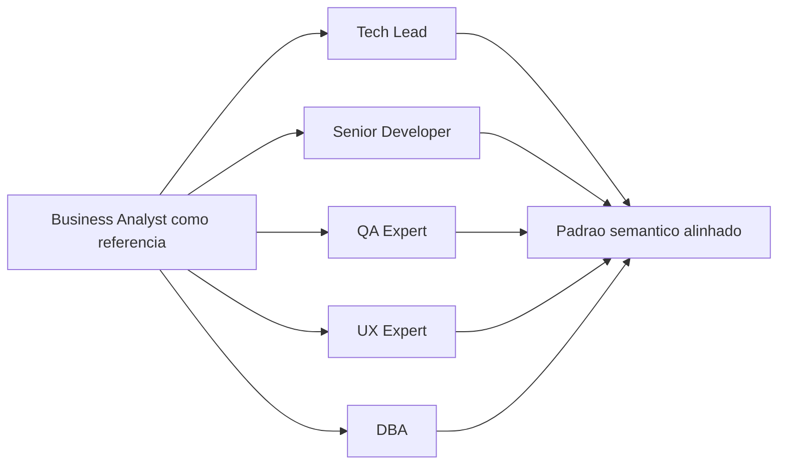

# Atualizacao de memoria - alinhamento dos arquetipos dos agents

## Contexto da mudanca

Foi solicitada a atualizacao dos arquétipos dos agents restantes tomando como referencia o padrao textual e operacional definido em `business-analyst.agent.md`.

## Decisao tomada

Atualizar exclusivamente a secao `### Arquetipo` dos seguintes arquivos:

- `tech-lead.agent.md`
- `senior-developer.agent.md`
- `qa-expert.agent.md`
- `ux-expert.agent.md`
- `dba.agent.md`

Cada arquétipo passou a seguir a mesma estrutura semantica da referencia, com:

- definicao sintetica do papel
- especializacao profunda da funcao
- foco exclusivo de atuacao
- contexto de plataformas ou cenarios complexos
- traducao do objetivo da funcao em saidas acionaveis para o time

## Impacto tecnico/negocio

- Padroniza a densidade e a clareza das personas entre os agents.
- Melhora a descoberta do comportamento esperado de cada funcao.
- Reduz ambiguidades em handoffs e no posicionamento operacional dos agents.

## Proximos passos

1. Revisar se as descricoes `description` dos agents tambem devem refletir esse mesmo nivel de especificidade.
2. Aplicar o mesmo criterio de alinhamento quando novos agents forem adicionados ao pacote.

## Rastreabilidade

- Memoria atualizada: `Agentes/memoria/MEMORIA-COMPARTILHADA.md`
- Arquivos alterados:
  - `Agentes/tech-lead.agent.md`
  - `Agentes/senior-developer.agent.md`
  - `Agentes/qa-expert.agent.md`
  - `Agentes/ux-expert.agent.md`
  - `Agentes/dba.agent.md`
- Referencia usada: `Agentes/business-analyst.agent.md`

## Diagrama da mudanca

