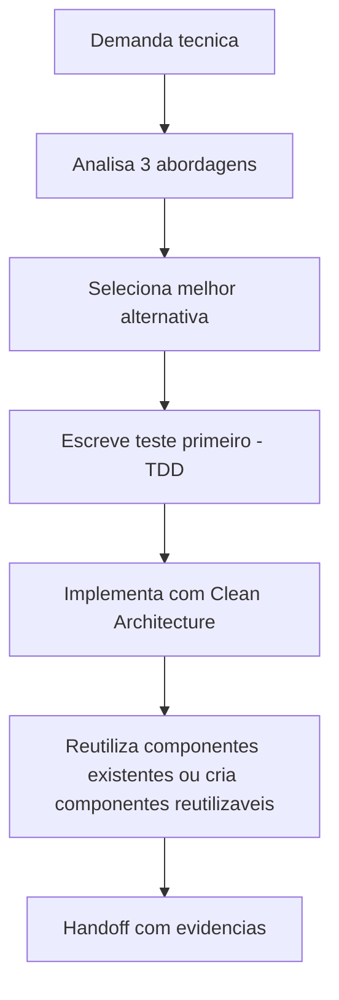

# Atualizacao de memoria - TDD, Clean Architecture e analise de abordagens no Senior Developer

## Contexto da mudanca

Foi solicitado que o Senior Developer passe a usar sempre TDD, adotar abordagens baseadas em Clean Architecture, analisar no minimo 3 abordagens de implementacao com vantagens e desvantagens, e priorizar reutilizacao de componentes existentes e criacao de componentes reutilizaveis.

## Decisao tomada

O `senior-developer.agent.md` passou a explicitar como obrigatorio que:

- toda implementacao siga TDD
- a solucao seja orientada por principios de Clean Architecture quando aplicavel
- ao menos 3 abordagens de implementacao sejam comparadas antes da escolha
- a escolha final registre vantagens, desvantagens e trade-offs
- componentes existentes sejam reutilizados sempre que possivel
- novos componentes sejam concebidos com foco em reutilizacao

## Impacto tecnico/negocio

- Aumenta a qualidade do desenho tecnico antes da implementacao.
- Reduz duplicacao de componentes e inconsistencias na base.
- Melhora testabilidade, isolamento e evolutividade da solucao.

## Proximos passos

1. Avaliar se o Tech Lead deve exigir o comparativo de abordagens como artefato obrigatorio em demandas relevantes.
2. Padronizar um template de analise de abordagens tecnicas em `templates/`.

## Rastreabilidade

- Memoria atualizada: `Agentes/memoria/MEMORIA-COMPARTILHADA.md`
- Arquivo alterado: `Agentes/senior-developer.agent.md`
- Solicitacao base: Senior Developer deve sempre utilizar TDD e Clean Architecture, comparar 3 abordagens e priorizar reutilizacao de componentes

## Diagrama da mudanca

