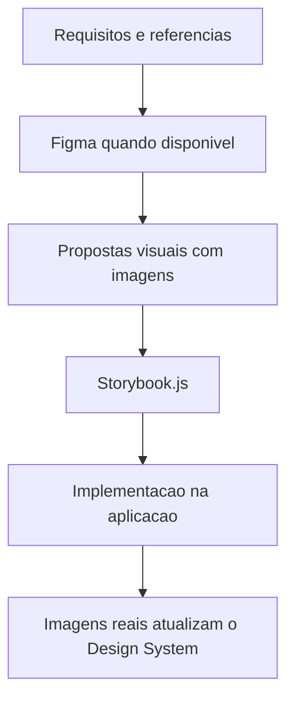

# Atualizacao de memoria - Design System completo do UX com imagens, Figma e Storybook

## Contexto da mudanca

Foi solicitado que o UX Expert passe a elaborar e manter um documento completo de Design System do projeto, com demonstracoes graficas dos componentes e interfaces, atualizacao com imagens reais apos implementacao, consulta ao Figma quando disponivel, uso de ferramentas externas para geracao de imagens e adocao de Storybook.js para apresentacao e manutencao do sistema de design.

## Decisao tomada

O `ux-expert.agent.md` passou a explicitar como obrigatorio que o UX Expert:

- mantenha o documento completo de Design System do projeto
- documente propostas com imagens demonstrativas
- atualize o documento com imagens reais apos a implementacao
- consulte Figma quando houver referencia disponivel
- utilize ferramentas externas quando necessario para gerar demonstracoes visuais
- adote Storybook.js como framework de apresentacao e manutencao do Design System

## Impacto tecnico/negocio

- Melhora a coerencia entre proposta visual, implementacao e documentacao viva do produto.
- Reduz perda de contexto entre design, frontend e manutencao futura.
- Cria um repositorio visual mais confiavel para componentes e interfaces.

## Proximos passos

1. Criar um template especifico para documento de Design System completo do UX Expert.
2. Avaliar se o Senior Developer tambem deve ter responsabilidade explicita de implementar e manter Storybook.js na stack quando houver frontend.

## Rastreabilidade

- Memoria atualizada: `Agentes/memoria/MEMORIA-COMPARTILHADA.md`
- Arquivo alterado: `Agentes/ux-expert.agent.md`
- Solicitacao base: UX deve manter documento completo de Design System com imagens, Figma e Storybook.js

## Diagrama da mudanca

