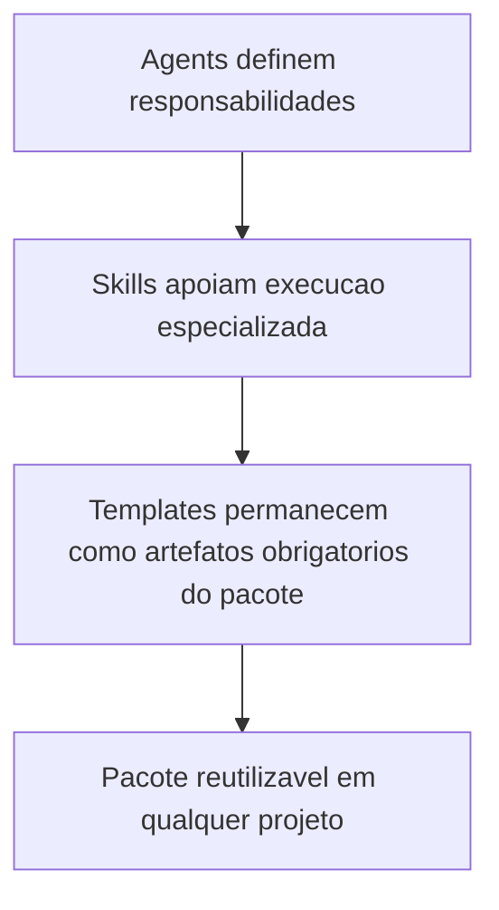

# 2026-03-21 12:23 - Skills genericizadas e alinhadas aos agents

## Objetivo

Tornar as skills do pacote reutilizaveis em qualquer projeto, removendo acoplamentos a um repositorio especifico e alinhando seu uso operacional as responsabilidades dos agents.

## Arquivos alterados

- `skills/documentation-sync/SKILL.md`
- `skills/documentation-sync/assets/template/documentation-impact-checklist.md`
- `skills/review-documentation/SKILL.md`
- `skills/review-documentation/assets/template/review-record-template.md`
- `skills/mermaid-generator/SKILL.md`
- `skills/mermaid-generator/assets/template/style.css`
- `business-analyst.agent.md`
- `senior-developer.agent.md`
- `tech-lead.agent.md`
- `memoria/MEMORIA-COMPARTILHADA.md`

## Resumo das alteracoes

1. `documentation-sync` deixou de depender de caminhos e artefatos de um projeto especifico e passou a operar sobre requisitos, arquitetura, QA, operacao e fechamento conforme existirem no repositorio.
2. `review-documentation` deixou de exigir `/review` e tecnologias especificas, passando a servir qualquer projeto com registro tecnico, changelog ou artefato equivalente.
3. `mermaid-generator` deixou de assumir fluxo de textbook, MkDocs e MicroSim, passando a servir documentacao geral de arquitetura, requisitos, reviews e operacao.
4. Business Analyst, Senior Developer e Tech Lead passaram a referenciar as skills mais aderentes como apoio operacional, sem substituir templates ou gates obrigatorios.
5. A memoria compartilhada recebeu `DEC-049` e `BL-052` para registrar a genericizacao e o alinhamento das skills ao pacote.

## Impacto esperado

- Permitir uso das skills em qualquer projeto sem herdarem convencoes indevidas.
- Reduzir redundancia operacional dentro dos agents ao apontar skills especializadas para PRD, user stories, arquitetura, review tecnico e diagramas.
- Melhorar coerencia entre skills, templates, agents e protocolo comum.

## Rastreabilidade

- Decisao: `DEC-049`
- Backlog: `BL-052`
- Arquivos de apoio principais: `skills/*/SKILL.md`, `business-analyst.agent.md`, `senior-developer.agent.md`, `tech-lead.agent.md`

## Fluxo consolidado

