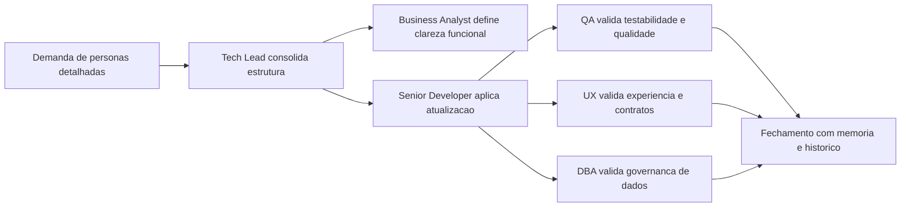

# Atualizacao de memoria - definicao de personas dos agents

## Contexto da mudanca

Foi solicitada a definicao detalhada de personas para cada agent do pacote, com alinhamento explicito as necessidades de cada funcao e atualizacao dos respectivos arquivos `*.agent.md`.

## Decisao tomada

Padronizar todos os agents com uma estrutura de persona operacional contendo:

- Arquetipo
- Foco principal
- Como pensa
- Como decide
- Como comunica
- Anti-padroes que evita
- Metricas de excelencia da persona

A estrutura foi aplicada com especializacao por funcao em:

- `tech-lead.agent.md`
- `business-analyst.agent.md`
- `senior-developer.agent.md`
- `qa-expert.agent.md`
- `ux-expert.agent.md`
- `dba.agent.md`

## Impacto tecnico/negocio

- Melhora a previsibilidade de comportamento de cada agent.
- Reduz ambiguidade em handoffs e criterios de aprovacao.
- Fortalece governanca de qualidade com gates explicitos (QA, UX e DBA).
- Aumenta rastreabilidade da execucao por meio da memoria compartilhada.

## Proximos passos

1. Aplicar a mesma estrutura de persona em futuros agents do pacote.
2. Revisar periodicamente as metricas de excelencia por funcao.
3. Usar as metricas para retroalimentar melhorias no fluxo de colaboracao.

## Rastreabilidade

- Memoria atualizada: `Agentes/memoria/MEMORIA-COMPARTILHADA.md`
- Arquivos alterados: os 6 `*.agent.md` listados acima
- Solicitacao base: "defina detalhadamente as personas para cada agent, alinha com as necessidade da cada funcao e atualize os agesnts com essas personas"

## Diagrama da mudanca

