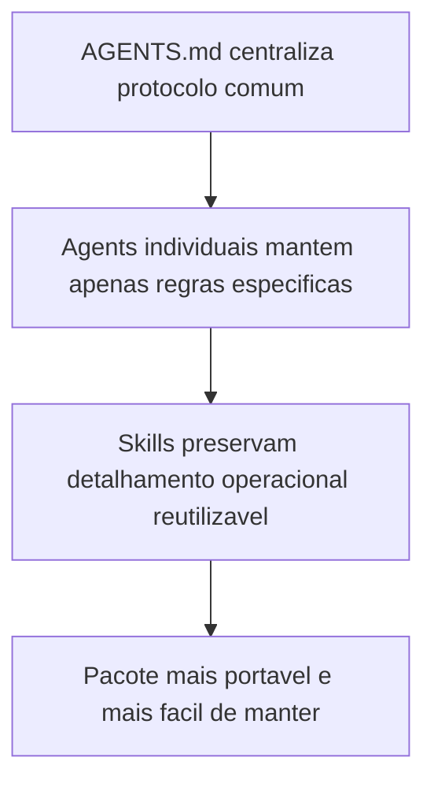

# 2026-03-23 00:01 - Centralizacao do protocolo comum e genericizacao residual de skills

## Objetivo

Reduzir redundancias entre os agents do pacote, reforcar `AGENTS.md` como fonte unica do protocolo transversal e remover referencias residuais a contexto especifico dentro da skill `prompt-logger`.

## Arquivos alterados

- `.github/agents/AGENTS.md`
- `.github/agents/business-analyst.agent.md`
- `.github/agents/senior-developer.agent.md`
- `.github/agents/qa-expert.agent.md`
- `.github/agents/ux-expert.agent.md`
- `.github/agents/dba.agent.md`
- `.github/agents/tech-lead.agent.md`
- `.github/skills/prompt-logger/SKILL.md`
- `.github/agents/memoria/MEMORIA-COMPARTILHADA.md`

## Resumo das alteracoes

1. `AGENTS.md` passou a declarar explicitamente que o protocolo comum obrigatorio e a fonte central das instrucoes transversais, evitando repeticao literal nos agents individuais.
2. O caminho `Agentes/memoria/historico/` foi corrigido para `memoria/historico/`, removendo acoplamento ao nome deste repositorio.
3. Os agents de Business Analyst, Senior Developer, QA Expert, UX Expert, DBA e Tech Lead deixaram de repetir instrucoes comuns de leitura de memoria, uso do `prompt-logger` e sintese de memoria, passando a referenciar o protocolo central.
4. A skill `prompt-logger` teve exemplos e trechos de orientacao genericizados para remover referencias residuais a um repositorio ou arquivo de instrucao especifico.

## Impacto esperado

- Menor custo de manutencao do pacote ao alterar regras transversais.
- Melhor separacao entre protocolo comum e responsabilidades especificas por persona.
- Skill `prompt-logger` mais reutilizavel em qualquer projeto sem exemplos acoplados a um dominio especifico.

## Riscos observados

- Agents individuais podem perder clareza se o consumidor ler apenas o arquivo da persona e ignorar `AGENTS.md`.

## Mitigacoes

- Cada agent alterado passou a explicitar a obrigacao de seguir integralmente o protocolo comum definido em `AGENTS.md`.
- A memoria principal foi atualizada para consolidar a decisao estrutural vigente.

## Rastreabilidade

- Decisao estrutural reforcada: `DEC-STR-15`
- Artefato de log do prompt: `docs/prompts/2026-03-23_001_generalizar-skills-e-agents.md`

## Fluxo consolidado

