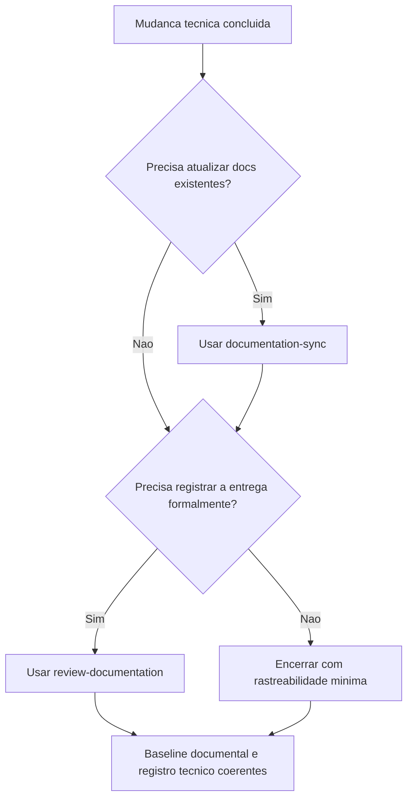

# 2026-03-23 00:02 - Diferenciacao de skills documentais e limpeza residual do catalogo

## Objetivo

Executar os proximos passos pendentes da rodada anterior: clarificar quando usar `documentation-sync` versus `review-documentation` e corrigir inconsistencias residuais no catalogo de skills para manter o pacote portavel e previsivel.

## Arquivos alterados

- `SKILL_HIERARCHY.md`
- `.github/skills/documentation-sync/SKILL.md`
- `.github/skills/review-documentation/SKILL.md`
- `.github/skills/accessibility-review/SKILL.md`
- `.github/agents/memoria/MEMORIA-COMPARTILHADA.md`
- `docs/prompts/2026-03-23_002_executar-proximos-passos.md`

## Resumo das alteracoes

1. `SKILL_HIERARCHY.md` passou a explicitar uma decision tree curta para diferenciar `documentation-sync` e `review-documentation`, incluindo a ordem recomendada quando ambas forem necessarias na mesma entrega.
2. `documentation-sync/SKILL.md` passou a declarar explicitamente que sua funcao e revisar e atualizar documentacao viva existente, sem substituir o registro tecnico formal da entrega.
3. `review-documentation/SKILL.md` passou a declarar explicitamente que sua funcao e registrar a entrega em artefato formal auditavel, sem substituir a manutencao da base documental viva.
4. `accessibility-review/SKILL.md` teve removida a referencia quebrada a `CONNECTORS.md`, que nao existe no repositorio e nao agregava ao uso portavel da skill.

## Resultado da auditoria do catalogo

- As referencias residuais mais relevantes mapeadas nas `SKILL.md` verificadas permaneceram coerentes com a estrutura atual do pacote.
- A referencia quebrada objetiva encontrada nesta rodada foi a mencao a `CONNECTORS.md` em `accessibility-review/SKILL.md`.
- Nao foram identificados, nesta rodada, residuos ativos de nomes de projeto especifico nos arquivos ajustados.

## Impacto esperado

- Menor ambiguidade ao escolher skills documentais durante entregas reais.
- Menor risco de uso incorreto de `review-documentation` como substituto de manutencao de docs, ou de `documentation-sync` como substituto de registro formal de entrega.
- Catalogo de skills mais limpo e portavel.

## Riscos observados

- Ainda pode haver referencias locais validas, mas pouco descobriveis, em skills mais extensas do catalogo.

## Mitigacoes

- Consolidar o criterio de escolha em `SKILL_HIERARCHY.md`.
- Manter a limpeza de referencias residuais como parte de futuras rodadas estruturais do pacote.

## Rastreabilidade

- Log do prompt: `docs/prompts/2026-03-23_002_executar-proximos-passos.md`
- Decisao estrutural relacionada: `DEC-STR-13`
- Decisao estrutural relacionada: `DEC-STR-15`

## Fluxo consolidado

