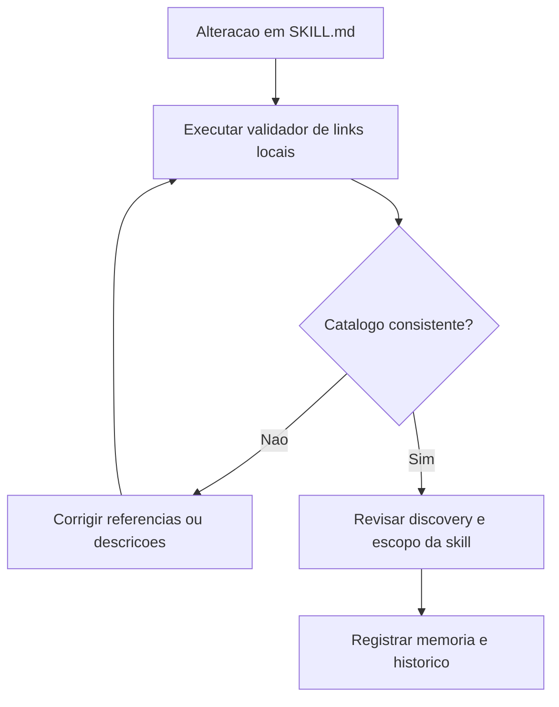

# 2026-03-23 00:03 - Validacao de links das skills e desambiguacao de acessibilidade

## Objetivo

Executar a proxima rodada de endurecimento do pacote: criar uma verificacao deterministica para referencias locais usadas pelas skills e reduzir a sobreposicao de discovery entre `accessibility`, `accessibility-compliance` e `accessibility-review`.

## Arquivos alterados

- `scripts/validate-skill-links.sh`
- `CONTRIBUTING.md`
- `SKILL_HIERARCHY.md`
- `.github/skills/accessibility/SKILL.md`
- `.github/skills/accessibility-compliance/SKILL.md`
- `.github/skills/accessibility-review/SKILL.md`
- `.github/skills/clean-architecture/SKILL.md`
- `.github/agents/memoria/MEMORIA-COMPARTILHADA.md`
- `docs/prompts/2026-03-23_003_executar-proximos-passos-validacao.md`

## Resumo das alteracoes

1. Foi criado `scripts/validate-skill-links.sh` para validar referencias locais usadas em `SKILL.md`, com tratamento de fragmentos `#ancora` e exclusao de globs genericos.
2. `CONTRIBUTING.md` passou a orientar a execucao do validador ao alterar skills com referencias locais para `references/` ou `assets/`.
3. `SKILL_HIERARCHY.md` passou a ter uma secao dedicada para diferenciar `accessibility-review`, `accessibility` e `accessibility-compliance`.
4. As descricoes e orientacoes iniciais das tres skills de acessibilidade foram refinadas para reduzir concorrencia entre auditoria, remediacao web e implementacao de padroes acessiveis.
5. Residuos de links quebrados encontrados durante a validacao foram removidos de `accessibility/SKILL.md` e `clean-architecture/SKILL.md`.

## Resultado da validacao

- O comando `sh scripts/validate-skill-links.sh` concluiu com sucesso.
- Os arquivos alterados nesta rodada ficaram sem erros reportados pelo workspace.
- O catalogo passou a ter uma verificacao simples e reproduzivel para prevenir regressao de links locais nas skills.

## Impacto esperado

- Menor risco de publicacao de skills com referencias locais quebradas.
- Menor ambiguidade ao escolher uma skill de acessibilidade no momento do discovery.
- Melhor previsibilidade de manutencao do pacote ao evoluir skills que dependem de `references/` e `assets/`.

## Riscos observados

- O validador cobre referencias locais explicitas nos padroes hoje usados, mas pode precisar ser expandido se o pacote adotar novos formatos de link local nas skills.

## Mitigacoes

- Manter a regra de contribuicao apontando para o script.
- Evoluir o validador junto com a convencao de escrita das skills quando surgirem novos formatos legitimamente adotados.

## Rastreabilidade

- Log do prompt: `docs/prompts/2026-03-23_003_executar-proximos-passos-validacao.md`
- Decisao estrutural relacionada: `DEC-STR-13`
- Decisao estrutural relacionada: `DEC-STR-15`

## Fluxo consolidado

