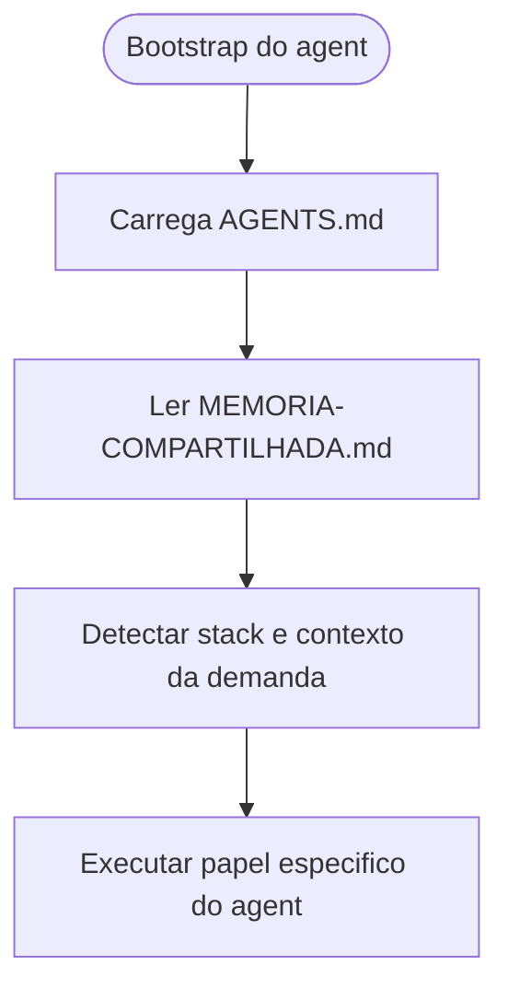

# Explicitacao do bootstrap de AGENTS.md em todos os agents

## Contexto

O pacote ja centralizava o protocolo transversal em [AGENTS.md](../../AGENTS.md), e os arquivos individuais dos agents o referenciavam de forma textual. Ainda assim, a carga inicial desse arquivo nao estava descrita como passo operacional explicito de bootstrap em todos os roles, o que deixava margem para interpretacao como mera referencia documental.

## Motivacao

Eliminar ambiguidade entre:

- seguir o protocolo comum por referencia indireta
- carregar efetivamente [AGENTS.md](../../AGENTS.md) antes de qualquer outra acao do agent

A mudanca visa tornar inequívoco que o protocolo comum e o primeiro artefato operacional a ser consumido, seguido pela leitura de [MEMORIA-COMPARTILHADA.md](../MEMORIA-COMPARTILHADA.md).

## Decisao adotada

1. Atualizar [AGENTS.md](../../AGENTS.md) para declarar explicitamente que todo agent deve carregar esse arquivo antes de iniciar.
2. Atualizar os 6 arquivos individuais de agent para incluir, como bootstrap textual, a leitura de [AGENTS.md](../../AGENTS.md) antes da memoria compartilhada.
3. Registrar a decisao estrutural na memoria compartilhada como `DEC-STR-22`.

## Arquivos impactados

- [AGENTS.md](../../AGENTS.md)
- [tech-lead.agent.md](../../tech-lead.agent.md)
- [senior-developer.agent.md](../../senior-developer.agent.md)
- [qa-expert.agent.md](../../qa-expert.agent.md)
- [ux-expert.agent.md](../../ux-expert.agent.md)
- [dba.agent.md](../../dba.agent.md)
- [business-analyst.agent.md](../../business-analyst.agent.md)
- [MEMORIA-COMPARTILHADA.md](../MEMORIA-COMPARTILHADA.md)

## Impacto observado

- Todos os roles passam a ter bootstrap operacional explícito e homogêneo.
- O protocolo transversal deixa de depender de inferência do leitor.
- A ordem de carga do contexto estrutural do pacote fica padronizada: `AGENTS.md` -> `MEMORIA-COMPARTILHADA.md` -> demais artefatos da demanda.

## Riscos residuais

- Agents externos ao pacote ou cópias não sincronizadas ainda podem operar com a versão anterior.
- A mudança melhora clareza, mas não substitui a necessidade de manter [AGENTS.md](../../AGENTS.md) atualizado.

## Validacao

- Conferida a presença do novo texto de bootstrap em todos os 6 arquivos de agent.
- Conferida a atualização do protocolo comum em [AGENTS.md](../../AGENTS.md).
- Conferido o registro estrutural em [MEMORIA-COMPARTILHADA.md](../MEMORIA-COMPARTILHADA.md).

