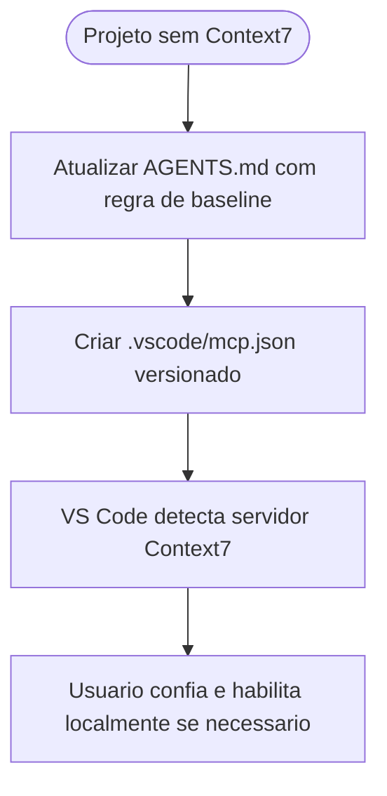

# Padronizacao do Context7 MCP no workspace do projeto

## Contexto

O pacote nao possuia ate entao um baseline versionado de MCP no workspace do projeto. O pedido atual exigiu que [AGENTS.md](../../AGENTS.md) passasse a orientar a instalacao e habilitacao do Context7 MCP no escopo do projeto quando a integracao ainda nao estivesse presente.

## Motivacao

- Garantir acesso consistente a documentacao atualizada via Context7 no nivel do projeto.
- Evitar dependencia exclusiva de configuracoes globais do usuario.
- Manter o baseline compativel com o editor atual e sem versionar credenciais.

## Decisao adotada

1. Atualizar [AGENTS.md](../../AGENTS.md) para exigir o baseline de Context7 MCP no projeto quando ausente.
2. Definir `.vscode/mcp.json` como artefato versionado do workspace para o setup do Context7 neste repositorio.
3. Adotar configuracao remota HTTP para `https://mcp.context7.com/mcp`, evitando depender de `node`/`npx` no ambiente atual para o baseline compartilhado.
4. Registrar explicitamente que o estado final de habilitacao/confianca no VS Code permanece local ao editor e nao e totalmente versionavel no repositório.

## Arquivos impactados

- [AGENTS.md](../../AGENTS.md)
- [MEMORIA-COMPARTILHADA.md](../MEMORIA-COMPARTILHADA.md)
- [.vscode/mcp.json](../../../../.vscode/mcp.json)

## Impacto observado

- O projeto passa a distribuir configuracao MCP de workspace pronta para o Context7.
- O protocolo comum dos agents agora trata o baseline MCP como parte do setup do projeto quando ausente.
- A solucao evita bloquear o baseline por indisponibilidade local de `node`, observada no ambiente atual.

## Riscos residuais

- A habilitacao final do servidor continua dependente da confianca local do VS Code em cada maquina.
- Uso autenticado com maior limite ou acesso adicional continua exigindo configuracao local de headers/API key fora do repositorio.

## Validacao

- Confirmada a ausencia previa de configuracao MCP no workspace.
- Confirmado o formato de `.vscode/mcp.json` como configuracao de workspace do VS Code.
- Confirmada a atualizacao do protocolo comum e o registro estrutural na memoria compartilhada.

