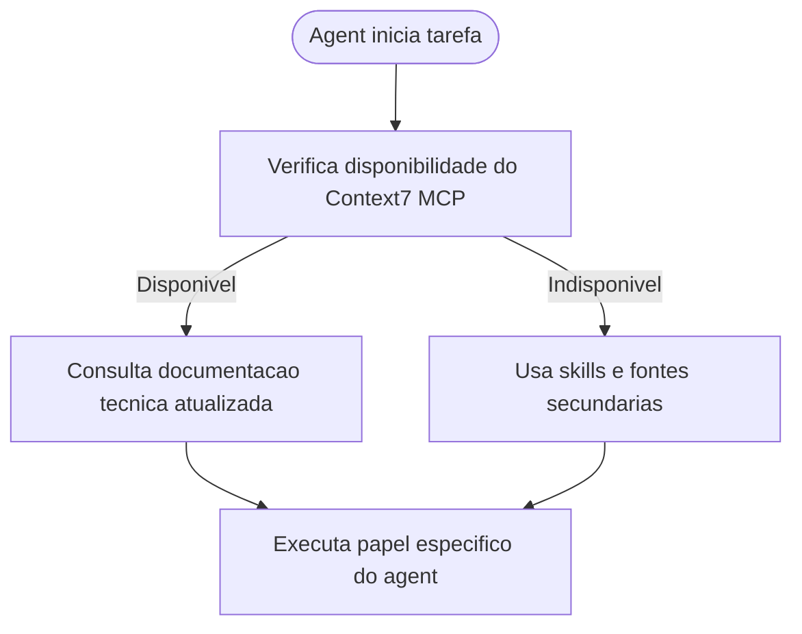

# Propagacao do uso operacional do Context7 MCP para todos os agents

## Contexto

O pacote ja possuia baseline de Context7 MCP no workspace e protocolo comum orientando sua configuracao no projeto. Ainda assim, o uso operacional da ferramenta nao estava explicitado de forma uniforme nos seis arquivos individuais de agent.

## Motivacao

- Garantir que todos os roles consultem documentacao tecnica atualizada quando o Context7 estiver disponivel.
- Reduzir dependencia de conhecimento estatico ou busca generica em tarefas tecnicas do pacote.
- Tornar o comportamento consistente entre Tech Lead, Business Analyst, Senior Developer, QA Expert, UX Expert e DBA.

## Decisao adotada

1. Atualizar [AGENTS.md](../../AGENTS.md) para declarar o Context7 MCP como fonte preferencial de documentacao tecnica quando disponivel e habilitado.
2. Atualizar os 6 arquivos individuais de agent para explicitar o uso do Context7 em seus respectivos dominios.
3. Manter fallback explicito para skills e demais fontes quando o MCP nao estiver disponivel ou habilitado.

## Arquivos impactados

- [AGENTS.md](../../AGENTS.md)
- [tech-lead.agent.md](../../tech-lead.agent.md)
- [senior-developer.agent.md](../../senior-developer.agent.md)
- [qa-expert.agent.md](../../qa-expert.agent.md)
- [ux-expert.agent.md](../../ux-expert.agent.md)
- [dba.agent.md](../../dba.agent.md)
- [business-analyst.agent.md](../../business-analyst.agent.md)
- [MEMORIA-COMPARTILHADA.md](../MEMORIA-COMPARTILHADA.md)

## Impacto observado

- Todos os agents passam a tratar o Context7 como fonte preferencial de documentacao tecnica quando ele estiver disponivel.
- O comportamento deixa de depender apenas de inferencia a partir do protocolo comum ou do baseline MCP do workspace.
- A distribuicao de responsabilidades continua preservada, com uso contextual do Context7 em cada role.

## Riscos residuais

- O Context7 continua dependente de disponibilidade e habilitacao no cliente MCP do operador.
- Em stacks ou ferramentas fora da cobertura do Context7, os agents ainda precisarao recorrer a skills e fontes complementares.

## Validacao

- Conferida a inclusao da diretriz de uso do Context7 no protocolo comum de [AGENTS.md](../../AGENTS.md).
- Conferida a presenca de orientacao explicita nos 6 arquivos individuais de agent.
- Conferido o registro estrutural correspondente em [MEMORIA-COMPARTILHADA.md](../MEMORIA-COMPARTILHADA.md).

