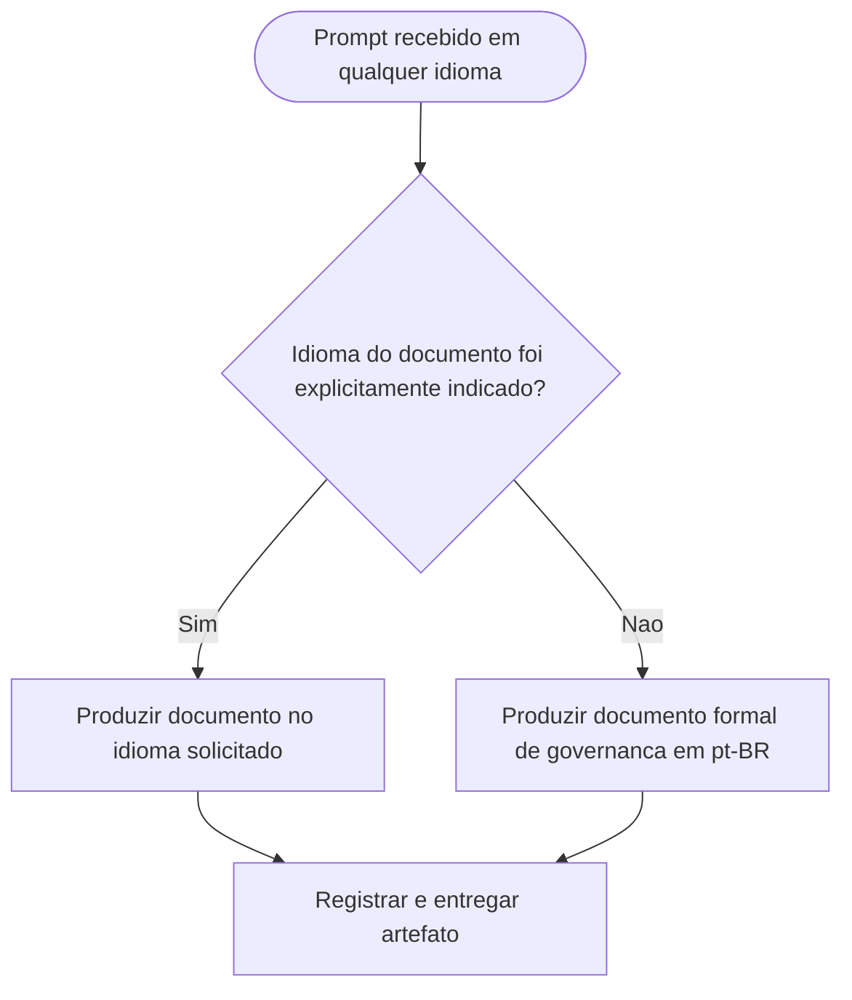

# Padronizacao do portugues do Brasil nos documentos de governanca

## Contexto

Os agents do pacote produzem artefatos formais de governanca, mas nao havia ate entao uma regra transversal determinando o idioma padrao desses documentos quando o prompt fosse recebido em outro idioma.

## Motivacao

- Uniformizar a linguagem oficial dos artefatos de governanca do projeto.
- Evitar que prompts em outro idioma alterem incidentalmente o idioma de documentos formais.
- Preservar a excecao para casos em que o idioma do documento seja explicitamente solicitado.
- Evitar conflito com a skill `prompt-logger`, que mantem os logs no idioma do prompt.

## Decisao adotada

1. Atualizar [AGENTS.md](../../AGENTS.md) com a regra comum de idioma padrao `pt-BR` para documentos formais de governanca.
2. Delimitar explicitamente que a regra nao altera o idioma dos logs produzidos pela skill `prompt-logger`.
3. Atualizar os 6 arquivos individuais de agent para reforcar a obrigacao em seus artefatos de governanca especificos.

## Arquivos impactados

- [AGENTS.md](../../AGENTS.md)
- [tech-lead.agent.md](../../tech-lead.agent.md)
- [senior-developer.agent.md](../../senior-developer.agent.md)
- [qa-expert.agent.md](../../qa-expert.agent.md)
- [ux-expert.agent.md](../../ux-expert.agent.md)
- [dba.agent.md](../../dba.agent.md)
- [business-analyst.agent.md](../../business-analyst.agent.md)
- [MEMORIA-COMPARTILHADA.md](../MEMORIA-COMPARTILHADA.md)

## Impacto observado

- O pacote passa a ter idioma oficial padrao para artefatos formais de governanca.
- A linguagem desses documentos deixa de variar com o idioma do prompt.
- A excecao fica claramente controlada por instrucao explicita de idioma do documento.

## Riscos residuais

- O conceito de "documento de governanca" pode exigir julgamento contextual em alguns entregaveis limítrofes.
- Trechos tecnicos, citacoes e payloads ainda podem precisar permanecer no idioma original por precisao.

## Validacao

- Conferida a inclusao da regra comum em [AGENTS.md](../../AGENTS.md).
- Conferida a propagacao da obrigacao para os 6 arquivos individuais de agent.
- Conferido o registro estrutural correspondente em [MEMORIA-COMPARTILHADA.md](../MEMORIA-COMPARTILHADA.md).

