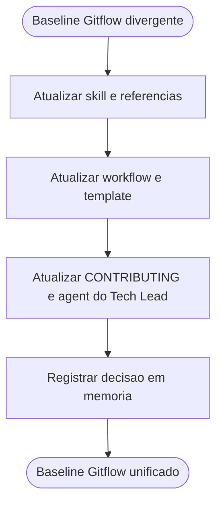

# Alinhamento do baseline Gitflow entre skill, automacao e documentacao

## Contexto

O pacote apresentava divergencia entre a skill `gitflow`, que orientava `bugfix/*`, e a automacao/documentacao ativa do repositorio, que aceitava `support/*` mas nao `bugfix/*`.

## Motivacao

- Remover contradicao entre orientacao ao usuario e validacao automatica do repositorio.
- Evitar que a skill recomendasse branches rejeitadas pelo workflow de PR.
- Manter um baseline Gitflow unificado e rastreavel entre skill, workflow, template, contribuicao e agents.

## Decisao adotada

1. Padronizar o baseline Gitflow do pacote para aceitar `feature/*`, `bugfix/*`, `release/*`, `hotfix/*` e `support/*`.
2. Atualizar a skill `gitflow` e suas referencias para refletir esse conjunto de branch types.
3. Atualizar o workflow de PR, o template de PR, o guia de contribuicao e a regra do Tech Lead para o mesmo conjunto.

## Arquivos impactados

- [.github/skills/gitflow/SKILL.md](../../../skills/gitflow/SKILL.md)
- [.github/skills/gitflow/references/branching-model.md](../../../skills/gitflow/references/branching-model.md)
- [.github/skills/gitflow/references/policies.md](../../../skills/gitflow/references/policies.md)
- [.github/workflows/pr-governance.yml](../../../workflows/pr-governance.yml)
- [.github/pull_request_template.md](../../../pull_request_template.md)
- [CONTRIBUTING.md](../../../../CONTRIBUTING.md)
- [tech-lead.agent.md](../../tech-lead.agent.md)
- [MEMORIA-COMPARTILHADA.md](../MEMORIA-COMPARTILHADA.md)

## Impacto observado

- A skill deixa de sugerir um prefixo que a automacao rejeita.
- O workflow e o template passam a aceitar `bugfix/*` sem perder suporte a `support/*`.
- O baseline Gitflow fica coerente entre governanca operacional, documentacao e validacao automatizada.

## Riscos residuais

- `support/*` continua sendo um fluxo mais situacional e exige criterio explicito de uso pela lideranca tecnica.
- A politica de targets para `support/*` pode exigir decisao contextual de backport/cherry-pick conforme a linha suportada.

## Validacao

- Conferida a atualizacao da regex do workflow de PR.
- Conferida a inclusao de `bugfix/*` no template de PR, em `CONTRIBUTING.md` e na regra do Tech Lead.
- Conferida a inclusao de `support/*` na skill `gitflow` e em suas referencias.

