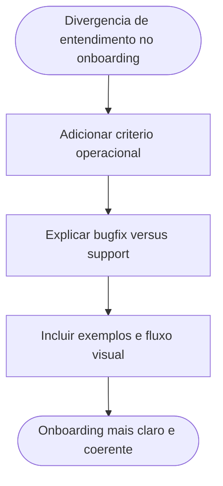

# Clarificacao do onboarding para escolha entre `bugfix/*` e `support/*`

## Contexto

Depois do alinhamento do baseline Gitflow do pacote, o onboarding ainda nao explicava a diferenca operacional entre `bugfix/*` e `support/*`.

## Objetivo

- Reduzir ambiguidade para quem entra no pacote e precisa abrir uma branch rapidamente.
- Explicar quando `bugfix/*` e o fluxo correto dentro de `develop`.
- Explicar quando `support/*` deve ser reservado para manutencao segregada de uma linha suportada.

## Alteracao aplicada

Foi adicionada uma secao em `ONBOARD.md` com:

1. definicao objetiva de `bugfix/*`;
2. definicao objetiva de `support/*`;
3. regra pratica de escolha;
4. exemplos de nomes de branch;
5. diagrama Mermaid para decisao rapida.

## Impacto

- O onboarding fica coerente com `DEC-STR-26` sem alterar o baseline Gitflow.
- Novos operadores conseguem distinguir manutencao rotineira em `develop` de sustentacao prolongada em linha separada.

## Arquivo impactado

- [ONBOARD.md](../../../../ONBOARD.md)

