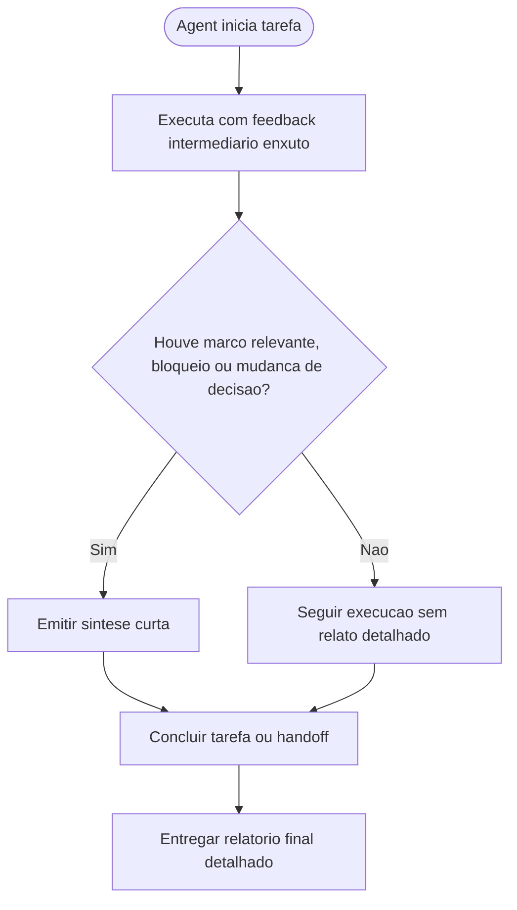

# Padronizacao de comunicacao enxuta durante a execucao dos agents

## Contexto

Os agents do pacote mantinham orientacoes de comunicacao objetivas, mas ainda sem uma regra transversal explicita para reduzir feedbacks visuais durante a execucao e concentrar o detalhamento completo no encerramento da tarefa.

## Motivacao

- Reduzir ruido operacional durante a execucao das tarefas.
- Preservar rastreabilidade sem exigir relatos extensos a cada marco intermediario.
- Padronizar um relatorio final detalhado com decisoes, arquivos impactados e atividades executadas.
- Manter consistencia entre o protocolo comum e os 6 arquivos individuais de agent.

## Decisao adotada

1. Atualizar [AGENTS.md](../../AGENTS.md) com uma regra transversal para limitar feedbacks intermediarios a sinteses curtas por marco, bloqueio, mudanca de decisao ou proximo passo imediato.
2. Atualizar os 6 arquivos individuais de agent para alinhar a secao `Como comunica` ao novo padrao de execucao enxuta e relatorio final detalhado.
3. Registrar a decisao estrutural correspondente em [MEMORIA-COMPARTILHADA.md](../MEMORIA-COMPARTILHADA.md).

## Arquivos impactados

- [AGENTS.md](../../AGENTS.md)
- [tech-lead.agent.md](../../tech-lead.agent.md)
- [senior-developer.agent.md](../../senior-developer.agent.md)
- [qa-expert.agent.md](../../qa-expert.agent.md)
- [ux-expert.agent.md](../../ux-expert.agent.md)
- [dba.agent.md](../../dba.agent.md)
- [business-analyst.agent.md](../../business-analyst.agent.md)
- [MEMORIA-COMPARTILHADA.md](../MEMORIA-COMPARTILHADA.md)

## Impacto observado

- O pacote passa a explicitar um padrao operacional com menor ruido visual durante a execucao.
- O detalhamento completo fica concentrado no encerramento ou no handoff formal, preservando auditoria e tomada de decisao.
- A politica de comunicacao fica consistente entre protocolo comum, personas individuais e memoria estrutural.

## Riscos residuais

- A reducao de feedback intermediario exige julgamento para nao omitir bloqueios realmente relevantes.
- Alguns fluxos mais longos ainda podem demandar checkpoints adicionais quando houver risco, dependencia externa ou decisao pendente.

## Validacao

- Conferida a inclusao da regra comum de comunicacao enxuta em [AGENTS.md](../../AGENTS.md).
- Conferido o alinhamento da secao `Como comunica` nos 6 arquivos individuais de agent.
- Conferido o registro estrutural correspondente em [MEMORIA-COMPARTILHADA.md](../MEMORIA-COMPARTILHADA.md).

