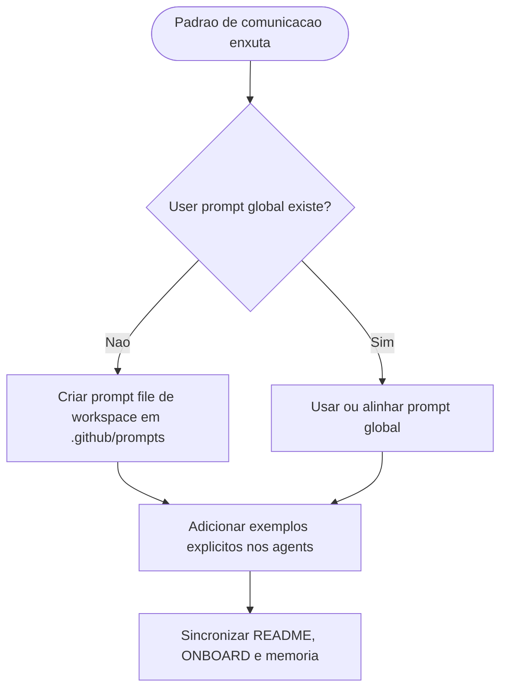

# Adicao de prompt reutilizavel de workspace e exemplos explicitos de comunicacao nos agents

## Contexto

A politica de comunicacao enxuta ja havia sido formalizada no pacote, mas ainda faltavam dois desdobramentos operacionais: um prompt reutilizavel para aplicar esse padrao fora do texto dos agents e exemplos explicitos de `status curto` e `relatorio final detalhado` nas personas individuais.

## Motivacao

- Reduzir ambiguidade na aplicacao pratica da comunicacao enxuta.
- Oferecer um atalho reutilizavel no workspace para acionar o padrao diretamente no chat.
- Manter README, ONBOARD, memoria e arquivos dos agents coerentes com o novo artefato.
- Contornar a ausencia do diretorio de user prompts do ambiente atual com uma alternativa suportada pelo VS Code: prompt file de workspace em `.github/prompts/`.

## Decisao adotada

1. Criar [execucao-enxuta.prompt.md](../../prompts/execucao-enxuta.prompt.md) como prompt file de workspace para tarefas com feedback intermediario minimo e relatorio final detalhado.
2. Atualizar os 6 arquivos individuais de agent para adicionar exemplos explicitos de `status curto` e `relatorio final detalhado` na secao `Como comunica`.
3. Atualizar [README.md](../../../../README.md) e [ONBOARD.md](../../../../ONBOARD.md) para expor o novo prompt reutilizavel.
4. Registrar o novo artefato permanente na memoria compartilhada.

## Arquivos impactados

- [execucao-enxuta.prompt.md](../../prompts/execucao-enxuta.prompt.md)
- [tech-lead.agent.md](../../tech-lead.agent.md)
- [business-analyst.agent.md](../../business-analyst.agent.md)
- [senior-developer.agent.md](../../senior-developer.agent.md)
- [qa-expert.agent.md](../../qa-expert.agent.md)
- [ux-expert.agent.md](../../ux-expert.agent.md)
- [dba.agent.md](../../dba.agent.md)
- [README.md](../../../../README.md)
- [ONBOARD.md](../../../../ONBOARD.md)
- [MEMORIA-COMPARTILHADA.md](../MEMORIA-COMPARTILHADA.md)

## Impacto observado

- O pacote passa a ter um atalho reutilizavel no workspace para acionar o padrao de execucao enxuta.
- Os agents passam a ter exemplos concretos do formato esperado para status intermediario e relatorio final.
- A documentacao principal do repositorio deixa claro onde esse prompt pode ser encontrado e quando usa-lo.

## Riscos residuais

- O prompt file de workspace nao substitui prompt files de usuario quando o operador quiser sincronizacao entre workspaces.
- Os exemplos nos agents continuam ilustrativos e exigem adaptacao contextual a cada tarefa.

## Validacao

- Confirmada a criacao de [execucao-enxuta.prompt.md](../../prompts/execucao-enxuta.prompt.md) no local suportado pelo VS Code para prompts de workspace.
- Confirmada a adicao de exemplos explicitos nos 6 arquivos individuais de agent.
- Confirmada a atualizacao de [README.md](../../../../README.md), [ONBOARD.md](../../../../ONBOARD.md) e [MEMORIA-COMPARTILHADA.md](../MEMORIA-COMPARTILHADA.md).

