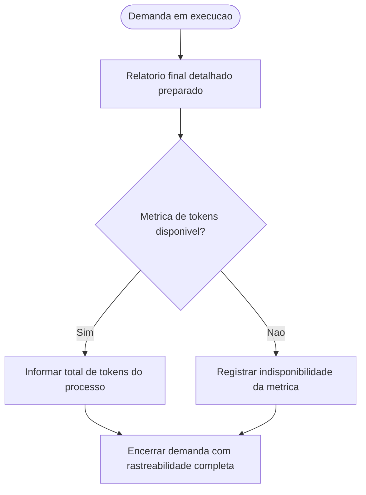

# Inclusao do total de tokens no relatorio final das demandas

## Contexto

O pacote ja padronizava o encerramento das demandas com um relatorio final detalhado, mas ainda nao exigia a apresentacao do total de tokens gastos ao longo de todo o processo.

## Motivacao

- Acrescentar uma metrica operacional objetiva ao fechamento das demandas.
- Tornar o consumo de tokens parte explicita da governanca de execucao.
- Evitar omissao silenciosa quando a plataforma nao expuser essa telemetria.
- Manter coerencia entre protocolo comum, arquivos individuais dos agents, prompt reutilizavel e memoria estrutural.

## Decisao adotada

1. Atualizar [AGENTS.md](../../AGENTS.md) para exigir que o relatorio final das demandas informe o total de tokens gastos no processo inteiro.
2. Determinar que, quando a plataforma, ferramenta ou ambiente nao expuser essa metrica, o agent registre explicitamente a indisponibilidade do dado.
3. Atualizar os 6 arquivos individuais de agent para refletir a nova exigencia no encerramento e em seus exemplos de relatorio final.
4. Atualizar [execucao-enxuta.prompt.md](../../prompts/execucao-enxuta.prompt.md) para manter o prompt reutilizavel alinhado ao novo requisito.
5. Registrar a decisao estrutural correspondente em [MEMORIA-COMPARTILHADA.md](../MEMORIA-COMPARTILHADA.md).

## Arquivos impactados

- [AGENTS.md](../../AGENTS.md)
- [tech-lead.agent.md](../../tech-lead.agent.md)
- [business-analyst.agent.md](../../business-analyst.agent.md)
- [senior-developer.agent.md](../../senior-developer.agent.md)
- [qa-expert.agent.md](../../qa-expert.agent.md)
- [ux-expert.agent.md](../../ux-expert.agent.md)
- [dba.agent.md](../../dba.agent.md)
- [execucao-enxuta.prompt.md](../../prompts/execucao-enxuta.prompt.md)
- [MEMORIA-COMPARTILHADA.md](../MEMORIA-COMPARTILHADA.md)

## Impacto observado

- Todos os agents passam a tratar o total de tokens como parte do relatorio final das demandas.
- O encerramento fica mais consistente entre personas e prompt reutilizavel.
- O pacote deixa explicito que a indisponibilidade dessa metrica deve ser declarada, em vez de omitida.

## Riscos residuais

- A disponibilidade real da metrica continua dependente da plataforma, ferramenta ou ambiente de execucao.
- Em alguns contextos, o valor pode precisar ser consolidado manualmente ou informado como indisponivel.

## Validacao

- Confirmada a inclusao da regra transversal em [AGENTS.md](../../AGENTS.md).
- Confirmada a propagacao da exigencia para os 6 arquivos individuais de agent.
- Confirmada a atualizacao do prompt reutilizavel [execucao-enxuta.prompt.md](../../prompts/execucao-enxuta.prompt.md).
- Confirmado o registro estrutural correspondente em [MEMORIA-COMPARTILHADA.md](../MEMORIA-COMPARTILHADA.md).

