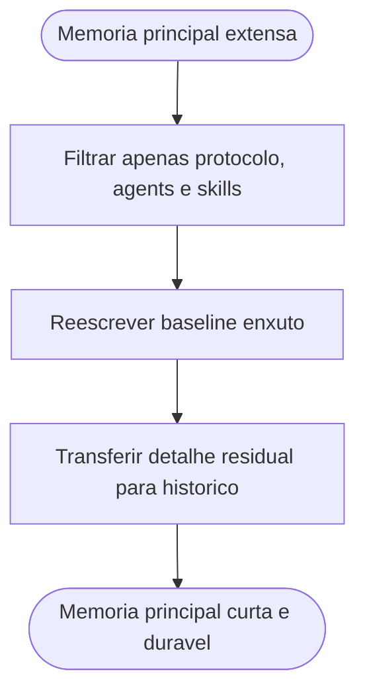

# Consolidacao da memoria compartilhada para protocolo, agents e skills

## Contexto

A memoria compartilhada ainda mantinha ownerships, artefatos permanentes, backlog, riscos recorrentes e uma lista extensa de referencias historicas. O novo pedido restringiu a memoria principal a um resumo que preserve apenas decisoes relativas ao protocolo e ao comportamento dos agents e das skills.

## Motivacao

- Reduzir custo de leitura antes da execucao de novas demandas.
- Preservar na memoria principal apenas o baseline duravel de protocolo e comportamento.
- Remover seções periféricas que já podem permanecer exclusivamente no histórico.
- Manter rastreabilidade sem reintroduzir redundância no arquivo principal.

## Decisao adotada

1. Reescrever [MEMORIA-COMPARTILHADA.md](../MEMORIA-COMPARTILHADA.md) como resumo estrutural focado em protocolo, comportamento dos agents e uso das skills.
2. Preservar regras de persistência, contexto mínimo, um resumo estrutural e apenas as decisões ativas ligadas a protocolo, agents e skills.
3. Remover da memória principal ownerships, artefatos permanentes, backlog, riscos permanentes e a lista detalhada de referências históricas.
4. Manter no histórico os detalhes cronológicos e os registros extensos anteriormente armazenados.

## Arquivos impactados

- [MEMORIA-COMPARTILHADA.md](../MEMORIA-COMPARTILHADA.md)

## Impacto observado

- A memória principal passa a ser mais curta e mais aderente ao papel de baseline operacional.
- A leitura pré-execução fica focada em protocolo, comportamento dos agents e disciplina de uso das skills.
- O histórico continua concentrando a cronologia e os detalhes removidos da memória principal.

## Riscos residuais

- Algumas informações antes disponíveis na memória principal agora exigem consulta direta ao histórico.
- Novas mudanças estruturais precisarão preservar a disciplina de não reexpandir a memória com seções periféricas.

## Validacao

- Confirmada a remoção das seções periféricas da memória principal.
- Confirmada a preservação das decisões centrais de protocolo, agents e skills.
- Confirmada a manutenção de uma referência explícita ao diretório de histórico.

