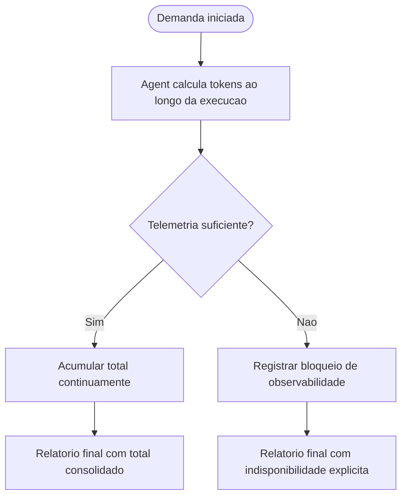

# Calculo continuo de tokens durante a execucao das demandas

## Contexto

O pacote ja exigia informar o total de tokens no relatorio final das demandas, mas ainda nao determinava que os agents mantivessem esse calculo de forma continua ao longo da execucao.

## Motivacao

- Tornar o controle de tokens uma disciplina operacional permanente, e nao apenas um item de fechamento.
- Garantir que todos os agents acompanhem o consumo acumulado durante a execucao da demanda.
- Preservar o total consolidado no relatorio final sem mascarar cenarios de baixa observabilidade.
- Manter coerencia entre protocolo comum, arquivos individuais dos agents, prompt reutilizavel e memoria estrutural.

## Decisao adotada

1. Atualizar [AGENTS.md](../../AGENTS.md) para exigir que todo agent calcule e mantenha acumulado o consumo de tokens durante toda a execucao, usando a melhor telemetria disponivel.
2. Refinar a regra de fechamento para exigir total consolidado no relatorio final e, quando nao houver dados suficientes para calculo confiavel, registrar explicitamente o bloqueio de observabilidade.
3. Atualizar os 6 arquivos individuais de agent para refletir o comportamento operacional continuo e ajustar exemplos de status curto e relatorio final.
4. Atualizar [execucao-enxuta.prompt.md](../../prompts/execucao-enxuta.prompt.md) para alinhar o prompt reutilizavel ao novo fluxo.
5. Registrar as decisoes estruturais correspondentes em [MEMORIA-COMPARTILHADA.md](../MEMORIA-COMPARTILHADA.md).

## Arquivos impactados

- [AGENTS.md](../../AGENTS.md)
- [tech-lead.agent.md](../../tech-lead.agent.md)
- [business-analyst.agent.md](../../business-analyst.agent.md)
- [senior-developer.agent.md](../../senior-developer.agent.md)
- [qa-expert.agent.md](../../qa-expert.agent.md)
- [ux-expert.agent.md](../../ux-expert.agent.md)
- [dba.agent.md](../../dba.agent.md)
- [execucao-enxuta.prompt.md](../../prompts/execucao-enxuta.prompt.md)
- [MEMORIA-COMPARTILHADA.md](../MEMORIA-COMPARTILHADA.md)

## Impacto observado

- O controle de tokens passa a ser parte do comportamento em execucao de todos os agents.
- O relatorio final continua consolidando o total do processo, agora como resultado de um acompanhamento continuo.
- O pacote distingue melhor indisponibilidade simples de um bloqueio real de observabilidade.

## Riscos residuais

- O calculo continuo ainda depende da telemetria realmente exposta pela plataforma, ferramenta ou ambiente.
- Em alguns contextos, o valor final pode continuar indisponivel mesmo apos a tentativa de acumulacao.

## Validacao

- Confirmada a atualizacao do protocolo comum em [AGENTS.md](../../AGENTS.md).
- Confirmada a propagacao do comportamento continuo e dos exemplos ajustados nos 6 arquivos individuais de agent.
- Confirmada a atualizacao do prompt reutilizavel [execucao-enxuta.prompt.md](../../prompts/execucao-enxuta.prompt.md).
- Confirmado o registro estrutural correspondente em [MEMORIA-COMPARTILHADA.md](../MEMORIA-COMPARTILHADA.md).

