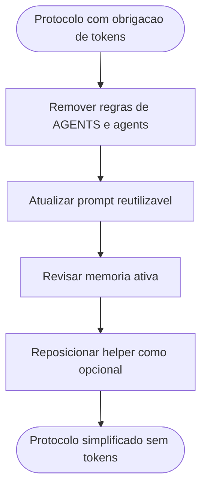

# Remocao da obrigatoriedade de tokens no protocolo

## Contexto

O pacote havia incorporado regras transversais para calcular, acompanhar e exibir estimativa de tokens no protocolo comum, nos agents e no prompt reutilizavel. Em seguida, foi decidido remover essa obrigatoriedade do protocolo, mantendo apenas o helper local como utilitario opcional do repositorio.

## Motivacao

- Retirar uma exigencia operacional que nao era mais desejada no fluxo padrao do pacote.
- Simplificar o protocolo e os relatorios finais dos agents.
- Preservar o helper de estimativa como ferramenta opcional, sem impor seu uso a toda execucao.
- Manter rastreabilidade da reversao sem reescrever o historico anterior.

## Decisao adotada

1. Remover de [AGENTS.md](../../AGENTS.md) as regras que exigiam calculo, acumulacao e exibicao de tokens.
2. Atualizar os 6 arquivos individuais de agent para remover referencias a tokens durante a execucao, nos exemplos de status curto e no relatorio final.
3. Atualizar [execucao-enxuta.prompt.md](../../prompts/execucao-enxuta.prompt.md) para retirar a instrucao de estimativa de tokens e sua exibicao no encerramento.
4. Atualizar [MEMORIA-COMPARTILHADA.md](../MEMORIA-COMPARTILHADA.md) para retirar as decisoes ativas de protocolo sobre tokens e manter apenas a nocao de utilitarios opcionais.
5. Ajustar [docs/estimativa-de-tokens.md](../../../docs/estimativa-de-tokens.md), [README.md](../../../README.md) e [ONBOARD.md](../../../ONBOARD.md) para tratar o helper como opcional, nao protocolar.

## Arquivos impactados

- [AGENTS.md](../../AGENTS.md)
- [tech-lead.agent.md](../../tech-lead.agent.md)
- [business-analyst.agent.md](../../business-analyst.agent.md)
- [senior-developer.agent.md](../../senior-developer.agent.md)
- [qa-expert.agent.md](../../qa-expert.agent.md)
- [ux-expert.agent.md](../../ux-expert.agent.md)
- [dba.agent.md](../../dba.agent.md)
- [execucao-enxuta.prompt.md](../../prompts/execucao-enxuta.prompt.md)
- [MEMORIA-COMPARTILHADA.md](../MEMORIA-COMPARTILHADA.md)
- [docs/estimativa-de-tokens.md](../../../docs/estimativa-de-tokens.md)
- [README.md](../../../README.md)
- [ONBOARD.md](../../../ONBOARD.md)

## Impacto observado

- O protocolo volta a ficar livre de obrigacoes relacionadas a tokens.
- Os relatorios finais dos agents deixam de exigir qualquer metrica de tokens.
- O helper de estimativa permanece no repositorio como ferramenta opcional para quem quiser usa-lo.

## Riscos residuais

- O historico cronologico antigo continua registrando a fase em que tokens eram obrigatorios, o que exige leitura contextual correta.
- O helper opcional pode ser confundido com regra protocolar caso documentacao futura volte a misturar os conceitos.

## Validacao

- Confirmada a remocao das regras de tokens em [AGENTS.md](../../AGENTS.md).
- Confirmada a remocao das referencias operacionais a tokens nos 6 arquivos individuais de agent.
- Confirmada a atualizacao de [execucao-enxuta.prompt.md](../../prompts/execucao-enxuta.prompt.md).
- Confirmada a atualizacao das decisoes ativas e da referencia historica em [MEMORIA-COMPARTILHADA.md](../MEMORIA-COMPARTILHADA.md).
- Confirmado o reposicionamento do helper como opcional em [docs/estimativa-de-tokens.md](../../../docs/estimativa-de-tokens.md), [README.md](../../../README.md) e [ONBOARD.md](../../../ONBOARD.md).

