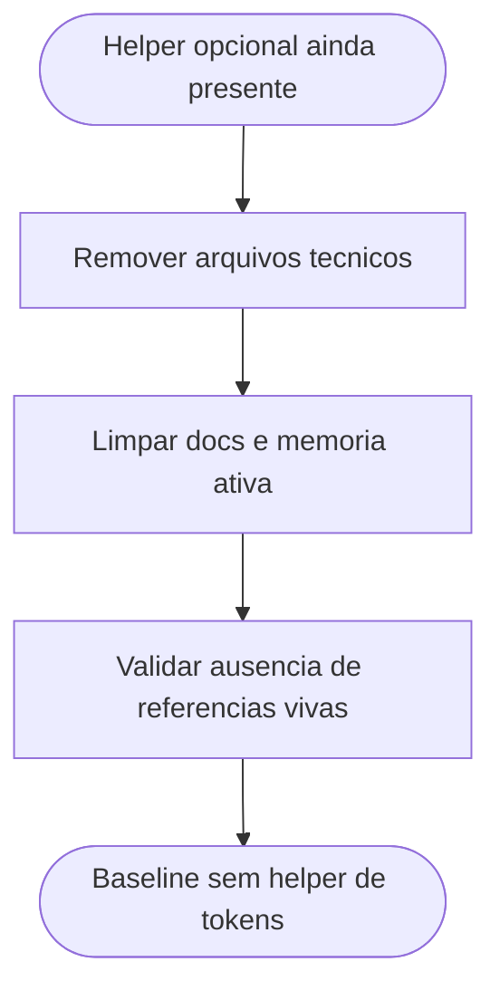

# Remocao completa do helper de estimativa de tokens

## Contexto

Depois da retirada da obrigatoriedade de tokens do protocolo, o repositorio ainda mantinha um helper opcional de estimativa de tokens, sua documentacao dedicada, sua dependencia isolada e seus testes. Em seguida, foi decidido remover tambem esses artefatos do baseline versionado.

## Motivacao

- Encerrar por completo a trilha de tokens no baseline vivo do pacote.
- Evitar manter arquivos tecnicos e documentais sem funcao no fluxo desejado.
- Simplificar a estrutura do repositorio e a onboarding surface.
- Preservar apenas o historico cronologico das iteracoes anteriores.

## Decisao adotada

1. Remover [docs/estimativa-de-tokens.md](../../../docs/estimativa-de-tokens.md).
2. Remover [requirements-token-estimation.txt](../../../requirements-token-estimation.txt).
3. Remover [scripts/estimate_tokens.py](../../../scripts/estimate_tokens.py) e [scripts/token_estimation.py](../../../scripts/token_estimation.py).
4. Remover [tests/test_token_estimation.py](../../../tests/test_token_estimation.py).
5. Atualizar [README.md](../../../README.md), [ONBOARD.md](../../../ONBOARD.md) e [MEMORIA-COMPARTILHADA.md](../MEMORIA-COMPARTILHADA.md) para eliminar referencias vivas ao helper.

## Arquivos impactados

- [README.md](../../../README.md)
- [ONBOARD.md](../../../ONBOARD.md)
- [MEMORIA-COMPARTILHADA.md](../MEMORIA-COMPARTILHADA.md)
- [docs/estimativa-de-tokens.md](../../../docs/estimativa-de-tokens.md)
- [requirements-token-estimation.txt](../../../requirements-token-estimation.txt)
- [scripts/estimate_tokens.py](../../../scripts/estimate_tokens.py)
- [scripts/token_estimation.py](../../../scripts/token_estimation.py)
- [tests/test_token_estimation.py](../../../tests/test_token_estimation.py)

## Impacto observado

- O baseline versionado deixa de incluir qualquer helper dedicado a tokens.
- A documentacao de entrada deixa de citar instalacao e uso desse utilitario.
- O protocolo, a memoria ativa e a superficie principal do repositorio ficam alinhados a um baseline sem tokens.

## Riscos residuais

- O historico cronologico continua registrando a fase em que o helper existiu, o que exige leitura contextual correta.
- Qualquer futura volta da funcionalidade de tokens deve ser tratada como nova decisao estrutural, nao como reativacao implicita.

## Validacao

- Confirmada a remocao dos arquivos do helper e de seus testes.
- Confirmada a limpeza das referencias vivas em [README.md](../../../README.md), [ONBOARD.md](../../../ONBOARD.md) e [MEMORIA-COMPARTILHADA.md](../MEMORIA-COMPARTILHADA.md).
- Confirmado que as referencias remanescentes a tokens ficaram restritas a logs e historico cronologico.

