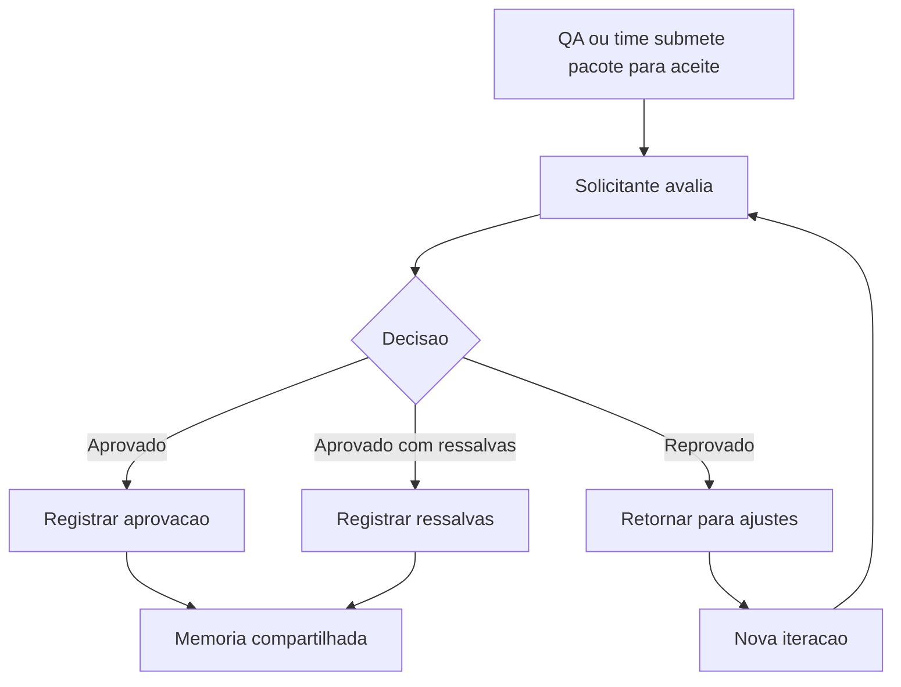

# Template - Aprovacao e Reaprovacao Explicita do Solicitante

## Identificacao

- Demanda:
- Funcionalidade ou pacote de testes:
- Solicitante:
- Responsavel pelo registro:
- Data:
- Tipo de registro: Aprovacao inicial | Reaprovacao

## Escopo submetido para aceite

- Itens avaliados:
- Versao ou iteracao:
- Referencias de testes, evidencias ou relatorios:
- Restricoes conhecidas:

## Decisao do solicitante

- Status: Aprovado | Aprovado com ressalvas | Reprovado
- Resumo da decisao:
- Observacoes do solicitante:
- Condicoes adicionais:

## Rastreabilidade da aprovacao

- Testes QA relacionados:
- Ciclo QA -> Developer relacionado:
- Houve alteracao posterior ao aceite anterior? Sim | Nao
- Este registro substitui aprovacao anterior? Sim | Nao

## Reaprovacao quando aplicavel

- Motivo da reaprovacao:
- Alteracoes realizadas apos aprovacao anterior:
- Impacto das alteracoes:
- Nova validacao exigida: Sim | Nao

## Proximos passos

1. Registrar esta decisao na memoria compartilhada.
2. Atualizar historico quando a mudanca for relevante.
3. Informar Tech Lead, QA Expert e Senior Developer conforme o impacto.

