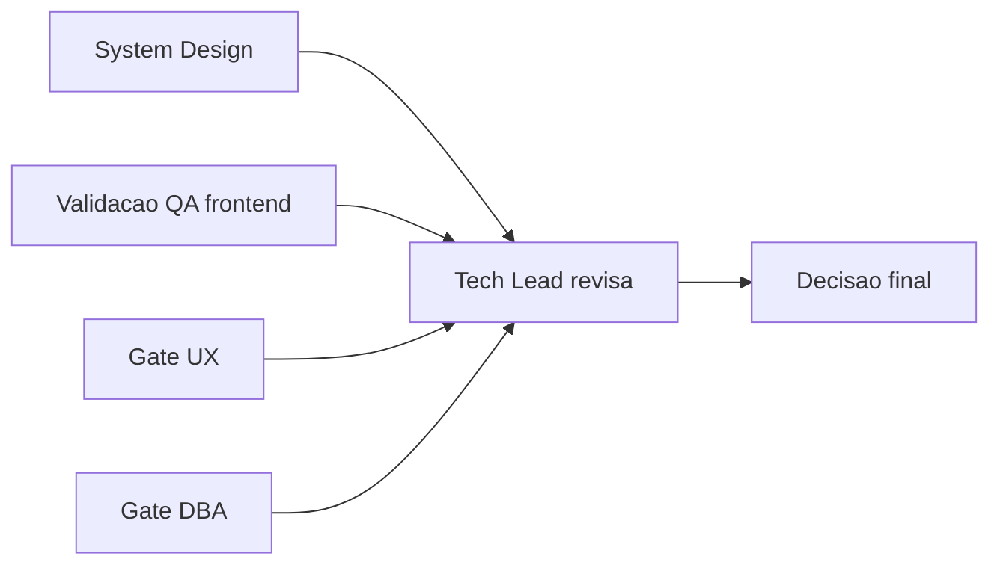

# Template - Aprovacao Final do Tech Lead

## Identificacao

- Projeto ou produto:
- Responsavel Tech Lead:
- Data da aprovacao:
- Escopo avaliado:
- Uso do template padrao neste fechamento?: Sim | Nao
- Em caso de nao, justificativa explicita para excecao:
- Status final: Aprovado | Aprovado com ressalvas | Reprovado

## Artefatos obrigatorios revisados

- Revisao consolidada do Tech Lead:
- Link ou referencia do arquivo concreto da revisao consolidada do Tech Lead:
- System Design revisado:
- Template padrao de System Design utilizado?: Sim | Nao
- Em caso de nao, justificativa explicita:
- PRD aplicavel?: Sim | Nao
- Referencia do PRD revisado:
- ARD aplicavel?: Sim | Nao
- Referencia do ARD revisado:
- Resumo das divergencias resolvidas entre PRD, ARD, implementacao e evidencias de validacao:
- Bloqueios remanescentes aceitos ou justificados:
- Validacao QA frontend aplicavel?: Sim | Nao
- Template QA frontend utilizado?: Sim | Nao
- Documento de validacao QA frontend referenciado no fechamento final:
- Trecho, link ou evidencia reaproveitada da validacao QA frontend:
- Em caso de nao, justificativa explicita:
- Documento de Design System referenciado?: Sim | Nao
- Evidencias adicionais consultadas:

## Gates aplicados

| Gate | Aplicavel | Resultado | Evidencia | Observacoes |
|---|---|---|---|---|
| Business Analyst / System Design | Sim |  |  |  |
| QA Expert / Validacao frontend | Sim |  |  |  |
| UX Expert / Interface | Sim |  |  |  |
| DBA / Persistencia | Nao |  |  |  |

## Criterios de aceite consolidados

| Criterio | Status | Evidencia | Observacoes |
|---|---|---|---|
| Revisao consolidada do Tech Lead registrada |  |  |  |
| Referencia concreta ao arquivo da revisao consolidada |  |  |  |
| Requisitos claros e rastreaveis |  |  |  |
| PRD revisado quando aplicavel |  |  |  |
| ARD revisado quando aplicavel |  |  |  |
| Divergencias entre PRD, ARD, implementacao e evidencias tratadas |  |  |  |
| System Design aderente ao template padrao |  |  |  |
| Vinculo entre System Design e Design System |  |  |  |
| Validacao QA frontend registrada |  |  |  |
| Referencia direta ao documento de validacao QA frontend |  |  |  |
| Riscos residuais aceitaveis |  |  |  |

## Riscos residuais e rollback

- Riscos residuais aceitos:
- Riscos residuais nao aceitos:
- Plano de rollback:
- Dependencias criticas para monitoramento:

## Decisao final

- Decisao do Tech Lead:
- Condicoes para fechamento:
- Pendencias remanescentes:
- Escalonamentos necessarios:
- Sintese final do impacto global da entrega:
- Justificativa consolidada para eventual desvio do template padrao:

