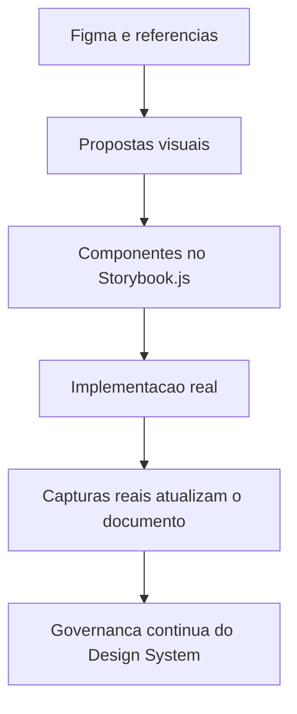

# Template - Documento Completo de Design System

## Identificacao

- Projeto ou produto:
- Responsavel UX:
- Responsavel tecnico Storybook:
- Data da versao:
- Fonte principal de referencia: Figma | Aplicacao real | Storybook.js | Outro

## Objetivo do documento

- Escopo do Design System:
- Problemas de experiencia que ele resolve:
- Publico consumidor do documento:
- Status: Proposta | Em implementacao | Implementado | Evolucao continua

## Fundamentos visuais

- Principios de design:
- Tokens de cor:
- Tipografia:
- Espacamento e grid:
- Iconografia:
- Elevacao e sombras:

## Componentes do sistema

| Componente | Objetivo | Estados | Variacoes | Link Storybook | Referencia Figma | Status |
|---|---|---|---|---|---|---|
|  |  |  |  |  |  |  |

## Interfaces e padroes de composicao

| Interface ou fluxo | Componentes envolvidos | Objetivo de uso | Status | Observacoes |
|---|---|---|---|---|
|  |  |  |  |  |

## Imagens de proposta

| Item | Descricao | Origem da imagem | Caminho ou referencia | Observacoes |
|---|---|---|---|---|
|  |  | Figma |  |  |

## Imagens reais apos implementacao

| Item | Descricao | Origem da captura | Caminho ou referencia | Diferencas para proposta |
|---|---|---|---|---|
|  |  | Aplicacao |  |  |

## Storybook.js

- URL ou localizacao:
- Estrutura de categorias:
- Convencoes de stories:
- Cobertura atual de componentes:
- Pendencias tecnicas:

## Referencias de Figma quando disponivel

- Projeto ou arquivo:
- Paginas consultadas:
- Componentes ou fluxos relevantes:
- Divergencias encontradas entre Figma e implementacao:

## Criterios de acessibilidade e responsividade

- Regras de acessibilidade aplicadas:
- Comportamento em breakpoints:
- Estados criticos contemplados:
- Pendencias conhecidas:

## Governanca e manutencao

- Responsavel pela evolucao visual:
- Responsavel pela sustentacao tecnica:
- Frequencia de revisao:
- Gatilhos para atualizacao:

## Proximos passos

1. Atualizar imagens reais sempre que a implementacao mudar.
2. Revisar Storybook.js e Figma em conjunto quando houver divergencias.
3. Registrar mudancas relevantes na memoria compartilhada.

