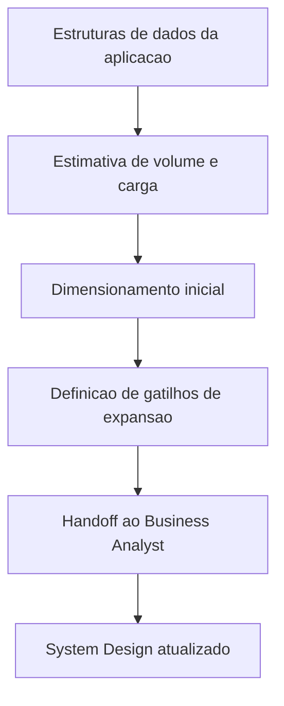

# Template - Plano de Dimensionamento e Expansao do Banco

## Identificacao

- Sistema ou modulo:
- Responsavel DBA:
- Data da versao:
- Ambiente de referencia: Desenvolvimento | Homologacao | Producao
- Versao do schema ou baseline:

## Contexto do plano

- Objetivo do plano:
- Escopo funcional coberto:
- Premissas de negocio:
- Premissas tecnicas:
- Restricoes conhecidas:

## Estruturas de dados consideradas

| Entidade ou agregado | Volume atual | Crescimento esperado | Criticidade | Observacoes |
|---|---|---|---|---|
|  |  |  |  |  |

## Padroes de acesso e carga

| Fluxo ou consulta critica | Tipo de operacao | Frequencia estimada | Janela de pico | Observacoes |
|---|---|---|---|---|
|  | Leitura |  |  |  |

## Premissas de dimensionamento

- Capacidade inicial estimada:
- Meta de crescimento:
- Horizonte do plano:
- Limites operacionais conhecidos:
- Dependencias de infraestrutura:

## Estrategia de dimensionamento

| Camada | Capacidade atual | Capacidade recomendada | Gatilho de expansao | Justificativa |
|---|---|---|---|---|
| Compute do banco |  |  |  |  |
| Armazenamento |  |  |  |  |
| Replica ou leitura |  |  |  |  |
| Backup e retencao |  |  |  |  |

## Estrategia de expansao

- Expansao vertical prevista:
- Expansao horizontal prevista:
- Politica de particionamento ou sharding quando aplicavel:
- Politica de arquivamento ou retencao:
- Plano de revisao periodica:

## Riscos e mitigacoes

| Risco | Impacto | Probabilidade | Mitigacao | Responsavel |
|---|---|---|---|---|
|  |  |  |  |  |

## Monitoracao e gatilhos operacionais

| Indicador | Limite de alerta | Limite critico | Acao esperada |
|---|---|---|---|
| CPU |  |  |  |
| Latencia |  |  |  |
| Crescimento de dados |  |  |  |

## Handoff para o Business Analyst

- Resumo executivo para documentacao no System Design:
- Impactos arquiteturais relevantes:
- Ajustes recomendados no plano de implantacao:
- Ajustes recomendados no dimensionamento geral da aplicacao:

## Aprovacoes e rastreabilidade

- Parecer do DBA:
- Data do handoff ao Business Analyst:
- Referencia no System Design:
- Necessita revisao do Tech Lead: Sim | Nao

## Proximos passos

1. Validar premissas com dados reais de carga e crescimento.
2. Atualizar o Business Analyst com o resumo executivo do plano.
3. Revisar periodicamente os gatilhos de expansao.

