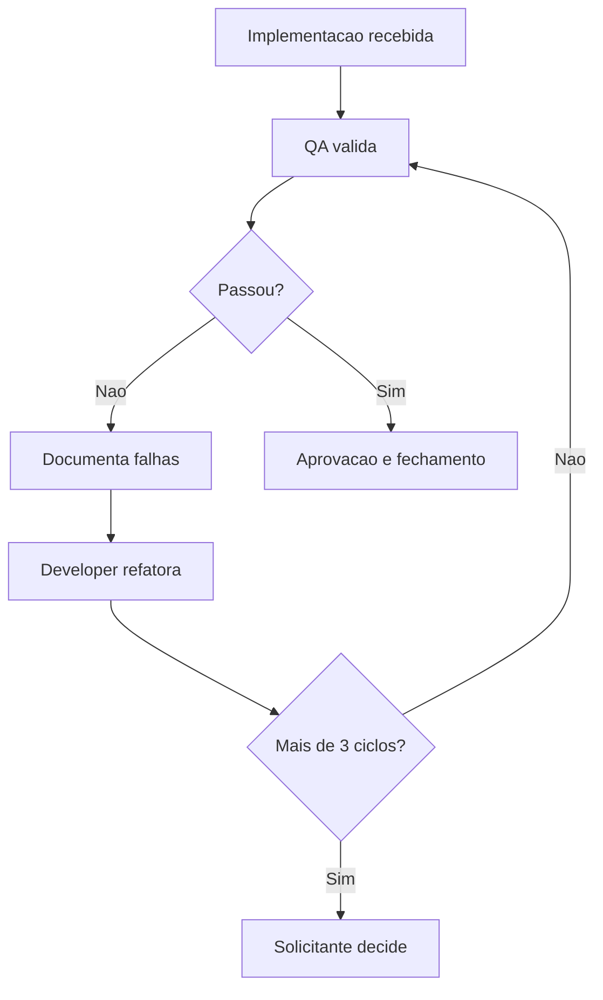

# Template - Relatorio de Reprovacao QA e Ciclos de Revalidacao

## Identificacao

- Demanda:
- Funcionalidade:
- Responsavel pela implementacao:
- Responsavel pela validacao QA:
- Data da rodada:
- Ciclo atual de revalidacao:

## Escopo validado

- Requisitos cobertos:
- Ambientes utilizados:
- Massa de dados utilizada:
- Dependencias relevantes:

## Resultado da validacao

- Status: Aprovado | Reprovado
- Resumo executivo:
- Risco para negocio:
- Impacto tecnico:

## Falhas documentadas

| ID | Cenário | Resultado esperado | Resultado obtido | Severidade | Evidência |
|---|---|---|---|---|---|
| QA-001 |  |  |  |  |  |

## Acoes de refatoracao solicitadas ao Senior Developer

| ID da falha | Acao esperada | Prioridade | Observacoes |
|---|---|---|---|
| QA-001 |  |  |  |

## Historico de ciclos QA -> Developer

| Ciclo | Data | Status | Resumo da devolucao | Responsavel |
|---|---|---|---|---|
| 1 |  | Reprovado |  |  |

## Criterio de escalonamento

- Quantidade de reprovacoes acumuladas:
- Ultrapassou 3 ciclos? Sim | Nao
- Encaminhar ao solicitante? Sim | Nao

## Decisao do solicitante quando houver escalonamento

- Data:
- Decisao:
- Ajustes solicitados:
- Reaprovacao necessaria: Sim | Nao

## Proximos passos

1. Refatorar e reenviar ao QA.
2. Atualizar memoria compartilhada com o ciclo e a decisao.
3. Escalar ao solicitante quando aplicavel.

