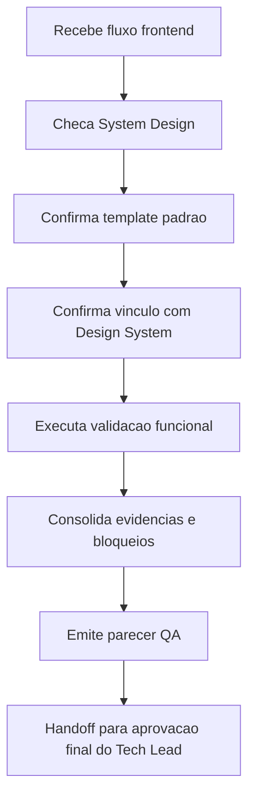

# Template - Validacao QA de Fluxos Frontend

## Identificacao

- Projeto ou produto:
- Responsavel QA:
- Data da validacao:
- Escopo validado:
- Status: Em validacao | Aprovado | Aprovado com ressalvas | Reprovado

## Precondicao documental

- O System Design existe?: Sim | Nao
- O System Design usou `templates/system-design-template.md`?: Sim | Nao
- Em caso de nao, existe justificativa explicita?: Sim | Nao
- O System Design referencia o documento de Design System?: Sim | Nao
- Link ou referencia do System Design:
- Link ou referencia do Design System:
- Link ou referencia de Figma:
- Link ou referencia de Storybook.js:

## Checagem de coerencia documental

| Item verificado | Evidencia encontrada | Status | Observacoes |
|---|---|---|---|
| Vinculo entre System Design e Design System |  |  |  |
| Uso do template padrao de System Design |  |  |  |
| Referencia de Figma quando aplicavel |  |  |  |
| Referencia de Storybook.js quando aplicavel |  |  |  |
| Evidencias visuais disponiveis |  |  |  |

## Fluxos frontend validados

| Fluxo | Objetivo | Tipo de validacao | Resultado | Evidencias |
|---|---|---|---|---|
|  |  | Manual |  |  |

## Evidencias de execucao

- Capturas ou videos:
- Logs ou relatarios:
- Ambiente validado:
- Dados de teste utilizados:

## Bloqueios e ressalvas

| Tipo | Descricao | Impacto | Acao recomendada | Owner |
|---|---|---|---|---|
| Bloqueio |  |  |  |  |

## Parecer final

- Resultado final:
- Condicoes para aceite:
- Necessidade de retorno ao Business Analyst:
- Necessidade de retorno ao UX Expert:
- Necessidade de retorno ao Tech Lead:
- Documento de aprovacao final do Tech Lead que deve receber esta validacao:
- Trecho, link ou referencia desta validacao a ser reutilizado no fechamento final:

