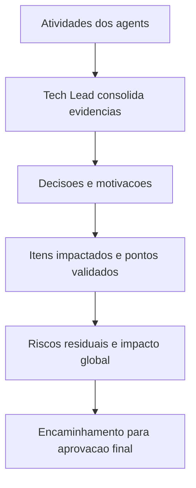

# Template - Revisao Consolidada do Tech Lead

## Identificacao

- Projeto ou produto:
- Responsavel Tech Lead:
- Data da revisao:
- Escopo revisado:
- Agents envolvidos:
- Status da revisao: Em andamento | Concluida | Concluida com ressalvas

## Resumo executivo

- Objetivo da entrega:
- Contexto consolidado:
- Resultado executivo da revisao:
- Recomendacao do Tech Lead:

## PRD e ARD

- PRD aplicavel?: Sim | Nao
- Referencia do PRD:
- ARD aplicavel?: Sim | Nao
- Referencia do ARD:

| Artefato | Item revisado | Consistencia com entrega | Lacunas encontradas | Observacoes |
|---|---|---|---|---|
| PRD |  |  |  |  |
| ARD |  |  |  |  |

## Divergencias entre PRD, ARD, implementacao e evidencias de validacao

| Divergencia | Origem | Impacto | Resolucao adotada | Status |
|---|---|---|---|---|
|  |  |  |  |  |

- Conclusao especifica sobre divergencias entre PRD e ARD:
- Conclusao especifica sobre divergencias entre artefatos, implementacao e evidencias de validacao:

## Registro consolidado das atividades por agent

| Agent | Atividade executada | Artefatos gerados | Decisoes associadas | Status |
|---|---|---|---|---|
| Business Analyst |  |  |  |  |
| Senior Developer |  |  |  |  |
| QA Expert |  |  |  |  |
| UX Expert |  |  |  |  |
| DBA |  |  |  |  |

## Decisoes e motivacoes

| Decisao | Motivacao | Alternativas consideradas | Dono | Impacto |
|---|---|---|---|---|
|  |  |  |  |  |

## Itens impactados

| Item impactado | Tipo | Mudanca observada | Risco associado | Mitigacao |
|---|---|---|---|---|
|  |  |  |  |  |

## Pontos validados

| Ponto validado | Origem da evidencia | Resultado | Observacoes |
|---|---|---|---|
|  |  |  |  |

## Pendencias, bloqueios e riscos residuais

| Tipo | Descricao | Impacto | Owner | Proxima acao |
|---|---|---|---|---|
| Pendencia |  |  |  |  |

## Impacto global da entrega

- Impacto no negocio:
- Impacto tecnico:
- Impacto operacional:
- Impacto em UX:
- Impacto em dados:

## Encaminhamento para fechamento

- Pronto para aprovacao final?: Sim | Nao
- Dependencias para `templates/aprovacao-final-tech-lead-template.md`:
- Arquivo concreto desta revisao consolidada para referencia no fechamento final:
- Resumo das divergencias resolvidas que devem constar no fechamento final:
- Bloqueios remanescentes que precisam constar no fechamento final:
- Observacoes finais do Tech Lead:

