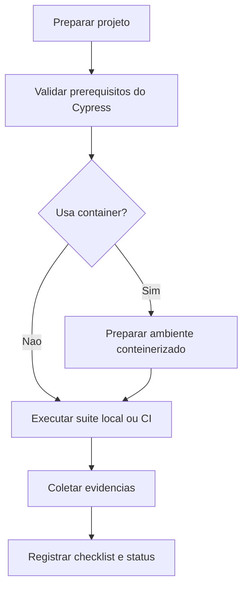

# Template - Setup e Checklist de Cypress

## Identificacao

- Projeto ou modulo:
- Responsavel pela preparacao:
- Responsavel pela validacao QA:
- Data:
- Ambiente alvo: Local | CI | Container | Outro

## Escopo do setup

- Objetivo do setup:
- Suite E2E coberta:
- Ambientes contemplados:
- Dependencias externas relevantes:

## Prerequisitos do projeto

| Item | Status | Evidencia | Observacoes |
|---|---|---|---|
| Dependencia do Cypress instalada |  |  |  |
| Scripts de execucao configurados |  |  |  |
| Arquivo de configuracao do Cypress presente |  |  |  |
| Variaveis de ambiente definidas |  |  |  |
| Fixtures ou massa de dados preparadas |  |  |  |
| Comando de inicializacao da aplicacao documentado |  |  |  |

## Prerequisitos do container quando aplicavel

| Item | Status | Evidencia | Observacoes |
|---|---|---|---|
| Imagem com dependencias de execucao do Cypress |  |  |  |
| Navegador suportado disponivel |  |  |  |
| Bibliotecas de sistema requeridas instaladas |  |  |  |
| Variaveis e volumes configurados |  |  |  |
| Rede e portas necessarias expostas |  |  |  |

## Checklist de execucao

| Etapa | Status | Evidencia | Observacoes |
|---|---|---|---|
| Instalar dependencias |  |  |  |
| Subir aplicacao alvo |  |  |  |
| Validar URL base do Cypress |  |  |  |
| Executar suite E2E |  |  |  |
| Coletar logs, screenshots e videos |  |  |  |
| Validar limpeza ou reaproveitamento de dados |  |  |  |

## Evidencias de execucao

- Comandos executados:
- Resultado esperado:
- Resultado obtido:
- Artefatos gerados:
- Limites ou restricoes encontradas:

## Falhas de setup ou ambiente

| ID | Descricao | Impacto | Acao corretiva | Responsavel |
|---|---|---|---|---|
| CYP-001 |  |  |  |  |

## Aprovacao operacional

- Setup validado para uso em QA: Sim | Nao
- Setup validado para uso em container: Sim | Nao | N/A
- Pendencias restantes:
- Responsavel pelo aceite:

## Proximos passos

1. Atualizar prerequisitos faltantes no projeto ou container.
2. Registrar evidencias na memoria compartilhada quando o setup fizer parte de uma entrega relevante.
3. Reexecutar a checklist apos qualquer alteracao estrutural no ambiente.

