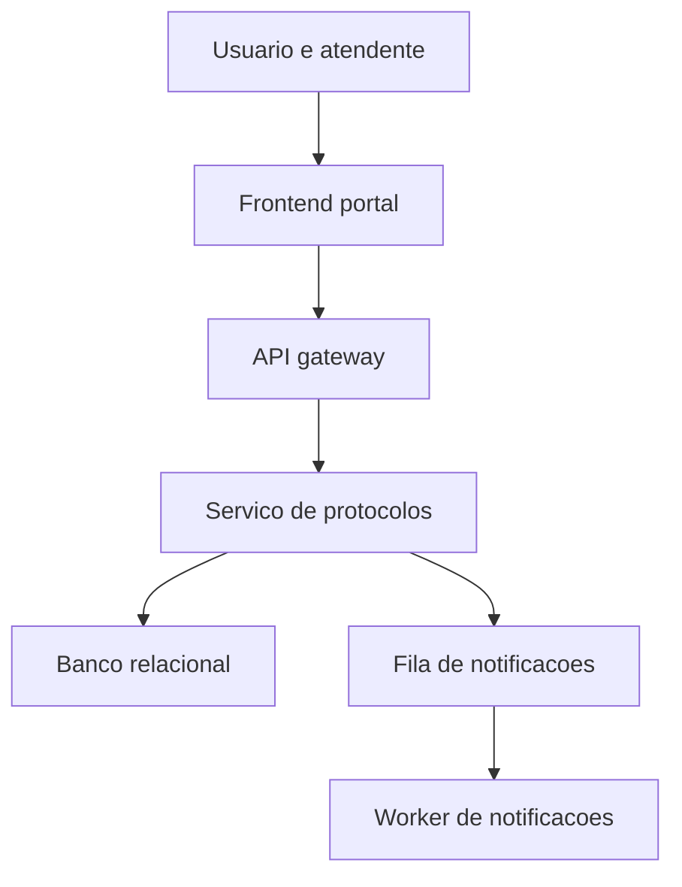
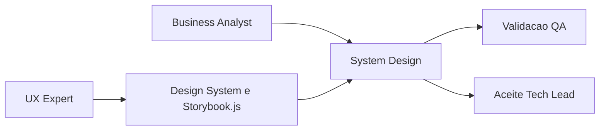

# Exemplo Preenchido - System Design

## Identificacao

- Projeto ou produto: Portal de Atendimento Unificado
- Responsavel Business Analyst: Business Analyst
- Responsavel tecnico principal: Tech Lead
- Data da versao: 2026-03-21
- Status: Em evolucao

## Objetivo do documento

- Problema de negocio enderecado: centralizar atendimento digital de solicitacoes, consultas e acompanhamento de protocolos em um unico portal.
- Escopo contemplado: autenticacao, abertura de solicitacao, consulta de status, painel do atendente, notificacoes e trilha de auditoria.
- Escopo fora: billing, integracao com meios de pagamento e analytics avancado.
- Premissas: usuarios autenticados via SSO institucional; operacao com picos em horarios comerciais.
- Restricoes: stack heterogenea, exigencia de rastreabilidade e conformidade com auditoria.

## Visao geral da solucao

- Resumo executivo da arquitetura: frontend web consome APIs internas, persistencia relacional suporta entidades transacionais, fila assicrona processa notificacoes e trilha de auditoria.
- Principais capacidades do sistema: abertura de chamados, consulta de status, operacao por atendentes, notificacao de eventos e observabilidade basica.
- Principais riscos arquiteturais: gargalo em consultas de historico, dependencia de integracao SSO e crescimento de carga em notificacoes.

## Componentes e responsabilidades

| Componente | Responsabilidade | Entradas | Saidas | Dependencias | Observacoes |
|---|---|---|---|---|---|
| Frontend portal | Interfaces de solicitacao e acompanhamento | Interacoes do usuario | Chamadas HTTP | API gateway, Design System | Aplicacao web responsiva |
| API gateway | Orquestracao e autenticacao | Requisicoes do frontend | Requisicoes para servicos | SSO, servicos internos | Ponto unico de entrada |
| Servico de protocolos | Regras de negocio dos protocolos | Eventos e comandos | Persistencia e eventos | Banco relacional, fila | Servico central |
| Worker de notificacoes | Processar envios assincronos | Eventos de dominio | Emails e logs | Fila, provedor externo | Escalavel horizontalmente |
| Banco relacional | Persistencia transacional | Escritas e leituras | Dados consistentes | Infra de banco | Replica de leitura futura |

## Integracoes e contratos

| Integracao | Tipo | Origem | Destino | Contrato ou protocolo | Risco principal |
|---|---|---|---|---|---|
| SSO institucional | Sincrona | API gateway | IdP | OAuth2/OIDC | Indisponibilidade externa |
| Provedor de email | Assincrona | Worker de notificacoes | SMTP/API | REST | Limite de throughput |
| Auditoria central | Assincrona | Servico de protocolos | Plataforma de logs | Evento JSON | Perda de eventos |

## Arquitetura de desenvolvimento

- Ambientes necessarios: frontend local, APIs locais, banco relacional e mock de SSO.
- Dependencias locais: Node.js, runtime backend, Docker para banco e fila.
- Servicos de apoio: banco PostgreSQL, fila de mensagens e fake SMTP.
- Observacoes de setup: seed inicial para usuarios, perfis e protocolos de exemplo.

## Arquitetura de producao

- Topologia: frontend estatico em CDN, APIs em cluster de aplicacao, worker assincrono separado e banco gerenciado.
- Componentes implantados: gateway, servico de protocolos, worker, banco, cache opcional e observabilidade.
- Observabilidade: logs centralizados, metricas de API, fila e banco.
- Alta disponibilidade e resiliencia: duas instancias minimas por servico, reprocessamento de fila e backup do banco.
- Politica de rollback: rollback de aplicacao por versao anterior; migracoes com plano reversivel controlado pelo DBA.

## Implantacao

### Desenvolvimento

1. Subir banco e fila com containers.
2. Executar migracoes e seed inicial.
3. Iniciar frontend, APIs e worker.
4. Validacoes apos implantacao: login, abertura de protocolo e envio de notificacao simulada.

### Producao

1. Aplicar migracoes aprovadas com janela controlada.
2. Publicar versao de APIs e worker.
3. Publicar frontend em CDN.
4. Validacoes apos implantacao: health checks, fluxo critico de abertura e consulta, monitoramento de fila.

## Dimensionamento da aplicacao

- Premissas de carga: 8 mil usuarios ativos por dia, pico simultaneo de 600 usuarios.
- Volume esperado: 50 mil protocolos por mes e 300 mil eventos de auditoria.
- Estrategia de escala: horizontal em API e worker; replica de leitura quando consultas historicas crescerem.
- Gargalos conhecidos: consultas de historico consolidado e envio massivo de notificacoes.
- Plano de expansao: adicionar cache de leitura, sharding logico de auditoria e worker dedicado por tipo de evento.

## Plano de dimensionamento e expansao do banco

- Fonte do handoff do DBA: plano de capacidade atualizado do banco relacional.
- Premissas de crescimento: aumento mensal de 12% em protocolos e 20% em eventos de auditoria.
- Estrategia de capacidade: indices compostos por status e data, particionamento futuro de auditoria e replica de leitura.
- Riscos de persistencia: crescimento rapido da trilha de auditoria e lock em migracoes com tabelas grandes.
- Acoes recomendadas: revisar queries criticas trimestralmente, validar particionamento e preparar replica antes do limite de IOPS.

## Secao obrigatoria - Referencia ao Design System

- Existe frontend ou interface relevante?: Sim
- Documento de Design System referenciado: `templates/design-system-completo-template.md` preenchido pelo UX Expert para o portal.
- Responsavel UX: UX Expert
- Link ou referencia de Figma: biblioteca institucional e fluxo de protocolo no Figma do projeto.
- Link ou referencia de Storybook.js: Storybook do portal com componentes de formulario, tabela e feedback.
- Evidencias visuais disponiveis: mockups aprovados, capturas reais da tela de abertura e painel do atendente.
- Divergencias conhecidas entre System Design e Design System: componente de tabela em fase de convergencia entre design e implementacao.
- Plano de tratamento das divergencias: UX e Senior Developer alinham backlog do componente; Business Analyst atualiza impacto no fluxo.

## Criterios de aceite e rastreabilidade

- Requisitos cobertos: autenticacao, abertura, consulta, notificacao e auditoria.
- Criterios de aceite por capacidade: resposta critica abaixo do limite acordado e fila sem backlog prolongado no pico.
- Evidencias de validacao esperadas: testes E2E Cypress, testes de exaustao, parecer DBA e parecer UX.
- Dependencias de QA, UX e DBA: QA valida fluxos e carga; UX valida coerencia visual; DBA valida capacidade e migracoes.

## Decisoes e trade-offs

| Decisao | Alternativas consideradas | Justificativa | Impacto |
|---|---|---|---|
| Worker assincrono para notificacoes | Processamento sincrono em API | Isola latencia do fluxo critico | Maior robustez em picos |
| Banco relacional central | Banco documento | Melhor aderencia ao modelo transacional e auditoria | Evolucao de schema exige mais governanca |

## Riscos e mitigacoes

| Risco | Impacto | Probabilidade | Mitigacao | Owner |
|---|---|---|---|---|
| Lentidao em consultas historicas | Alto | Media | Replica de leitura e otimizacao de indices | DBA |
| Divergencia entre Design System e frontend real | Medio | Media | Revisao quinzenal entre UX e Senior Developer | UX Expert |
| Fila crescer alem do previsto | Alto | Baixa | Autoescalonamento de workers e alertas | Tech Lead |

## Diagramas Mermaid

### Contexto e componentes

### Implantacao e vinculacao com Design System

## Proximos passos

1. Atualizar o documento quando houver nova integracao externa ou mudanca de topologia.
2. Revisar a secao de Design System a cada release frontend relevante.
3. Registrar novas decisoes de capacidade e arquitetura na memoria compartilhada.