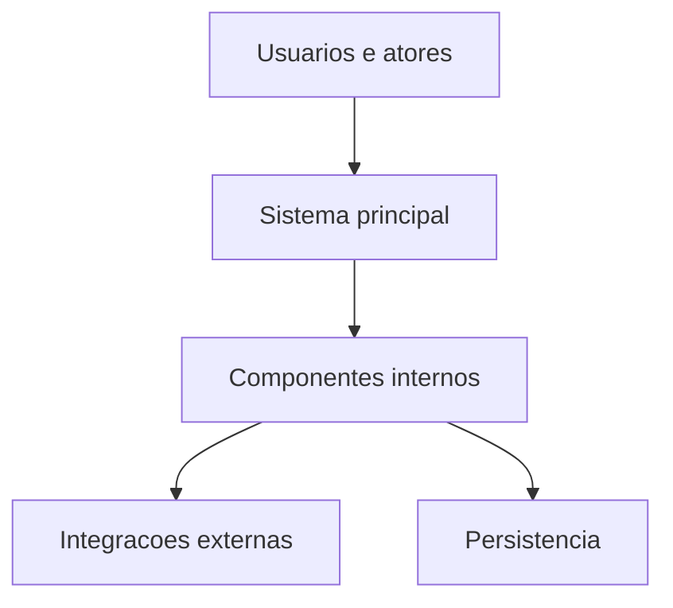
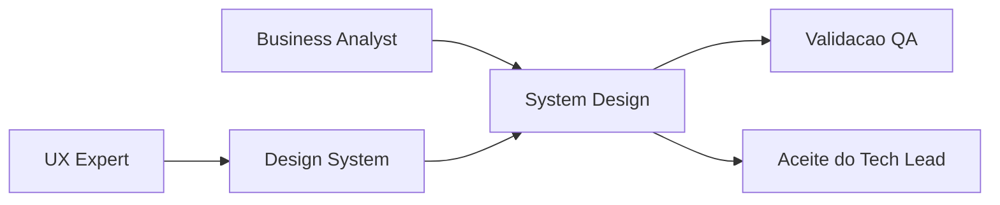

# Template - System Design

## Identificacao

- Projeto ou produto:
- Responsavel Business Analyst:
- Responsavel tecnico principal:
- Data da versao:
- Status: Proposta | Em validacao | Aprovado | Em evolucao

## Objetivo do documento

- Problema de negocio enderecado:
- Escopo contemplado:
- Escopo fora:
- Premissas:
- Restricoes:

## Visao geral da solucao

- Resumo executivo da arquitetura:
- Principais capacidades do sistema:
- Principais riscos arquiteturais:

## Componentes e responsabilidades

| Componente | Responsabilidade | Entradas | Saidas | Dependencias | Observacoes |
|---|---|---|---|---|---|
|  |  |  |  |  |  |

## Integracoes e contratos

| Integracao | Tipo | Origem | Destino | Contrato ou protocolo | Risco principal |
|---|---|---|---|---|---|
|  |  |  |  |  |  |

## Arquitetura de desenvolvimento

- Ambientes necessarios:
- Dependencias locais:
- Servicos de apoio:
- Observacoes de setup:

## Arquitetura de producao

- Topologia:
- Componentes implantados:
- Observabilidade:
- Alta disponibilidade e resiliencia:
- Politica de rollback:

## Implantacao

### Desenvolvimento

1. Passo 1:
2. Passo 2:
3. Validacoes apos implantacao:

### Producao

1. Passo 1:
2. Passo 2:
3. Validacoes apos implantacao:

## Dimensionamento da aplicacao

- Premissas de carga:
- Volume esperado:
- Estrategia de escala:
- Gargalos conhecidos:
- Plano de expansao:

## Plano de dimensionamento e expansao do banco

- Fonte do handoff do DBA:
- Premissas de crescimento:
- Estrategia de capacidade:
- Riscos de persistencia:
- Acoes recomendadas:

## Secao obrigatoria - Referencia ao Design System

- Existe frontend ou interface relevante?: Sim | Nao
- Documento de Design System referenciado:
- Responsavel UX:
- Link ou referencia de Figma:
- Link ou referencia de Storybook.js:
- Evidencias visuais disponiveis:
- Divergencias conhecidas entre System Design e Design System:
- Plano de tratamento das divergencias:

## Criterios de aceite e rastreabilidade

- Requisitos cobertos:
- Criterios de aceite por capacidade:
- Evidencias de validacao esperadas:
- Dependencias de QA, UX e DBA:

## Decisoes e trade-offs

| Decisao | Alternativas consideradas | Justificativa | Impacto |
|---|---|---|---|
|  |  |  |  |

## Riscos e mitigacoes

| Risco | Impacto | Probabilidade | Mitigacao | Owner |
|---|---|---|---|---|
|  |  |  |  |  |

## Diagramas Mermaid

### Contexto e componentes

### Implantacao e vinculacao com Design System

## Proximos passos

1. Atualizar o documento sempre que houver mudanca de arquitetura, implantacao, capacidade ou integracao.
2. Revisar a secao de Design System sempre que houver frontend ou alteracao relevante de interface.
3. Registrar decisoes relevantes na memoria compartilhada.