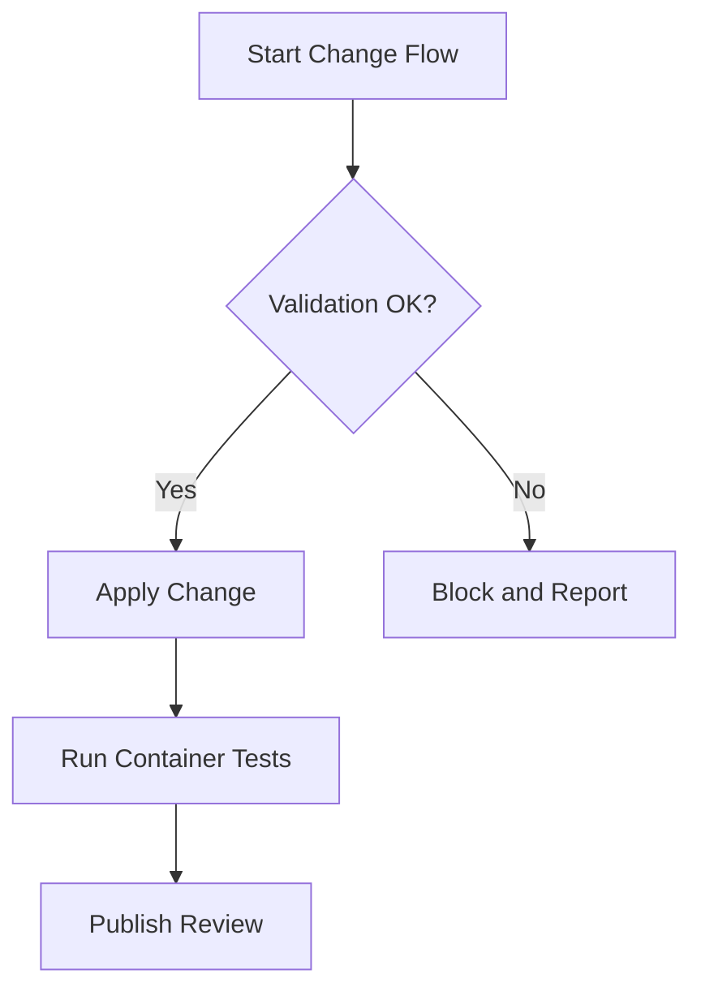

# Mermaid Patterns for Review Documents

Every review document must contain at least one Mermaid diagram.

## Recommended Diagram Types

- `flowchart`: business/process flow
- `sequenceDiagram`: interaction sequence between actors/services
- `graph TD`: architecture and dependency relations
- `stateDiagram-v2`: lifecycle/state transitions

## Selection Rules

- Use `sequenceDiagram` for request/response and integration behavior.
- Use `flowchart` for process and rule orchestration.
- Use `graph TD` for component architecture overview.
- Use `stateDiagram-v2` when state machine behavior changed.

## Minimum Content Rule

The diagram must include:

- Start and end points
- Main decision points
- Error/fallback path when relevant
- Labels meaningful to third parties

## Example Skeleton

