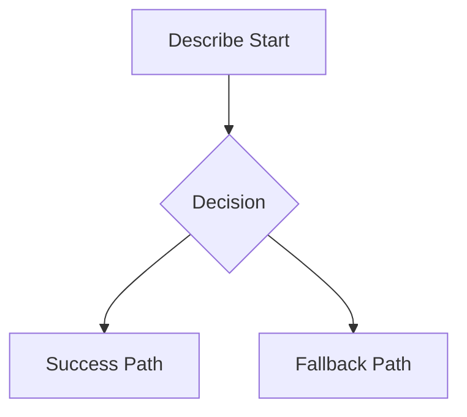

# Complete Review Template

## 1. Context and Objective

- Change summary:
- Motivation:
- Business objective:

## 2. PRD Impact

- Problem statement:
- Stakeholders:
- Scope in:
- Scope out:
- Acceptance criteria:

## 3. Technical Scope

- Modules/components affected:
- Contracts/schemas affected:
- Files changed:

## 4. ADR/ARD Decision

- Decision:
- Context:
- Alternatives:
- Trade-offs:
- Consequences:
- Status:

## 5. Diagram (Mermaid)

## 6. Validation Evidence

- Command(s):
- Result(s):
- Coverage/quality notes:

## 7. Risks, Impact, and Rollback

- Risks:
- Impact analysis:
- Rollback plan:

## 8. Traceability

- Requirement/User Story IDs:
- Issue/PR:
- Test cases:
- Documentation updated:

## 9. Third-Party Handover

- What changed:
- Why it changed:
- How to validate:
- Known limitations:

## 10. Completion Gate

- [ ] PRD impact complete
- [ ] ADR/ARD complete
- [ ] Mermaid included
- [ ] Validation evidence complete
- [ ] Risks and rollback complete
- [ ] Handover complete

Result: PASS / FAIL
